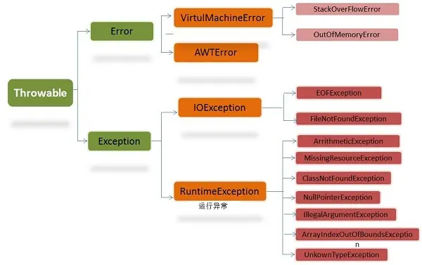

# Java核心知识点


##  int、char、long 各占多少字节数
??? answer "答案"
    | 类型     | 位数   | 字节数  |
    | ------ | ---- | ---- |
    | boolen | 8    | 1    |
    | int    | 32   | 4    |
    | float  | 32   | 4    |
    | double | 64   | 8    |
    | char   | 16   | 2    |
    | byte   | 8    | 1    |
    | short  | 16   | 2    |
    | long   | 64   | 8    |

## int 和 Integer 的区别
??? answer "答案"
    Java 为每一个基本数据类型都引入了对应的包装类，从Java 5 开始引入了自动装箱 / 拆箱机制，使得两者可以相互转化。**所以最基本的一点区别就是**：Integer 是int的包装类，int的初始值为零，而Integer的初值为null。int与Integer相比，会把Integer自动拆箱为int再去比。

    参考自：[http://blog.csdn.net/login_sonata/article/details/71001851](http://blog.csdn.net/login_sonata/article/details/71001851)


## 什么是内部类？内部类的作用
??? answer "答案"
    Java 常见的内部类有四种：成员内部类、静态内部类、方法内部类和匿名内部类。

    内部类可以很好的实现隐蔽，一般的非内部类，是不允许有private和protectd等权限的，但内部类（除方法内部类）可以通过这些修饰符来实现隐蔽。

    内部类拥有外部类的访问权限（分静态与非静态情况），通过这一特性可以比较好的处理类之间的关联性，将一类事物的流程放在一起内部处理。

    通过内部类可以实现多重继承，Java默认是单继承的，我们可以通过多个内部类继承实现多个父类，接着由于外部类完全可访问内部类，所以就实现了类似多继承的效果。

    参考自：[https://www.jianshu.com/p/7fe3af7f0f2d](https://www.jianshu.com/p/7fe3af7f0f2d)


## Serializable 和 Parcelable 的区别
??? answer "答案"
    Serializable 是 Java的序列化接口。特点是简单，直接实现该接口就行了，其他工作都被系统完成了，但是对于内存开销大，序列化和反序列化需要很多的 I/O 流操作。

    Parcelable 是Android的序列化方式，主要用于在内存序列化上，采用该方法需要实现该接口并且手动实现序列化过程，相对复杂点。如果序列化到存储设备（文件等）或者网络传输，比较复杂，建议用Serializable 方式。

    **最大的区别就是存储媒介的不同：**Serializable 使用IO读写存储在硬盘上，Parcelable 是直接在内存中读写，内存读写速度远大于IO读写，所以Parcelable 更加高效。Serializable在序列化过程中会产生大量的临时变量，会引起频繁的GC，效率低下。


## final、finally、finalize的区别
??? answer "答案"
    final用于声明属性、方法和类，分别表示属性不可变，方法不可覆盖，类不可继承。

    finally是异常处理语句结构的一部分，表示总是执行。

    finalize是Object类的一个方法，在垃圾收集器执行的时候会回调被回收对象的finalize()方法，可以覆盖此方法提供垃圾收集时其他资源的回收，例如关闭文件。

## String，StringBuilder，StringBuffer的区别？
??? answer "答案"
    从源码层面分析 `String`、`StringBuilder` 和 `StringBuffer` 的特性。以下是基于 JDK 源码的详细分析：

    ---

    ### 1. **String 的不可变性**
    `String` 的不可变性是通过以下方式实现的：
    - **`final` 修饰的字符数组**：`String` 内部使用 `final` 修饰的 `char[]` 来存储字符串内容，确保字符数组引用不可变。
    - **`final` 修饰的类**：`String` 类本身是 `final` 的，防止被继承和修改。

    #### 源码片段
    ```java
    // 类也是final，这样确保String不会被继承。
    public final class String implements java.io.Serializable, Comparable<String>, CharSequence {
        // 使用 final 修饰的字符数组
        private final char value[];

        // 构造函数
        public String(String original) {
            this.value = original.value; // 直接引用原字符数组
            this.hash = original.hash;
        }

        // 其他方法...
    }
    ```

    **关键点**：
    - `private final char value[]`：字符数组被 `final` 修饰，一旦初始化后，引用不可变。
    - `String` 类的所有修改操作（如 `concat`、`substring` 等）都会返回一个新的 `String` 对象，而不是修改原对象。

    ---

    ### 2. **StringBuffer 的线程安全**
    `StringBuffer` 的线程安全是通过以下方式实现的：
    - **`synchronized` 关键字**：`StringBuffer` 的所有关键方法都使用 `synchronized` 修饰，确保多线程环境下的线程安全。

    #### 源码片段
    ```java
    public final class StringBuffer extends AbstractStringBuilder implements java.io.Serializable, CharSequence {
        // 关键方法使用 synchronized 修饰
        @Override
        public synchronized StringBuffer append(String str) {
            toStringCache = null;
            super.append(str);
            return this;
        }

        @Override
        public synchronized StringBuffer insert(int offset, String str) {
            toStringCache = null;
            super.insert(offset, str);
            return this;
        }

        @Override
        public synchronized StringBuffer reverse() {
            toStringCache = null;
            super.reverse();
            return this;
        }

        // 其他方法...
    }
    ```

    **关键点**：
    - `synchronized` 修饰的方法（如 `append`、`insert`、`reverse` 等）确保多线程环境下操作是线程安全的。
    - `toStringCache` 是一个缓存字段，用于优化 `toString()` 方法的性能。

    ---

    ### 3. **StringBuilder 的非线程安全**
    `StringBuilder` 是非线程安全的，它的方法与 `StringBuffer` 类似，但没有使用 `synchronized` 关键字。

    #### 源码片段
    ```java
    public final class StringBuilder extends AbstractStringBuilder implements java.io.Serializable, CharSequence {
        // 关键方法没有 synchronized 修饰
        @Override
        public StringBuilder append(String str) {
            super.append(str);
            return this;
        }

        @Override
        public StringBuilder insert(int offset, String str) {
            super.insert(offset, str);
            return this;
        }

        @Override
        public StringBuilder reverse() {
            super.reverse();
            return this;
        }

        // 其他方法...
    }
    ```

    **关键点**：
    - `StringBuilder` 的方法没有 `synchronized` 修饰，因此是非线程安全的。
    - 由于没有同步开销，`StringBuilder` 的性能比 `StringBuffer` 更高。

    ---

    ### 4. **AbstractStringBuilder**
    `StringBuilder` 和 `StringBuffer` 都继承自 `AbstractStringBuilder`，它是一个抽象类，封装了大部分字符串操作的逻辑。

    #### 源码片段
    ```java
    abstract class AbstractStringBuilder implements Appendable, CharSequence {
        // 字符数组，用于存储字符串内容
        char[] value;

        // 当前字符数组的长度
        int count;

        // 扩容方法
        private void ensureCapacityInternal(int minimumCapacity) {
            if (minimumCapacity - value.length > 0) {
                value = Arrays.copyOf(value, newCapacity(minimumCapacity));
            }
        }

        // 其他方法...
    }
    ```

    **关键点**：
    - `AbstractStringBuilder` 使用 `char[] value` 存储字符串内容，`StringBuilder` 和 `StringBuffer` 都直接继承了这个实现。
    - `ensureCapacityInternal` 方法用于动态扩容字符数组。

    另外StringBuilder和StringBuffer初始化容量都是16.

    @IntrinsicCandidate
    public StringBuilder() {
        super(16);
    }

    @IntrinsicCandidate
    public StringBuffer() {
        super(16);
    }

    ---

    ### 总结
    - **`String` 的不可变性**：通过 `final char[] value` 和 `final` 类实现。
    - **`StringBuffer` 的线程安全**：通过 `synchronized` 关键字修饰方法实现。
    - **`StringBuilder` 的非线程安全**：没有使用 `synchronized`，性能更高。


## new String创建了几个对象
??? answer "答案"
    在Java中，使用 `new String()` 创建字符串对象时，会涉及到以下几个步骤：

    1. **字符串常量池**：如果字符串字面量（例如 `"example"`）已经在常量池中存在，则不会在常量池中创建新的对象。如果不存在，则会在常量池中创建一个新的字符串对象。

    2. **堆内存**：使用 `new String()` 会在堆内存中创建一个新的字符串对象，即使字符串常量池中已经存在相同的字符串。

    因此，使用 `new String("example")` 时，通常会创建 **两个对象**：
    - 一个在字符串常量池中（如果常量池中还没有该字符串）。
    - 一个在堆内存中。

    ### 示例代码
    ```java
    String s1 = "example"; // 只在常量池中创建对象
    String s2 = new String("example"); // 在堆内存中创建对象，常量池中可能已存在
    ```

    ### 总结
    - 如果字符串常量池中不存在该字符串，`new String("example")` 会创建 **两个对象**（常量池和堆内存各一个）。
    - 如果字符串常量池中已存在该字符串，`new String("example")` 只会创建 **一个对象**（堆内存中）。

    注意：字符串常量池是JVM优化字符串存储的一种机制，目的是减少重复字符串的内存占用。


## String为什么要设计成final？
??? answer "答案"
    `String` 类被设计为 `final` 的主要原因是为了确保 **不可变性**、**安全性** 和 **性能优化**。以下是详细的原因分析：

    ---

    ### 1. **确保不可变性**
    `String` 的核心特性是不可变性，即一旦创建，其内容就不能被修改。将 `String` 类设计为 `final` 可以防止子类继承并重写其方法，从而破坏不可变性。

    #### 示例
    如果 `String` 不是 `final`，可能会有人通过继承 `String` 并重写其方法来修改其内部状态：
    ```java
    public class MutableString extends String {
        private char[] value;

        public MutableString(String original) {
            super(original);
            this.value = original.toCharArray();
        }

        @Override
        public String concat(String str) {
            // 修改内部状态
            this.value = (new String(this.value) + str).toCharArray();
            return new String(this.value);
        }
    }
    ```
    如果允许这种行为，`String` 的不可变性就会被破坏，导致程序行为不可预测。

    ---

    ### 2. **安全性**
    `String` 在 Java 中被广泛使用，尤其是在以下场景：
    - **类加载机制**：类名、方法名等都是 `String` 类型。
    - **网络通信**：URL、参数等通常是 `String` 类型。
    - **文件路径**：文件路径是 `String` 类型。

    如果 `String` 不是 `final`，恶意代码可以通过继承 `String` 并重写其方法来篡改这些关键数据，从而导致安全问题。

    #### 示例
    假设 `String` 不是 `final`，攻击者可以创建一个恶意子类：
    ```java
    public class MaliciousString extends String {
        public MaliciousString(String original) {
            super(original);
        }

        @Override
        public boolean equals(Object obj) {
            // 篡改 equals 方法，破坏程序的逻辑
            return true;
        }
    }
    ```
    如果允许这种行为，程序的安全性将无法保证。

    ---

    ### 3. **性能优化**
    `String` 的不可变性使得 JVM 可以进行多种性能优化：
    - **字符串常量池**：`String` 是不可变的，因此可以被缓存和重用。例如，字符串字面量会被放入字符串常量池，多个相同的字面量会共享同一个对象。
    - **哈希值缓存**：`String` 的 `hashCode()` 方法会缓存哈希值，因为 `String` 不可变，哈希值只需要计算一次。
    - **线程安全**：`String` 的不可变性天然支持线程安全，无需额外的同步开销。

    如果 `String` 不是 `final`，这些优化将无法实现，因为子类可能会修改 `String` 的状态。

    #### 示例
    ```java
    String s1 = "Hello";
    String s2 = "Hello";
    System.out.println(s1 == s2); // 输出 true，因为 s1 和 s2 指向常量池中的同一个对象
    ```
    如果 `String` 不是 `final`，这种优化将无法保证。

    ---

    ### 4. **设计一致性**
    `String` 是 Java 中最基础的类之一，它的行为必须保持一致性和可预测性。将 `String` 设计为 `final` 可以确保所有 `String` 对象都遵循相同的规则，避免因继承和多态导致的意外行为。

    ---

    ### 5. **防止方法重写**
    `String` 类中有一些关键方法（如 `equals`、`hashCode`、`compareTo` 等），这些方法的行为必须严格遵循规范。如果 `String` 不是 `final`，子类可能会重写这些方法，导致程序行为异常。

    #### 示例
    ```java
    public class BadString extends String {
        @Override
        public boolean equals(Object obj) {
            // 重写 equals 方法，破坏其契约
            return false;
        }
    }
    ```
    如果允许这种行为，`String` 的 `equals` 方法将失去其意义。

    ---

    ### 总结
    `String` 类被设计为 `final` 的主要原因包括：
    1. **确保不可变性**：防止子类破坏 `String` 的不可变性。
    2. **安全性**：防止恶意代码通过继承 `String` 篡改关键数据。
    3. **性能优化**：支持字符串常量池、哈希值缓存等优化。
    4. **设计一致性**：确保 `String` 的行为一致且可预测。
    5. **防止方法重写**：避免子类重写关键方法导致程序行为异常。

    通过将 `String` 设计为 `final`，Java 确保了 `String` 的稳定性、安全性和高性能，使其成为 Java 中最重要和最常用的类之一。


## String a = "Hello", String b = new String("Hello") 使用 "==" 时，它们相等吗？为什么？什么原理？
??? answer "答案"
    不相等，一个在常量池，一个在堆里。内存地址不一致。


## JVM常量池，堆，栈
??? answer "答案"
    在Java中，内存管理主要由JVM（Java虚拟机）负责。JVM将内存划分为不同的区域，主要包括**常量池**、**堆**、**栈**等。这些内存区域各有不同的作用，下面详细解释它们的功能，并通过案例说明。

    ### 1. 常量池（Constant Pool）
    **作用**：
    - 常量池是JVM中的一块特殊内存区域，用于存储编译期生成的各种字面量和符号引用。
    - 字面量包括字符串、final常量、类和接口的全限定名、字段和方法的名称和描述符等。
    - 常量池是方法区的一部分，在Java 8之前，方法区是永久代（PermGen）的一部分，而在Java 8及之后，方法区被元空间（Metaspace）取代。

    **案例**：
    ```java
    String str1 = "Hello";
    String str2 = "Hello";
    System.out.println(str1 == str2); // true
    ```
    - 在这个例子中，字符串`"Hello"`会被存储在常量池中。`str1`和`str2`都指向常量池中的同一个字符串对象，因此`str1 == str2`为`true`。

    ### 2. 堆（Heap）
    **作用**：
    - 堆是JVM中最大的一块内存区域，用于存储对象实例和数组。
    - 所有通过`new`关键字创建的对象都会分配在堆中。
    - 堆是线程共享的，因此需要考虑线程安全问题。
    - 堆内存分为新生代（Young Generation）和老年代（Old Generation），新生代又分为Eden区、Survivor区（From和To）。

    **案例**：
    ```java
    Object obj = new Object();
    ```
    - 在这个例子中，`new Object()`会在堆中创建一个对象实例，`obj`变量存储的是该对象在堆中的引用。

    ### 3. 栈（Stack）
    **作用**：
    - 栈是线程私有的内存区域，每个线程都有自己的栈。
    - 栈用于存储局部变量、方法调用和部分结果。
    - 栈中的每个方法调用会创建一个栈帧（Stack Frame），栈帧中存储局部变量表、操作数栈、动态链接和方法返回地址等信息。
    - 栈的内存分配和回收是自动的，方法调用结束时，栈帧会自动弹出。

    **案例**：
    ```java
    public void method() {
        int a = 10;
        int b = 20;
        int c = a + b;
        System.out.println(c);
    }
    ```
    - 在这个例子中，`method`方法被调用时，JVM会为该方法创建一个栈帧，栈帧中存储局部变量`a`、`b`和`c`。方法执行完毕后，栈帧会被弹出，局部变量也随之销毁。

    ### 4. 方法区（Method Area）
    **作用**：
    - 方法区是线程共享的内存区域，用于存储类的元数据（如类信息、常量、静态变量、即时编译器编译后的代码等）。
    - 在Java 8之前，方法区是永久代（PermGen）的一部分，而在Java 8及之后，方法区被元空间（Metaspace）取代，元空间使用本地内存。

    **案例**：
    ```java
    public class MyClass {
        public static final int CONSTANT = 100;
        public static void main(String[] args) {
            System.out.println(CONSTANT);
        }
    }
    ```
    - 在这个例子中，`CONSTANT`是一个静态常量，它会被存储在方法区中。`MyClass`类的元数据（如类名、方法信息等）也会存储在方法区。

    ### 5. 本地方法栈（Native Method Stack）
    **作用**：
    - 本地方法栈与栈类似，但它是为JVM调用本地方法（Native Method）服务的。
    - 本地方法栈存储的是本地方法的调用信息。

    **案例**：
    - 当你调用一个用C/C++编写的本地方法时，JVM会使用本地方法栈来管理这些方法的调用。

    ### 总结
    - **常量池**：存储编译期生成的字面量和符号引用。
    - **堆**：存储对象实例和数组，是线程共享的。
    - **栈**：存储局部变量和方法调用，是线程私有的。
    - **方法区**：存储类的元数据和静态变量，是线程共享的。
    - **本地方法栈**：用于支持本地方法的调用。

    这些内存区域共同协作，确保Java程序能够高效运行。理解它们的作用有助于更好地进行内存管理和性能优化。


## 常量池
??? answer "答案"
    https://blog.csdn.net/qq_41376740/article/details/80338158


## Java基础类型有哪些？
??? answer "答案"
    ```java
    Java有8种基本数据类型：
    - byte：8位，-128到127
    - short：16位，-32,768到32,767
    - int：32位，-2^31到2^31-1
    - long：64位，-2^63到2^63-1
    - float：32位，单精度浮点
    - double：64位，双精度浮点
    - char：16位，表示一个Unicode字符
    - boolean：表示true/false

    基本类型的包装类分别是：Byte, Short, Integer, Long, Float, Double, Character和Boolean
    ```


## Java中equals和 "==" 的区别？
??? answer "答案"
    来源链接 https://www.cnblogs.com/smyhvae/p/3929585.html

    【正文】
    平时在学Android和Java语言的时候，总是碰到“equals”和“==”这两个字符，老感觉差不多；其实还是有一些区别的，今天干脆把它们彻底弄清楚。

    一、java当中的数据类型和“==”的含义：
    - 基本数据类型（也称原始数据类型） ：byte,short,char,int,long,float,double,boolean。他们之间的比较，应用双等号（==）,比较的是他们的值。

    - 引用数据类型：当他们用（==）进行比较的时候，比较的是他们在内存中的存放地址（确切的说，是堆内存地址）。

    注：对于第二种类型，除非是同一个new出来的对象，他们的比较后的结果为true，否则比较后结果为false。因为每new一次，都会重新开辟堆内存空间。

    二、equals()方法介绍：

    JAVA当中所有的类都是继承于Object这个超类的，在Object类中定义了一个equals的方法，equals的源码是这样写的：
    public boolean equals(Object obj) {
        //this - s1
        //obj - s2
        return (this == obj);
    }

    可以看到，这个方法的初始默认行为是比较对象的内存地址值，一般来说，意义不大。所以，在一些类库当中这个方法被重写了，如String、Integer、Date。在这些类当中equals有其自身的实现（一般都是用来比较对象的成员变量值是否相同），而不再是比较类在堆内存中的存放地址了。 

    所以说，对于复合数据类型之间进行equals比较，在没有覆写equals方法的情况下，他们之间的比较还是内存中的存放位置的地址值，跟双等号（==）的结果相同；如果被复写，按照复写的要求来。

    我们对上面的两段内容做个总结吧：

     == 的作用：

    　　基本类型：比较的就是值是否相同

    　　引用类型：比较的就是地址值是否相同

    equals 的作用:

    　　引用类型：默认情况下，比较的是地址值。

    注：不过，我们可以根据情况自己重写该方法。一般重写都是自动生成，比较对象的成员变量值是否相同

    关于String中的equals方法。


## Java中 == equals hashCode区别和关联
??? answer "答案"
    Java中的数据类型可分为两类，基本数据类型和引用类型。基本数据类型：byte、short、char、int、long、float、double、boolean。他们之间的比较用双等号（==），比较的是值。引用类型：类、接口、数组。当他们用双等号（==）进行比较的时候，比较的是他们在内存中的存放地址。对象是放在堆中的，栈中存放的是对象的引用（地址）。由此可见，双等号是对栈中的值进行比较的。如果要比较堆中对象是否相同，那么就要重写equals方法了。

    默认情况下（没有覆盖equals方法）下的equals方法都是调用Object类的equals方法，而Object的equals方法主要是用于判断对象的内存地址引用是不是同一个地址（是不是同一个对象）。下面是Object类中的equals方法：

    public boolean equals(Object obj) {  
        return (this == obj);  
    } 
    定义的equals方法与==是等效的。

    但是，要是类中覆盖了equals方法，那么就要根据具体代码来确定equals方法的作用了。**覆盖后的一般都是通过对象的内容是否相等来判断对象是否相等。**下面是String类对equals方法进行了重写：

    public boolean equals(Object anObject) {  
        if (this == anObject) {  
            return true;  
        }  
        if (anObject instanceof String) {  
            String anotherString = (String)anObject;  
            int n = count;  
            if (n == anotherString.count) {  
            char v1[] = value;  
            char v2[] = anotherString.value;  
            int i = offset;  
            int j = anotherString.offset;  
            while (n-- != 0) {  
                if (v1[i++] != v2[j++])  
                return false;  
            }  
            return true;  
            }  
        }  
        return false;  
    }
    在 Object#equals 方法注释上，也给出了重写 equals 函数要遵守的规则：自反性、对称性、传递性和一致性，并且给出了具体示例。注释中还给出了，重写 equals 方法时也要重写 hashCode 方法，从而维持 hashCode 的语义，即如果对象相等，那么他们的哈希值必须相同。

    hashCode()方法返回的就是一个数值，从方法名上来看，其目的就是生成一个hash码，hash码的主要用途就是在对对象进行散列的时候作为key输入。

    参考自：http://blog.csdn.net/hla199106/article/details/46907725


## Java泛型的作用及使用场景
??? answer "答案"
    Java泛型（Generics）是Java 5引入的一项重要特性，它允许在定义类、接口和方法时使用类型参数，从而使代码更加通用、类型安全，并减少类型转换的需求。泛型的主要作用是增强代码的可重用性和类型安全性。

    ### 泛型的作用

    1. **类型安全**：
    - 泛型在编译时进行类型检查，确保只有指定类型的对象可以被使用，从而避免运行时的`ClassCastException`。
    - 例如，使用`List<String>`可以确保列表中只能存储`String`类型的对象。

    2. **代码复用**：
    - 泛型允许编写通用的代码，适用于多种类型，而不需要为每种类型编写重复的代码。
    - 例如，可以编写一个通用的`Box<T>`类，用于存储任何类型的对象。

    3. **减少类型转换**：
    - 使用泛型后，编译器会自动插入类型转换代码，减少了手动类型转换的需求。
    - 例如，从`List<String>`中获取元素时，不需要手动将`Object`转换为`String`。

    4. **增强代码可读性**：
    - 泛型使代码更加清晰，类型信息一目了然，提高了代码的可读性和可维护性。

    ### 泛型的使用场景

    1. **集合类（Collections）**：
    - Java集合框架中的类（如`List`、`Set`、`Map`等）都使用了泛型。通过泛型，可以指定集合中存储的元素类型。
    - 例如：
        ```java
        List<String> list = new ArrayList<>();
        list.add("Hello");
        String str = list.get(0); // 不需要类型转换
        ```

    2. **自定义泛型类和接口**：
    - 可以定义自己的泛型类或接口，以适应不同的类型需求。
    - 例如：
        ```java
        public class Box<T> {
            private T item;
            
            public void setItem(T item) {
                this.item = item;
            }
            
            public T getItem() {
                return item;
            }
        }
        
        Box<String> stringBox = new Box<>();
        stringBox.setItem("Generic Box");
        String item = stringBox.getItem();
        ```

    3. **泛型方法**：
    - 可以在方法中使用泛型，使方法能够处理不同类型的参数。
    - 例如：
        ```java
        public <T> void printArray(T[] array) {
            for (T element : array) {
                System.out.println(element);
            }
        }
        
        Integer[] intArray = {1, 2, 3};
        String[] strArray = {"A", "B", "C"};
        printArray(intArray);
        printArray(strArray);
        ```

    4. **泛型与继承**：
    - 泛型可以与继承结合使用，创建更加灵活的类层次结构。
    - 例如：
        ```java
        public class Animal {}
        public class Dog extends Animal {}
        
        public class Cage<T extends Animal> {
            private T animal;
            
            public void setAnimal(T animal) {
                this.animal = animal;
            }
            
            public T getAnimal() {
                return animal;
            }
        }
        
        Cage<Dog> dogCage = new Cage<>();
        dogCage.setAnimal(new Dog());
        ```

    5. **通配符（Wildcards）**：
    - 泛型通配符（`?`）用于表示未知类型，通常用于方法参数中，以增加灵活性。
    - 例如：
        ```java
        public void printList(List<?> list) {
            for (Object elem : list) {
                System.out.println(elem);
            }
        }
        
        List<Integer> intList = Arrays.asList(1, 2, 3);
        List<String> strList = Arrays.asList("A", "B", "C");
        printList(intList);
        printList(strList);
        ```

    6. **边界通配符（Bounded Wildcards）**：
    - 通过`<? extends T>`和`<? super T>`可以限制通配符的范围，增加类型安全性。
    - 例如：
        ```java
        public void processNumbers(List<? extends Number> numbers) {
            for (Number number : numbers) {
                System.out.println(number);
            }
        }
        
        List<Integer> intList = Arrays.asList(1, 2, 3);
        List<Double> doubleList = Arrays.asList(1.1, 2.2, 3.3);
        processNumbers(intList);
        processNumbers(doubleList);
        ```

    ### 总结

    Java泛型通过类型参数化提高了代码的通用性和类型安全性，广泛应用于集合类、自定义类、方法等场景。泛型不仅减少了类型转换的需求，还增强了代码的可读性和可维护性。合理使用泛型可以显著提升Java程序的健壮性和灵活性。


## Java枚举的特点及使用场景
??? answer "答案"
    Java 枚举（`enum`）是一种特殊的类，用于定义一组固定的常量。枚举类型在 Java 5 中引入，提供了更安全、更可读的方式来处理常量。以下是 Java 枚举的特点及使用场景：

    ### 特点

    1. **类型安全**：
    - 枚举提供了一种类型安全的方式来定义常量。与使用整数或字符串常量相比，枚举可以避免传入无效的值。

    2. **固定的常量集合**：
    - 枚举定义了一组固定的常量，这些常量在编译时就已经确定，不能在运行时修改。

    3. **可添加方法和字段**：
    - 枚举可以像普通类一样拥有字段、方法和构造函数。这使得枚举不仅可以表示常量，还可以封装相关的行为。

    4. **实现接口**：
    - 枚举可以实现接口，从而提供更多的灵活性和功能。

    5. **支持 switch 语句**：
    - 枚举可以与 `switch` 语句一起使用，使代码更简洁和易读。

    6. **内置方法**：
    - 枚举提供了内置方法，如 `values()` 和 `valueOf()`，用于遍历枚举常量或根据名称获取枚举常量。

    7. **单例模式**：
    - 枚举常量是单例的，每个枚举常量在 JVM 中只有一个实例。这使得枚举非常适合实现单例模式。

    ### 使用场景

    1. **定义常量**：
    - 当需要定义一组相关的常量时，枚举是一个理想的选择。例如，定义星期几、颜色、状态等。

    ```java
    public enum Day {
        MONDAY, TUESDAY, WEDNESDAY, THURSDAY, FRIDAY, SATURDAY, SUNDAY
    }
    ```

    2. **状态机**：
    - 枚举可以用于表示对象的状态，并且可以在枚举中定义状态转换的逻辑。

    ```java
    public enum State {
        ON {
            @Override
            public State next() {
                return OFF;
            }
        },
        OFF {
            @Override
            public State next() {
                return ON;
            }
        };

        public abstract State next();
    }
    ```

    3. **策略模式**：
    - 枚举可以用于实现策略模式，每个枚举常量代表一种策略，并且可以封装相应的行为。

    ```java
    public enum Operation {
        PLUS {
            public int apply(int a, int b) {
                return a + b;
            }
        },
        MINUS {
            public int apply(int a, int b) {
                return a - b;
            }
        };

        public abstract int apply(int a, int b);
    }
    ```

    4. **单例模式**：
    - 枚举是实现单例模式的最佳方式之一，因为枚举常量是单例的，并且线程安全。

    ```java
    public enum Singleton {
        INSTANCE;

        public void doSomething() {
            // 单例方法
        }
    }
    ```

    5. **命令模式**：
    - 枚举可以用于实现命令模式，每个枚举常量代表一个命令，并且可以封装相应的操作。

    ```java
    public enum Command {
        START {
            public void execute() {
                System.out.println("Starting...");
            }
        },
        STOP {
            public void execute() {
                System.out.println("Stopping...");
            }
        };

        public abstract void execute();
    }
    ```

    ### 示例

    ```java
    public enum Planet {
        MERCURY(3.303e+23, 2.4397e6),
        VENUS(4.869e+24, 6.0518e6),
        EARTH(5.976e+24, 6.37814e6);

        private final double mass;   // in kilograms
        private final double radius; // in meters

        Planet(double mass, double radius) {
            this.mass = mass;
            this.radius = radius;
        }

        public double getMass() {
            return mass;
        }

        public double getRadius() {
            return radius;
        }

        public double surfaceGravity() {
            return G * mass / (radius * radius);
        }

        private static final double G = 6.67300E-11;

        public double surfaceWeight(double otherMass) {
            return otherMass * surfaceGravity();
        }
    }
    ```

    在这个示例中，`Planet` 枚举定义了行星的质量和半径，并提供了计算表面重力的方法。

    ### 总结

    Java 枚举是一种强大的工具，适用于定义常量、状态机、策略模式、单例模式等多种场景。枚举的类型安全性和灵活性使其成为处理固定常量集合的理想选择。

## 枚举的多种使用案例
??? answer "答案"

    ### 1. **定义常量（星期几）**

    #### 枚举定义：
    ```java
    public enum Day {
        MONDAY, TUESDAY, WEDNESDAY, THURSDAY, FRIDAY, SATURDAY, SUNDAY
    }
    ```

    #### 使用方式：
    ```java
    public class Main {
        public static void main(String[] args) {
            Day today = Day.WEDNESDAY;

            // 使用 switch 语句
            switch (today) {
                case MONDAY:
                    System.out.println("今天是星期一，努力工作！");
                    break;
                case WEDNESDAY:
                    System.out.println("今天是星期三，加油！");
                    break;
                case FRIDAY:
                    System.out.println("今天是星期五，周末快到了！");
                    break;
                default:
                    System.out.println("今天是" + today + "，继续努力！");
            }

            // 遍历所有枚举值
            System.out.println("一周的每一天：");
            for (Day day : Day.values()) {
                System.out.println(day);
            }
        }
    }
    ```

    ---

    ### 2. **状态机（开关状态）**

    #### 枚举定义：
    ```java
    public enum State {
        ON {
            @Override
            public State next() {
                return OFF;
            }
        },
        OFF {
            @Override
            public State next() {
                return ON;
            }
        };

        public abstract State next();
    }
    ```

    #### 使用方式：
    ```java
    public class Main {
        public static void main(String[] args) {
            State currentState = State.OFF;
            System.out.println("当前状态: " + currentState);

            // 切换到下一个状态
            currentState = currentState.next();
            System.out.println("切换后状态: " + currentState);

            // 再次切换
            currentState = currentState.next();
            System.out.println("切换后状态: " + currentState);
        }
    }
    ```

    ---

    ### 3. **策略模式（加减操作）**

    #### 枚举定义：
    ```java
    public enum Operation {
        PLUS {
            public int apply(int a, int b) {
                return a + b;
            }
        },
        MINUS {
            public int apply(int a, int b) {
                return a - b;
            }
        };

        public abstract int apply(int a, int b);
    }
    ```

    #### 使用方式：
    ```java
    public class Main {
        public static void main(String[] args) {
            int a = 10;
            int b = 5;

            // 使用加法
            int result = Operation.PLUS.apply(a, b);
            System.out.println("加法结果: " + result);

            // 使用减法
            result = Operation.MINUS.apply(a, b);
            System.out.println("减法结果: " + result);
        }
    }
    ```

    ---

    ### 4. **单例模式**

    #### 枚举定义：
    ```java
    public enum Singleton {
        INSTANCE;

        public void doSomething() {
            System.out.println("单例模式正在执行操作...");
        }
    }
    ```

    #### 使用方式：
    ```java
    public class Main {
        public static void main(String[] args) {
            // 获取单例实例
            Singleton instance = Singleton.INSTANCE;

            // 调用方法
            instance.doSomething();
        }
    }
    ```

    ---

    ### 5. **命令模式（启动和停止命令）**

    #### 枚举定义：
    ```java
    public enum Command {
        START {
            public void execute() {
                System.out.println("系统正在启动...");
            }
        },
        STOP {
            public void execute() {
                System.out.println("系统正在停止...");
            }
        };

        public abstract void execute();
    }
    ```

    #### 使用方式：
    ```java
    public class Main {
        public static void main(String[] args) {
            // 执行启动命令
            Command startCommand = Command.START;
            startCommand.execute();

            // 执行停止命令
            Command stopCommand = Command.STOP;
            stopCommand.execute();
        }
    }
    ```

    ---

    ### 6. **行星计算（质量和半径）**

    #### 枚举定义：
    ```java
    public enum Planet {
        MERCURY(3.303e+23, 2.4397e6),
        VENUS(4.869e+24, 6.0518e6),
        EARTH(5.976e+24, 6.37814e6);

        private final double mass;   // 质量（千克）
        private final double radius; // 半径（米）

        Planet(double mass, double radius) {
            this.mass = mass;
            this.radius = radius;
        }

        public double getMass() {
            return mass;
        }

        public double getRadius() {
            return radius;
        }

        public double surfaceGravity() {
            return G * mass / (radius * radius);
        }

        private static final double G = 6.67300E-11; // 万有引力常数

        public double surfaceWeight(double otherMass) {
            return otherMass * surfaceGravity();
        }
    }
    ```

    #### 使用方式：
    ```java
    public class Main {
        public static void main(String[] args) {
            double earthWeight = 70; // 假设一个人在地球上的重量是 70 kg
            double mass = earthWeight / Planet.EARTH.surfaceGravity();

            // 计算在不同行星上的重量
            System.out.println("在地球上的重量: " + earthWeight + " kg");
            System.out.println("在火星上的重量: " + Planet.MERCURY.surfaceWeight(mass) + " kg");
            System.out.println("在金星上的重量: " + Planet.VENUS.surfaceWeight(mass) + " kg");
        }
    }
    ```

    ---

    ### 总结

    通过这些示例，你可以看到枚举在实际开发中的灵活性和强大功能。无论是定义常量、实现状态机、策略模式，还是单例模式，枚举都能提供简洁、安全且易于维护的解决方案。希望这些示例能帮助你更好地理解和使用 Java 枚举！


## 静态属性和静态方法是否可以被继承？是否可以被重写？以及原因。
??? answer "答案"
    静态属性和静态方法可以被继承，但是没有被重写而是被隐藏。

    静态方法和属性是属于类的，调用的时候直接通过 类名.方法名 完成，不需要继承机制就可以调用。如果子类里面定义了静态方法和属性，那么这时候父类的静态方法或属性称之为“隐藏”。至于是否继承一说，子类是有继承静态方法和属性，但是跟实例方法和属性不太一样，存在隐藏这种情况。

    多态之所以能够实现依赖于继承、接口和重写、重载（继承和重写最为关键）。有了继承和重写就可以实现父类的引用指向不同子类的对象。 重写的功能是：重写后子类的优先级高于父类的优先级，但是隐藏是没有这个优先级之分的。

    静态属性、静态方法和非静态的属性都可以被继承和隐藏而不能被重写，因此不能实现多态，不能实现父类的引用可以指向不同子类的对象。

    非静态方法可以被继承和重写，因此可以实现多态。


## 静态内部类的设计意图
??? answer "答案"
    只是为了降低包的深度，方便类的使用，静态内部类适用于包含类当中，但又不依赖于外在的类，不用使用外在类的非静态属性和方法，只是为了方便管理类结构而定义。在创建静态内部类的时候，不需要外部类对象的引用。

    非静态内部类有一个很大的优点：可以自由使用外部类中的变量和方法。

    static class Outer {
        class Inner {}
        static class StaticInner {}
    }

    Outer outer = new Outer();
    Outer.Inner inner = outer.new Inner();
    Outer.StaticInner inner0 = new Outer.StaticInner();
    参考自：https://www.zhihu.com/question/28197253


## 成员内部类、静态内部类、方法内部类（局部内部类）和匿名内部类的理解，以及项目中的应用
??? answer "答案"
    成员内部类：

        最普通的内部类，它的定义位于一个类的内部，这样看起来，成员内部类相当于外部类的一个成员，成员内部类可以无条件访问外部类的所有成员属性和成员方法（包括private成员和静态成员）。不过需要注意的是，当成员内部类拥有和外部类同名的成员变量或者方法时，会发生隐藏现象，即默认情况下访问的是成员内部类的成员。如果要访问外部类的同名成员，形式如下：

    ```java
    外部类.this.成员变量
    外部类.this.成员方法
    ```

    虽然成员内部类可以无条件的访问外部类的成员，而外部类想访问成员内部类的成员却不是那么随心所欲了。成员内部类是依附外部类而存在的，也就是说，如果要创建成员内部类的对象，前提必须存在一个外部类对象。创建成员内部类对象的一般方式如下：

    ```java
    public class Test {
        public static void main(String[] args)  {
            //第一种方式：
            Outter outter = new Outter();
            Outter.Inner inner = outter.new Inner();  //必须通过Outter对象来创建
            
            //第二种方式：
            Outter.Inner inner1 = outter.getInnerInstance();
        }
    }
    
    class Outter {
        private Inner inner = null;
        public Outter() {
            
        }
        
        public Inner getInnerInstance() {
            if(inner == null)
                inner = new Inner();
            return inner;
        }
        
        class Inner {
            public Inner() {
                
            }
        }
    }
    ```

    内部类可以拥有private、protected、public以及包访问权限。如果成员内部类用private修饰，则只能在外部类的内部访问，如果用public修饰，则任何地方都能访问，如果用protected修饰，则只能在同一个包下或者继承外部类的情况下访问，如果是默认访问权限，则只能是同一个包下访问。这一点和外部类有一点不一样，外部类只能被public和包访问两种权限修饰。由于成员内部类看起来像外部类的一个成员，所以可以像类的成员一样拥有多种修饰权限。

    静态内部类：

        静态内部类也是定义在另一个类里面的类，只不过在类的前面多了一个关键字static。静态内部类是不需要依赖外部类的，这点和类的静态成员属性有点相似，并且它不能使用外部类的非static成员变量或者方法。这点很好理解，因为在没有外部类的对象的情况下，可以创建静态内部类的对象，如果允许访问外部类的非static成员就会产生矛盾，因为外部类的非static成员必须依赖于具体的对象。

    局部内部类：

        局部内部类是定义在一个方法或者一个作用域里面的的类，它和成员内部类的区别在于局部内部类的访问权限仅限于方法内或者该作用域内。注意，局部内部类就像是方法里面的一个局部变量一样，是不能有public、protected、private以及static修饰符的。

    匿名内部类：

        匿名内部类不能有访问修饰符和static修饰符的，一般用于编写监听代码。匿名内部类是唯一一个没有构造器的类。正因为没有构造器，所以匿名内部类的适用范围非常有限，大部分匿名内部类用于接口回调。一般来说，匿名内部类用于继承其他类或者实现接口，并不需要增加额外的方法，只是对继承方法的实现或者是重写。

    应用场景：

    1. 最重要的一点，每个内部类都能独立的继承一个接口的实现，无论外部类是否已经继承了某个接口的实现，对于内部类都没有影响。内部类使得多继承的解决方案变得完整。

        2. 方便将存在一定逻辑关系的类组织在一起，又可以对外界隐蔽。
        3. 方便编写事件驱动程序
        4. 方便编写线程代码

    总结：

        对于成员内部类，必须先产生外部类的实例化对象，才能产生内部类的实例化对象。而非静态内部类不用产生外部类的实例化对象即可产生内部类的实例化对象。

    ```java
    创建静态内部类对象的一般形式：
    外部类类名.内部类类名 xxx = new 外部类类名.内部类类名()
    创建成员内部类对象的一般形式：
    外部类类名.内部类类名 xxx = new 外部类对象名.new 内部类类名()
    ```

    参考自：[http://www.cnblogs.com/latter/p/5665015.html](http://www.cnblogs.com/latter/p/5665015.html)


##  对象拷贝理解？深拷贝、浅拷贝的区别？
??? answer "答案"
    首先要先明白为什么需要使用克隆呢？

    克隆的对象可能包含一些已经修改过的属性，而 new 出来的对象的属性都还是初始化时候的值，所以当需要一个新的对象来保存当前对象的 "状态" 就需要克隆了。

    那如何实现对象克隆呢？有两种办法：

    实现 Cloneable 接口并重写 Object 类中的 clone() 方法
    实现 Serialiable 接口，通过对象的序列化和反序列化实现克隆，可以实现真正的深度克隆
    深拷贝和浅拷贝的区别是什么？

    浅拷贝

    当对象被复制的时候只复制它本身和其中包含的值类型的成员变量，而引用类型的成员变量并没有复制。

    深拷贝

    除了对象本身被复制外，对象所包含的所有成员变量也将被复制。

    Java 默认的是浅拷贝，如果想实现深拷贝，就需要对象所包含的引用类型的成员变量也需要实现 Cloneable 接口，或者实现 Serialiable 接口。


## Java的异常体系
??? answer "答案"

    异常简介：异常是阻止当前方法继续执行的问题，如：文件找不到、网络连接失败、非法参数等等。发现异常的理想时期是编译阶段，然而编译阶段不能找出所有的异常，余下的问题必须在运行期间。

    Java中的异常分为可查异常和不可查异常。

    可查异常：

    即编译时异常，只编译器在编译时可以发现的错误，程序在运行时很容易出现的异常状况，这些异常可以预计，所以在编译阶段就必须手动进行捕捉处理，即要用try-catch语句捕获它，要么用throws子句声明抛出，否者编译无法通过，如：IOException、SQLException以及用户自定义Exception异常。
    不可查异常：

    不可查异常包括**运行时异常**和**错误**，他们都是在程序运行时出现的。异常和错误的区别：异常能被程序本身处理，错误是无法处理的。**运行时异常指的是**程序在运行时才会出现的错误，由程序员自己分析代码决定是否用try...catch进行捕获处理。如空指针异常、类转换异常、数组下标越界异常等等。**错误是指**程序无法处理的错误，表示运行应用程序中较严重的问题，如系统崩溃、虚拟机错误、动态连接失败等等。大多数错误与代码编写者执行的操作无关，而表示代码运行时JVM出现的问题。
    Java异常类层次结构图：

    

    从上图可以看出Java通过API中Throwable类的众多子类描述各种不同的异常。因而，Java异常都是对象，是Throwable子类的实例。

    异常处理机制：

    当异常发生时，将使用new在堆上创建一个异常对象，对于这个异常对象，有两种处理方式：

    使用throw关键字将异常对象抛出，则当前执行路径被终止，异常处理机制将在其他地方寻找catch快对异常进行处理
    使用try...catch在当前逻辑中进行捕获处理
    throws 和 throw：

    throws：一个方法在声明时可以使用throws关键字声明可能会产生的若干异常

    throw：抛出异常，并退出当前方法或作用域

    使用 finally 清理：

    在 Java 中的 finally 的存在并不是为了释放内存资源，因为 Java 有垃圾回收机制，因此需要 Java 释放的资源主要是：已经打开的文件或者网络连接等。

    在 try 中无论有没有捕获异常，finally 都会被执行。

    参考自：https://www.jianshu.com/p/ffca876ce719


## 类加载流程双亲委托机制
??? answer "答案"
    ### 类加载流程

    装载
    链接
    验证
    准备
    解析
    初始化
    双亲委托机制

    某个特定的类加载器在接到加载类的请求时，首先将加载任务委托给父类加载器，依次递归，如果父类加载器可以完成类加载任务，就成功返回；只有父类加载器无法完成此加载任务时，才会自己去加载。

    使用双亲委托模型的好处在于Java类随着它的类加载器一起具备类一种带有优先级的层次关系。例如类java.lang.Object，它存在rt.jar中，无论哪一个类加载器要加载这个类，最终都会委托处于模型最顶端的Bootstrap ClassLoader进行加载，因此Object类在程序的各类加载器环境中都是同一个类。相反，如果没有双亲委派模型，而是由各个类加载器自行加载的话，如果用户编写了一个java.lang.Object的同名类并放在ClassPath中，那么系统中将会出现多个不同的Object类，程序将变得混乱。因此，如果开发者尝试编写一个与rt.jar类库中重名的Java类，可以正常编译，但是永远无法被加载运行。

    当前ClassLoader首先从自己已经加载的类中查询是否此类已经记载，如果已经加载则可以直接返回已经加载的类。

    每个类加载器都有自己的加载缓存，当一个类被加载了以后就会放入缓存，等下次加载的时候就可以直接返回了。

    当前ClassLoader的缓存中没有找到被加载的类的时候，会委托父类加载器去加载，父类加载器采用同样的策略，首先查看自己的缓存，然后委托父类的父类去加载，一直到BootStrap ClassLoader。

    当所有的父类加载器都没有加载的时候，再有当前的类加载器加载，并将其放入它自己的缓存中，以便下次加载请求时直接返回。

    为什么需要这样的委托机制呢？理解这个问题，我们要引入另外一个关于ClassLoader的概念“命名空间”，它是指要确定某一个类，需要类的全限定名以及加载此类的ClassLoader来共同确定。也就是说，即使两个类的全限定名相同，但是因为不同的ClassLoader加载了此类，那么在JVM中它是不同的类。明白了命名空间以后，我们再来看看委托模型。采用了委托模型以后加大了不同的ClassLoader的交互能力，比如上面说的，我们JDK本身提供的类库，比如HashMap、LinkedList等等，这些类由bootstrap类加载器加载以后，无论你程序中有多少个类加载器，那么这些类其实都是可以共享的，这样就避免了不同的类加载器加载了同样名字的不同类以后造成混乱。


## 为什么需要类加载流程双亲委托机制？它解决了什么问题？
??? answer "答案"
    Java 的类加载流程采用双亲委托机制，主要是为了解决以下问题：
    ### 1. **避免重复加载**
    - **问题**：如果一个类被多个类加载器加载，可能会导致同一个类在内存中存在多个版本，引发冲突。
    - **解决**：双亲委托机制确保类加载请求先交给父类加载器处理，父类加载器已加载的类，子类加载器不会重复加载，从而避免类的重复加载。

    ### 2. **保证核心类库的安全性**
    - **问题**：用户自定义的类加载器可能加载恶意代码，替换核心类库（如 `java.lang.String`），破坏系统安全。
    - **解决**：双亲委托机制优先由启动类加载器加载核心类库，防止用户自定义类替换核心类，确保核心类库的安全性。

    ### 3. **确保类的唯一性**
    - **问题**：不同类加载器加载同一个类，可能导致类的行为不一致。
    - **解决**：双亲委托机制确保类由同一个加载器加载，保证类的唯一性，避免因不同加载器导致的类行为差异。

    ### 4. **简化类加载器的实现**
    - **问题**：类加载器需要处理复杂的类加载逻辑，实现难度大。
    - **解决**：双亲委托机制将类加载请求逐级委托，简化了类加载器的实现，只需关注特定路径的类加载。

    ### 双亲委托机制的工作流程
    1. **检查类是否已加载**：类加载器先检查类是否已被加载。
    2. **委托父类加载器**：若未加载，将请求委托给父类加载器。
    3. **父类加载器处理**：父类加载器重复此过程，直到启动类加载器。
    4. **自行加载**：若父类加载器无法加载，子类加载器才尝试加载。

    ### 示例
    ```java
    public class Main {
        public static void main(String[] args) {
            ClassLoader classLoader = Main.class.getClassLoader();
            while (classLoader != null) {
                System.out.println(classLoader);
                classLoader = classLoader.getParent();
            }
        }
    }
    ```
    输出可能为：
    ```
    sun.misc.Launcher$AppClassLoader@18b4aac2
    sun.misc.Launcher$ExtClassLoader@6d06d69c
    ```
    显示类加载器的层次结构。

    ### 总结
    双亲委托机制通过避免重复加载、确保核心类库安全、保证类的唯一性和简化类加载器实现，解决了类加载过程中的多个问题。


## 双亲委派模型 
??? answer "答案"
    类加载器大致分为3类：启动类加载器、扩展类加载器、应用程序类加载器。

    启动类加载器主要加载 jre/lib下的jar文件。

    扩展类加载器主要加载 jre/lib/ext 下的jar文件。

    应用程序类加载器主要加载 classpath 下的文件。

    所谓的双亲委派模型就是当加载一个类时，会优先使用父类加载器加载，当父类加载器无法加载时才会使用子类加载器去加载。这么做的目的是为了避免类的重复加载。
    


## 
??? answer "答案"