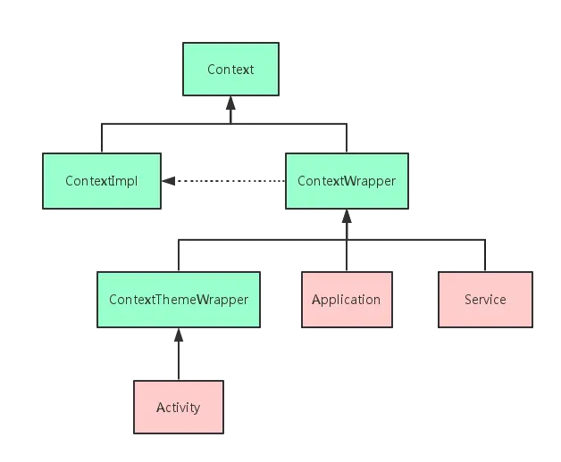
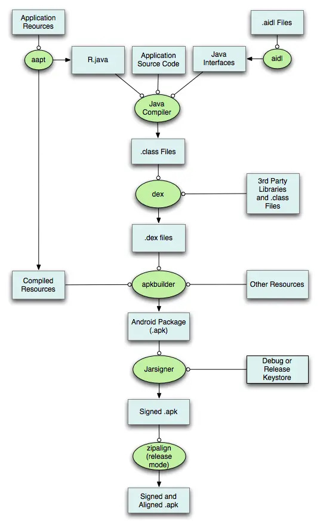

## Activity的生命周期
??? answer "答案"
    在 Android 开发中，Activity 是应用程序的核心组件之一，负责管理用户界面和用户交互。Activity 的生命周期由一系列回调方法组成，开发者可以通过重写这些方法来管理 Activity 的状态和行为。以下是 Activity 生命周期的主要方法：

    ### 1. **onCreate()**
    - **调用时机**：Activity 首次创建时调用。
    - **作用**：通常用于执行一次性初始化操作，如设置布局 (`setContentView`)、初始化变量、绑定数据等。
    - **参数**：`Bundle savedInstanceState` 保存了 Activity 之前的状态（如果有）。

    ### 2. **onStart()**
    - **调用时机**：Activity 即将变为可见状态时调用。
    - **作用**：Activity 进入前台，但用户还不能与之交互。通常用于准备 UI 或启动后台任务。

    ### 3. **onResume()**
    - **调用时机**：Activity 进入前台并可以与用户交互时调用。
    - **作用**：Activity 处于活动状态，用户可以与之交互。通常用于启动动画、传感器、摄像头等资源。

    ### 4. **onPause()**
    - **调用时机**：Activity 失去焦点但仍部分可见时调用（例如，弹出对话框或另一个 Activity 覆盖）。
    - **作用**：通常用于释放资源、保存数据或停止动画等操作。此方法应快速执行，因为下一个 Activity 的 `onResume()` 会等待此方法完成。

    ### 5. **onStop()**
    - **调用时机**：Activity 完全不可见时调用（例如，用户切换到其他应用或另一个 Activity 完全覆盖当前 Activity）。
    - **作用**：释放不再需要的资源，或执行较耗时的操作（如保存数据到数据库）。

    ### 6. **onDestroy()**
    - **调用时机**：Activity 被销毁前调用（例如，用户按下返回键或调用 `finish()` 方法）。
    - **作用**：释放所有资源，确保没有内存泄漏。

    ### 7. **onRestart()**
    - **调用时机**：Activity 从停止状态重新启动时调用（例如，用户从其他应用返回）。
    - **作用**：通常用于重新初始化在 `onStop()` 中释放的资源。

    ---

    ### 生命周期图示
    以下是 Activity 生命周期的典型流程：

    ```
    onCreate() -> onStart() -> onResume() -> Activity 运行中
        ↑          |               |
        |          |               |
        |       onStop()        onPause()
        |          |               |
        |          ↓               ↓
    onDestroy() <- onRestart() <- onStop()
    ```

    ---

    ### 特殊情况
    1. **配置更改（如屏幕旋转）**：
    - Activity 会被销毁并重新创建，调用 `onDestroy()` 和 `onCreate()`。
    - 可以通过 `onSaveInstanceState()` 保存临时数据，并在 `onCreate()` 或 `onRestoreInstanceState()` 中恢复。

    2. **后台被系统回收**：
    - 如果系统内存不足，后台的 Activity 可能会被销毁。此时可以通过 `onSaveInstanceState()` 保存状态，并在重新创建时恢复。

    ---

    ### 常用场景
    - **初始化操作**：在 `onCreate()` 中完成。
    - **资源释放**：在 `onPause()` 或 `onStop()` 中完成。
    - **数据保存**：在 `onPause()` 或 `onSaveInstanceState()` 中完成。
    - **恢复数据**：在 `onCreate()` 或 `onRestoreInstanceState()` 中完成。

    理解 Activity 的生命周期对于开发稳定、高效的 Android 应用至关重要。


## Fragment的生命周期
??? answer "答案"
    在 Android 开发中，Fragment 是一个可以嵌入到 Activity 中的模块化组件，用于构建灵活的用户界面。Fragment 的生命周期与 Activity 的生命周期密切相关，但也有其独特的回调方法。以下是 Fragment 生命周期的主要方法：

    ---

    ### 1. **onAttach()**
    - **调用时机**：Fragment 与 Activity 关联时调用。
    - **作用**：可以获取与 Fragment 关联的 Activity 引用，通常用于初始化与 Activity 的交互。

    ### 2. **onCreate()**
    - **调用时机**：Fragment 创建时调用。
    - **作用**：用于初始化 Fragment 的变量和状态。此时 Fragment 的视图尚未创建。

    ### 3. **onCreateView()**
    - **调用时机**：Fragment 创建其视图层次结构时调用。
    - **作用**：返回 Fragment 的视图（通过 `LayoutInflater` 加载布局）。如果 Fragment 没有 UI，可以返回 `null`。
    - **参数**：
        - `LayoutInflater inflater`：用于加载布局。
        - `ViewGroup container`：父容器。
        - `Bundle savedInstanceState`：保存的状态数据。

    ### 4. **onViewCreated()**
    - **调用时机**：`onCreateView()` 返回后调用，视图已经创建完成。
    - **作用**：可以在此方法中对视图进行初始化操作（如查找视图、设置监听器等）。

    ### 5. **onActivityCreated()**
    - **调用时机**：关联的 Activity 的 `onCreate()` 方法完成后调用。
    - **作用**：可以在此方法中执行与 Activity 相关的初始化操作（例如，依赖 Activity 的视图或数据）。

    ### 6. **onStart()**
    - **调用时机**：Fragment 变为可见状态时调用。
    - **作用**：Fragment 进入前台，但用户还不能与之交互。

    ### 7. **onResume()**
    - **调用时机**：Fragment 可以与用户交互时调用。
    - **作用**：Fragment 处于活动状态，用户可以与之交互。

    ### 8. **onPause()**
    - **调用时机**：Fragment 失去焦点但仍部分可见时调用。
    - **作用**：通常用于释放资源或保存数据。

    ### 9. **onStop()**
    - **调用时机**：Fragment 完全不可见时调用。
    - **作用**：释放不再需要的资源。

    ### 10. **onDestroyView()**
    - **调用时机**：Fragment 的视图被销毁时调用。
    - **作用**：清理与视图相关的资源。

    ### 11. **onDestroy()**
    - **调用时机**：Fragment 被销毁时调用。
    - **作用**：释放所有资源。

    ### 12. **onDetach()**
    - **调用时机**：Fragment 与 Activity 解除关联时调用。
    - **作用**：清理与 Activity 的引用。

    ---

    ### 生命周期图示
    以下是 Fragment 生命周期的典型流程：

    ```
    onAttach() -> onCreate() -> onCreateView() -> onViewCreated() -> onActivityCreated()
        ↑                                                                 |
        |                                                                 ↓
    onDetach() <- onDestroy() <- onDestroyView() <- onStop() <- onPause()
    ```

    ---

    ### Fragment 与 Activity 生命周期的关系
    Fragment 的生命周期受其宿主 Activity 的生命周期影响。例如：
    - 当 Activity 的 `onCreate()` 被调用时，Fragment 的 `onAttach()`、`onCreate()` 和 `onCreateView()` 会被调用。
    - 当 Activity 的 `onDestroy()` 被调用时，Fragment 的 `onDestroyView()`、`onDestroy()` 和 `onDetach()` 会被调用。

    ---

    ### 特殊情况
    1. **Fragment 的 `setRetainInstance(true)`**：
    - 当 Activity 因配置更改（如屏幕旋转）被销毁并重新创建时，Fragment 不会被销毁，而是保留实例。
    - 适用于需要在配置更改时保留数据的场景。

    2. **Fragment 的 `onSaveInstanceState()`**：
    - 用于保存 Fragment 的临时状态（类似于 Activity 的 `onSaveInstanceState()`）。
    - 在 `onCreate()`、`onCreateView()` 或 `onViewCreated()` 中可以通过 `savedInstanceState` 恢复状态。

    ---

    ### 常用场景
    - **初始化视图**：在 `onCreateView()` 或 `onViewCreated()` 中完成。
    - **释放资源**：在 `onPause()`、`onStop()` 或 `onDestroyView()` 中完成。
    - **保存状态**：在 `onSaveInstanceState()` 中完成。
    - **恢复状态**：在 `onCreate()`、`onCreateView()` 或 `onViewCreated()` 中完成。

    理解 Fragment 的生命周期对于构建灵活、高效的 Android 应用至关重要，尤其是在使用多个 Fragment 构建复杂 UI 时。


## Android Fragment为什么不能直接初始化传递参数，而是要用什么args
??? answer "答案"
    在 Android 开发中，Fragment 不能直接通过构造函数传递参数，主要是因为系统在重建 Fragment 时可能会调用默认的无参构造函数。为了确保 Fragment 在重建时能够正确恢复状态，Android 推荐使用 `Bundle` 和 `arguments` 来传递参数。arguments类型就是Bundle。

    ### 原因
    1. **系统重建 Fragment**：当系统重建 Fragment（如屏幕旋转、内存回收等）时，会调用默认的无参构造函数。如果依赖构造函数传递参数，这些参数会在重建时丢失。
    2. **生命周期管理**：Fragment 的生命周期由系统管理，直接通过构造函数传递参数可能导致不可预见的错误。

    ### 推荐方式：使用 `Bundle` 和 `arguments`
    通过 `Bundle` 传递参数可以确保在 Fragment 重建时参数能够正确恢复。

    #### 示例
    1. **创建 Fragment 并设置参数**：
    ```java
    public static MyFragment newInstance(String param1, int param2) {
        MyFragment fragment = new MyFragment();
        Bundle args = new Bundle();
        args.putString("key1", param1);
        args.putInt("key2", param2);
        fragment.setArguments(args);
        return fragment;
    }
    ```

    2. **在 Fragment 中获取参数**：
    ```java
    @Override
    public void onCreate(Bundle savedInstanceState) {
        super.onCreate(savedInstanceState);
        if (getArguments() != null) {
            String param1 = getArguments().getString("key1");
            int param2 = getArguments().getInt("key2");
        }
    }
    ```

    ### 总结
    使用 `Bundle` 和 `arguments` 传递参数是 Android 推荐的方式，能够确保 Fragment 在重建时参数不会丢失，同时避免直接通过构造函数传递参数带来的问题。


    ### 关于 `Bundle` 和 `arguments` 的具体存储位置、存储流程以及恢复数据的流程。
    ---

    ### **1. 存储位置**
    `Bundle` 和 `arguments` 的数据最终会被存储到以下两个地方之一：
    1. **内存**：如果 Activity 或 Fragment 只是被暂时销毁（例如屏幕旋转），数据会保存在内存中。
    2. **磁盘**：如果系统内存不足，Activity 或 Fragment 被完全销毁，数据会被序列化并保存到磁盘（具体来说是保存到 `Activity` 的 `onSaveInstanceState` 生成的 `Bundle` 中）。

    ---

    ### **2. 存储流程**
    当系统需要销毁并重建 Fragment 时，数据的存储流程如下：

    #### **步骤 1：Fragment 的 `onSaveInstanceState` 被调用**
    - 当 Fragment 即将被销毁时，系统会调用 `onSaveInstanceState(Bundle outState)` 方法。
    - 如果 Fragment 有通过 `setArguments()` 设置的 `arguments`，系统会将这些 `arguments` 保存到 `outState` 中。

    #### **步骤 2：数据写入 `Bundle`**
    - `Bundle` 是一个键值对容器，内部使用 `ArrayMap` 存储数据。
    - 数据会被序列化为字节流（通过 `Parcel` 实现），并写入 `Bundle`。

    #### **步骤 3：`Bundle` 保存到内存或磁盘**
    - 如果 Activity 或 Fragment 只是暂时销毁（例如屏幕旋转），`Bundle` 会保存在内存中。
    - 如果系统内存不足，Activity 或 Fragment 被完全销毁，`Bundle` 会被序列化并保存到磁盘（通过 `Activity` 的 `onSaveInstanceState` 机制）。

    ---

    ### **3. 恢复数据的流程**
    当 Fragment 被重建时，数据的恢复流程如下：

    #### **步骤 1：Fragment 的默认构造函数被调用**
    - 系统会调用 Fragment 的无参构造函数创建一个新的 Fragment 实例。

    #### **步骤 2：`Bundle` 数据恢复**
    - 系统会将之前保存的 `Bundle` 数据通过 `setArguments(Bundle args)` 方法传递给新的 Fragment 实例。
    - 这个 `Bundle` 就是之前通过 `onSaveInstanceState` 保存的数据。

    #### **步骤 3：Fragment 的 `onCreate` 被调用**
    - 在 `onCreate(Bundle savedInstanceState)` 方法中，可以通过 `getArguments()` 获取到之前保存的 `arguments`。
    - 如果 `savedInstanceState` 不为空，也可以通过它获取其他状态数据。

    ---

    ### **4. 具体存储和恢复的代码示例**

    #### **存储数据**
    ```java
    @Override
    public void onSaveInstanceState(Bundle outState) {
        super.onSaveInstanceState(outState);
        // 保存额外的数据到 outState
        outState.putString("key", "value");
    }
    ```

    #### **恢复数据**
    ```java
    @Override
    public void onCreate(Bundle savedInstanceState) {
        super.onCreate(savedInstanceState);
        if (savedInstanceState != null) {
            // 从 savedInstanceState 中恢复数据
            String value = savedInstanceState.getString("key");
        }
        if (getArguments() != null) {
            // 从 arguments 中恢复数据
            String param1 = getArguments().getString("key1");
        }
    }
    ```

    ---

    ### **5. 存储和恢复的底层流程**

    #### **存储流程**
    1. 系统调用 `Fragment.onSaveInstanceState(Bundle outState)`。
    2. `arguments` 被写入 `outState`。
    3. `outState` 被序列化为字节流（通过 `Parcel`）。
    4. 字节流被保存到内存或磁盘。

    #### **恢复流程**
    1. 系统调用 Fragment 的无参构造函数创建新实例。
    2. 系统将之前保存的 `Bundle` 数据通过 `setArguments(Bundle args)` 传递给新实例。
    3. 在 `onCreate(Bundle savedInstanceState)` 中，可以通过 `getArguments()` 或 `savedInstanceState` 获取数据。

    ---

    ### **6. 总结**
    - **存储位置**：`Bundle` 和 `arguments` 的数据最终存储在内存或磁盘中。
    - **存储流程**：通过 `onSaveInstanceState` 将数据写入 `Bundle`，然后序列化并保存。
    - **恢复流程**：系统通过 `setArguments` 将保存的 `Bundle` 传递给新的 Fragment 实例，并在 `onCreate` 中恢复数据。

    这种机制确保了 Fragment 在重建时能够正确恢复状态，避免了数据丢失。


## Activity的启动模式，以及它们之间的区别？
??? answer "答案"
    在Android开发中，Activity的启动模式（Launch Mode）决定了Activity的实例如何与任务栈（Task）关联。Android提供了四种启动模式，每种模式适用于不同的场景。

    ### 1. **standard（标准模式）**
    - **默认模式**：每次启动Activity都会创建一个新的实例，并放入当前任务栈中。
    - **特点**：
    - 每次启动都会创建新实例。
    - 同一个Activity可以有多个实例存在于不同的任务栈中。
    - **适用场景**：
    - 大多数普通Activity。
    - 不需要特殊处理的任务栈管理。

    ### 2. **singleTop（栈顶复用模式）**
    - **特点**：
    - 如果Activity已经位于任务栈的栈顶，则不会创建新实例，而是复用栈顶的实例，并调用`onNewIntent()`方法。
    - 如果Activity不在栈顶，则会创建新实例。
    - **适用场景**：
    - 避免重复创建同一个Activity的实例。
    - 例如，通知栏点击打开同一个Activity时，避免重复创建。

    ### 3. **singleTask（栈内单例模式）**
    - **特点**：
    - 系统会检查任务栈中是否已存在该Activity的实例。如果存在，则将该实例之上的所有Activity出栈，使其成为栈顶，并调用`onNewIntent()`方法。
    - 如果不存在，则创建新实例并放入任务栈。
    - 该模式通常会在一个新的任务栈中创建Activity（通过`taskAffinity`属性指定）。
    - **适用场景**：
    - 需要保证某个Activity在任务栈中只有一个实例。
    - 例如，应用的主页（Home Activity）通常使用此模式，确保用户返回到主页时，其他Activity都被清除。

    ### 4. **singleInstance（单实例模式）**
    - **特点**：
    - 该Activity会单独运行在一个新的任务栈中，且该任务栈中只能有这一个Activity。
    - 如果再次启动该Activity，则会复用已有的实例，并调用`onNewIntent()`方法。
    - **适用场景**：
    - 需要完全独立运行的Activity。
    - 例如，来电界面或闹钟界面，确保它们独立于其他任务栈。

    ---

    ### 启动模式的设置方式
    1. **在`AndroidManifest.xml`中声明**：
    ```xml
    <activity android:name=".MyActivity"
        android:launchMode="singleTask" />
    ```
    2. **通过Intent标志设置**：
    ```java
    Intent intent = new Intent(this, MyActivity.class);
    intent.addFlags(Intent.FLAG_ACTIVITY_SINGLE_TOP);
    startActivity(intent);
    ```

    ---

    ### 总结对比
    | 启动模式      | 是否创建新实例 | 是否复用实例 | 任务栈管理                     | 适用场景                         |
    |---------------|----------------|--------------|--------------------------------|----------------------------------|
    | **standard**  | 总是创建       | 否           | 放入当前任务栈                 | 普通Activity                    |
    | **singleTop** | 栈顶时不创建   | 栈顶时复用   | 放入当前任务栈                 | 避免栈顶重复创建（如通知跳转）   |
    | **singleTask**| 栈内无时创建   | 栈内时复用   | 可能创建新任务栈               | 主页或唯一实例（如主界面）       |
    | **singleInstance** | 新任务栈中创建 | 总是复用     | 单独任务栈，仅一个Activity     | 完全独立运行（如来电界面）       |

    ---

    ### 实际应用场景
    1. **standard**：普通页面跳转，如列表页跳转到详情页。
    2. **singleTop**：避免重复打开同一个页面，如通知栏点击打开同一个页面。
    3. **singleTask**：应用主页，确保用户返回时回到主页并清除其他页面。
    4. **singleInstance**：独立运行的页面，如来电界面或闹钟界面。

    通过合理使用启动模式，可以有效管理Activity的实例和任务栈，提升用户体验和应用性能。


## Android Handler消息机制原理？
??? answer "答案"
    Android 的 Handler 消息机制用于线程间通信，主要由 Handler、Message、MessageQueue 和 Looper 四个核心组件构成。

    ### 1. Handler
    - **作用**：发送和处理消息。
    - **功能**：
    - 发送消息到 MessageQueue。
    - 从 MessageQueue 中取出消息并处理。

    ### 2. Message
    - **作用**：消息的载体。
    - **内容**：包含消息标识（what）、数据（obj）、处理时间（when）等。

    ### 3. MessageQueue
    - **作用**：消息队列，存储待处理的消息。
    - **特点**：按时间顺序排列，Looper 从中取出消息。

    ### 4. Looper
    - **作用**：消息循环，不断从 MessageQueue 中取出消息并分发给 Handler。
    - **特点**：
    - 每个线程只能有一个 Looper。
    - 通过 `Looper.prepare()` 创建，`Looper.loop()` 启动循环。

    ### 工作流程
    1. **创建 Looper**：`Looper.prepare()` 创建 Looper 并绑定到当前线程。
    2. **启动消息循环**：`Looper.loop()` 开始循环，从 MessageQueue 中取出消息。
    3. **发送消息**：Handler 发送消息到 MessageQueue。
    4. **处理消息**：Looper 将消息分发给 Handler 的 `handleMessage()` 方法处理。

    ### 示例代码
    ```java
    // 创建 Looper 并启动消息循环
    new Thread(() -> {
        Looper.prepare();
        Handler handler = new Handler() {
            @Override
            public void handleMessage(Message msg) {
                // 处理消息
            }
        };
        Looper.loop();
    }).start();

    // 发送消息
    handler.sendMessage(handler.obtainMessage(1, "Hello"));
    ```

    ### 总结
    - **Handler**：发送和处理消息。
    - **Message**：消息载体。
    - **MessageQueue**：存储消息。
    - **Looper**：循环取出消息并分发。

    该机制实现了线程间的异步通信，广泛应用于 Android 开发。

## MessageQuene是什么数据结构，为什么可以插入？什么情况会插入？
??? answer "答案"
    ### MessageQueue 的数据结构
    `MessageQueue` 是一个基于**单向链表**的优先级队列，消息按时间顺序排列，时间最早的消息在链表头部。

    源码入下
    ```java
    public final class MessageQueue {
        private static final String TAG = "MessageQueue";
        private static final boolean DEBUG = false;

        // True if the message queue can be quit.
        @UnsupportedAppUsage
        private final boolean mQuitAllowed;

        @UnsupportedAppUsage
        @SuppressWarnings("unused")
        private long mPtr; // used by native code

        @UnsupportedAppUsage
        Message mMessages;
        private Message mLast;
        @UnsupportedAppUsage
        private final ArrayList<IdleHandler> mIdleHandlers = new ArrayList<IdleHandler>();
        private SparseArray<FileDescriptorRecord> mFileDescriptorRecords;
        private IdleHandler[] mPendingIdleHandlers;
        private boolean mQuitting;

    ```

    ### 为什么可以插入？
    `MessageQueue` 提供了 `enqueueMessage()` 方法，用于插入消息。插入时，会根据消息的 `when`（处理时间）将其插入到合适的位置，确保队列按时间顺序排列。

    ### 插入操作
    1. **插入到链表头部**：如果队列为空或新消息的处理时间早于当前头部消息。
    2. **插入到链表中间**：如果新消息的处理时间介于已有消息之间。
    3. **插入到链表尾部**：如果新消息的处理时间最晚。

    ### 插入的时机
    1. **Handler 发送消息**：
    - `sendMessage(Message msg)`
    - `sendMessageDelayed(Message msg, long delayMillis)`
    - `post(Runnable r)`
    - `postDelayed(Runnable r, long delayMillis)`

    2. **定时任务**：
    - 使用 `Handler` 的 `sendMessageDelayed()` 或 `postDelayed()` 方法发送延迟消息。

    3. **IdleHandler**：
    - 当 `MessageQueue` 空闲时，插入 `IdleHandler` 任务。

    ### 示例代码
    ```java
    Handler handler = new Handler(Looper.getMainLooper()) {
        @Override
        public void handleMessage(Message msg) {
            // 处理消息
        }
    };

    // 发送即时消息
    handler.sendMessage(handler.obtainMessage(1, "Hello"));

    // 发送延迟消息
    handler.sendMessageDelayed(handler.obtainMessage(2, "Delayed Hello"), 1000);

    // 使用 post 方法发送 Runnable
    handler.post(() -> {
        // 执行任务
    });

    // 使用 postDelayed 方法发送延迟 Runnable
    handler.postDelayed(() -> {
        // 执行延迟任务
    }, 1000);
    ```

    ### 总结
    - **数据结构**：基于单向链表的优先级队列。
    - **插入操作**：通过 `enqueueMessage()` 方法按时间顺序插入。
    - **插入时机**：Handler 发送消息、定时任务、IdleHandler 等场景。

    这种设计确保了消息按时间顺序处理，适合异步任务调度。

## 哪些系统类有Handler？
??? answer "答案"
    在 Android 中，`Handler` 是一个用于在不同线程间传递和处理消息的类。以下是一些常见的系统类会使用 `Handler`：

    ### 1. **Activity**
    - **用途**: 用于在主线程中更新 UI。
    - **原因**: Android 规定 UI 操作必须在主线程（UI 线程）中进行，`Handler` 可以帮助将任务从后台线程传递到主线程执行。

    ### 2. **Service**
    - **用途**: 用于在后台线程中处理耗时操作，并通过 `Handler` 将结果传递回主线程。
    - **原因**: 服务可能运行在后台线程，但结果可能需要更新 UI 或通知用户。

    ### 3. **AsyncTask**
    - **用途**: 内部使用 `Handler` 将后台任务的结果传递回主线程。
    - **原因**: `AsyncTask` 用于简化后台任务与 UI 更新的交互，`Handler` 是其实现机制的一部分。

    ### 4. **HandlerThread**
    - **用途**: 提供一个带有 `Looper` 的线程，方便使用 `Handler` 进行消息处理。
    - **原因**: 适用于需要在独立线程中处理消息的场景。

    ### 5. **ViewRootImpl**
    - **用途**: 用于处理 UI 事件和更新。
    - **原因**: 确保 UI 更新操作在主线程中执行。

    ### 6. **InputMethodManager**
    - **用途**: 管理输入法相关操作。
    - **原因**: 输入法事件需要在主线程中处理，`Handler` 用于确保这一点。

    ### 7. **Choreographer**
    - **用途**: 协调动画、输入和绘制操作。
    - **原因**: 确保这些操作在主线程中按正确的顺序执行。

    ### 8. **WindowManager**
    - **用途**: 管理窗口的创建、更新和销毁。
    - **原因**: 窗口操作通常涉及 UI 更新，需要在主线程中处理。

    ### 为什么要使用 `Handler`？

    1. **线程间通信**: `Handler` 允许在不同线程间传递消息，确保 UI 更新在主线程中执行。
    2. **任务调度**: 可以延迟执行任务或定期执行任务。
    3. **简化代码**: 提供了一种简单的方式来处理异步任务和 UI 更新。
    4. **消息队列管理**: 通过 `Looper` 和 `MessageQueue` 管理消息，确保按顺序处理。

    总结来说，`Handler` 是 Android 中实现线程间通信和任务调度的核心工具，广泛应用于需要更新 UI 或处理异步任务的场景。


## Handler如何实现的延时操作？
??? answer "答案"
    主要是MQ管理，postDelay上去一个msg。mq会放到前面判断一层，然后阻塞MQ,定时唤醒MQ。
    如果此时有别的post事件，会唤醒MQ，直接将delay放到后面。执行post事件。

    `Handler` 的延时操作通过 `MessageQueue` 中消息的 **`when`** 字段实现。`when` 表示消息应被处理的时间戳，`Handler` 根据该字段决定何时处理消息。

    ### 实现原理

    1. **`when` 字段**：
    - 每个 `Message` 都有一个 `when` 字段，表示消息的处理时间。
    - `when` 的值是系统启动时间（`SystemClock.uptimeMillis()`）加上延时时间。

    2. **`MessageQueue` 的排序**：
    - `MessageQueue` 是一个按 `when` 排序的优先级队列。
    - 新消息插入时，会根据 `when` 插入到合适的位置，确保队列按时间顺序排列。

    3. **`Looper` 的处理**：
    - `Looper` 不断从 `MessageQueue` 中取出消息。
    - 如果当前时间小于消息的 `when`，`Looper` 会休眠，直到时间到达。

    ### 延时操作的实现步骤

    1. **发送延时消息**：
    - 使用 `Handler` 的 `sendMessageDelayed(Message msg, long delayMillis)` 或 `postDelayed(Runnable r, long delayMillis)` 方法。
    - 这些方法会计算 `when` 字段的值，并将其插入 `MessageQueue`。

    2. **计算 `when`**：
    - `when = SystemClock.uptimeMillis() + delayMillis`。
    - `SystemClock.uptimeMillis()` 返回系统启动到现在的毫秒数，不受系统时间修改影响。

    3. **插入 `MessageQueue`**：
    - `MessageQueue` 根据 `when` 的值将消息插入到合适的位置。

    4. **`Looper` 处理消息**：
    - `Looper` 从 `MessageQueue` 中取出消息时，如果当前时间小于 `when`，会休眠直到时间到达。
    - 时间到达后，`Looper` 将消息分发给 `Handler` 处理。

    ### 示例代码

    ```java
    Handler handler = new Handler(Looper.getMainLooper()) {
        @Override
        public void handleMessage(Message msg) {
            // 处理消息
            Log.d("Handler", "Message received: " + msg.obj);
        }
    };

    // 发送即时消息
    handler.sendMessage(handler.obtainMessage(1, "Hello"));

    // 发送延时消息（1秒后处理）
    handler.sendMessageDelayed(handler.obtainMessage(2, "Delayed Hello"), 1000);

    // 使用 postDelayed 发送延时 Runnable
    handler.postDelayed(() -> {
        Log.d("Handler", "Runnable executed");
    }, 2000);
    ```

    ### 关键点

    - **`when` 字段**：决定消息的处理时间。
    - **`MessageQueue` 排序**：按 `when` 排序，确保消息按时间顺序处理。
    - **`Looper` 的休眠机制**：如果当前时间未到，`Looper` 会休眠，避免忙等待。

    ### 总结

    `Handler` 的延时操作通过 `Message` 的 `when` 字段和 `MessageQueue` 的排序机制实现。`Looper` 根据 `when` 决定何时处理消息，从而实现精确的延时操作。这种机制高效且节省资源，适合 Android 的异步任务调度。

## Handler,Thread和HandlerThread的差别
??? answer "答案"
    在Android开发中，`Handler`、`Thread`和`HandlerThread`是常用的多线程处理工具，它们各自有不同的用途和特点。以下是它们的区别：

    ### 1. **Thread**
    - **定义**：`Thread`是Java中的基本多线程实现类，用于创建并执行异步任务。
    - **特点**：
    - 直接继承`Thread`类或实现`Runnable`接口来创建线程。
    - 适用于执行耗时操作（如网络请求、文件读写等）。
    - 线程执行完成后会自动销毁。
    - **缺点**：
    - 无法直接更新UI（Android的UI线程是单线程模型，非UI线程不能直接操作UI）。
    - 需要手动管理线程的生命周期和资源释放。
    - **示例**：
    ```java
    new Thread(new Runnable() {
        @Override
        public void run() {
            // 执行耗时操作
        }
    }).start();
    ```

    ---

    ### 2. **Handler**
    - **定义**：`Handler`是Android中用于线程间通信的工具，通常与`Looper`和`MessageQueue`配合使用。
    - **特点**：
    - 主要用于在主线程和子线程之间传递消息或任务。
    - 可以将任务（`Runnable`）或消息（`Message`）发送到与`Handler`关联的线程中执行。
    - 通常用于更新UI（因为`Handler`可以绑定到主线程的`Looper`）。
    - **使用场景**：
    - 在子线程中执行耗时操作后，通过`Handler`将结果发送到主线程更新UI。
    - **示例**：
    ```java
    Handler handler = new Handler(Looper.getMainLooper());
    new Thread(new Runnable() {
        @Override
        public void run() {
            // 执行耗时操作
            handler.post(new Runnable() {
                @Override
                public void run() {
                    // 在主线程更新UI
                }
            });
        }
    }).start();
    ```

    ---

    ### 3. **HandlerThread**
    - **定义**：`HandlerThread`是Android提供的一个带有`Looper`的线程类，结合了`Thread`和`Handler`的功能。
    - **特点**：
    - 继承自`Thread`，内部实现了`Looper`，可以直接使用`Handler`。
    - 适用于需要长时间运行


## HandlerThread特征
??? answer "答案"
    1. HandlerThread其实是Handler+Thread+Looper的组合，它本质上是一个Thread，因为它继承了Thread，相比普通的Thread，他不会阻塞，因为它内部通过Looper实现了消息循环机制，保证了多个任务的串行执行。缺点：效率低。
    2. HandlerThread需要搭配Handler使用，单独使用的意义不大。HandlerThread线程中作具体的事情，必须要在Handler的callback接口中进行，他自己的run方法被写死了。
    3. 子线程中的Handler与HandlerThread的联系是通过childHandler=new Handler(handlerThread.getLooper(),mSubCallback)执行的，也就是说，childHandler获得HandlerThread线程的Looper，这样他们两个就在同一个阵营了，这也就是创建Handler作为HandlerThread线程消息执行者，必须在调用start()方法之后的原因 —— HandlerThread.start()之后，run方法才能跑起来，Looper才得以创建，handlerThread.getLooper()才不会出错。
    4. HandlerThread会将通过handleMessage传递进来的任务进行串行执行，由messageQueue的特性决定的，从而也说明了HandlerThread效率相对比较低。

## Android平台，哪些情况下会导致内存泄漏？
??? answer "答案"
    在Android平台上，内存泄漏通常发生在以下情况下：

    ### 1. **静态引用**
    - **静态变量**：静态变量持有Activity或Context的引用，导致其无法被回收。
    - **单例模式**：单例类持有Context引用，且未及时释放。

    ### 2. **非静态内部类**
    - **Handler**：非静态内部类Handler持有外部类（如Activity）的引用，若Handler未处理完消息，Activity无法被回收。
    - **AsyncTask**：非静态内部类AsyncTask持有外部类引用，若任务未完成，外部类无法被回收。

    ### 3. **资源未释放**
    - **未关闭的Cursor**：数据库查询后未关闭Cursor。
    - **未释放的Bitmap**：Bitmap使用后未调用`recycle()`方法。
    - **未取消的监听器**：注册的监听器未及时取消。

    ### 4. **匿名内部类**
    - **匿名内部类**：匿名内部类隐式持有外部类引用，若其生命周期长于外部类，会导致内存泄漏。

    ### 5. **Context引用**
    - **错误的Context使用**：使用Activity Context代替Application Context，导致Activity无法被回收。

    ### 6. **集合类**
    - **未清理的集合**：集合类持有对象引用，未及时清理会导致对象无法被回收。

    ### 7. **线程**
    - **未终止的线程**：线程持有Activity引用且未终止，导致Activity无法被回收。

    ### 8. **WebView**
    - **WebView未销毁**：WebView持有Context引用，未调用`destroy()`方法会导致内存泄漏。

    ### 9. **动画**
    - **未取消的动画**：无限循环的动画未及时取消，会导致Activity无法被回收。

    ### 10. **第三方库**
    - **第三方库问题**：某些第三方库可能存在内存泄漏问题，需及时更新或修复。

    ### 预防措施
    - 使用弱引用（WeakReference）避免强引用。
    - 及时释放资源，如关闭Cursor、释放Bitmap等。
    - 使用Application Context代替Activity Context。
    - 避免在非静态内部类中持有外部类引用。
    - 使用工具如LeakCanary检测内存泄漏。

    通过这些措施，可以有效减少内存泄漏的发生。


## Android平台的网络请求导致内存泄漏
??? answer "答案"
    Android平台网络请求引起的内存泄漏
    是的，在Android平台上，网络请求确实可能引起内存泄漏。以下是几种常见的情况：

    常见的内存泄漏案例
    1. 持有Activity/Fragment引用的回调
    案例：

    java
    复制
    public class MyActivity extends AppCompatActivity {
        @Override
        protected void onCreate(Bundle savedInstanceState) {
            super.onCreate(savedInstanceState);
            
            ApiClient.getUserData(new Callback() {
                @Override
                public void onSuccess(UserData data) {
                    // 更新UI
                    updateUI(data);
                }
                
                @Override
                public void onFailure(Error error) {
                    showError(error);
                }
            });
        }
        
        private void updateUI(UserData data) {
            // 更新UI代码
        }
    }
    泄漏对象：Activity实例

    原因：匿名内部类Callback隐式持有外部类MyActivity的引用。如果网络请求耗时较长，而用户在请求完成前旋转屏幕或退出Activity，Activity实例将因为被Callback持有而无法被GC回收。

    解决方案
    1 使用弱引用：

    java
    WeakReference<MyActivity> weakActivity = new WeakReference<>(this);

    2 及时取消请求：

    java
    @Override
    protected void onDestroy() {
        super.onDestroy();
        if (disposable != null && !disposable.isDisposed()) {
            disposable.dispose();
        }
        // 或者取消Retrofit Call
        call.cancel();
    }
    3 使用ViewModel+LiveData架构，将网络请求与UI生命周期分离

    4 使用静态内部类+弱引用处理Handler

    5 使用Android Jetpack的Lifecycle-aware组件，如协程的lifecycleScope


## 如何使用Handler操作UI才不会导致内存泄漏？
??? answer "答案"
    在Android中使用`Handler`操作UI时，如果不注意，很容易导致内存泄漏。以下是正确使用`Handler`以避免内存泄漏的方法：

    ---

    ### 1. **使用静态内部类 + 弱引用**
    - 将`Handler`定义为静态内部类，避免隐式持有外部类（如Activity）的引用。
    - 使用`WeakReference`引用外部类，确保在外部类被销毁时可以被垃圾回收。

    ```java
    public class MyActivity extends AppCompatActivity {
        private MyHandler mHandler = new MyHandler(this);

        private static class MyHandler extends Handler {
            private final WeakReference<MyActivity> mActivity;

            MyHandler(MyActivity activity) {
                mActivity = new WeakReference<>(activity);
            }

            @Override
            public void handleMessage(Message msg) {
                MyActivity activity = mActivity.get();
                if (activity != null) {
                    // 操作UI
                    activity.updateUI();
                }
            }
        }

        private void updateUI() {
            // 更新UI的逻辑
        }
    }
    ```

    ---

    ### 2. **在`onDestroy()`中移除回调**
    - 在Activity或Fragment销毁时，调用`Handler`的`removeCallbacksAndMessages(null)`方法，移除所有未处理的消息和回调。

    ```java
    @Override
    protected void onDestroy() {
        super.onDestroy();
        mHandler.removeCallbacksAndMessages(null); // 移除所有消息
    }
    ```

    ---

    ### 3. **使用`Lifecycle`感知的Handler**
    - 在Android中，可以使用`Lifecycle`相关的组件（如`LiveData`或`ViewModel`）来替代`Handler`，避免直接操作UI。
    - 如果需要使用`Handler`，可以结合`LifecycleObserver`，在生命周期结束时自动移除回调。

    ```java
    public class MyLifecycleHandler implements LifecycleObserver {
        private Handler mHandler = new Handler(Looper.getMainLooper());
        private Runnable mRunnable;

        public MyLifecycleHandler(Lifecycle lifecycle, Runnable runnable) {
            mRunnable = runnable;
            lifecycle.addObserver(this);
        }

        @OnLifecycleEvent(Lifecycle.Event.ON_START)
        void start() {
            mHandler.postDelayed(mRunnable, 1000); // 延迟执行
        }

        @OnLifecycleEvent(Lifecycle.Event.ON_STOP)
        void stop() {
            mHandler.removeCallbacks(mRunnable); // 移除回调
        }
    }
    ```

    ---

    ### 4. **使用`HandlerThread`**
    - 如果需要后台线程处理任务并更新UI，可以使用`HandlerThread`，它结合了`Handler`和`Thread`的优点。
    - 在`HandlerThread`中处理耗时任务，通过`Handler`将结果发送到主线程更新UI。

    ```java
    HandlerThread handlerThread = new HandlerThread("MyHandlerThread");
    handlerThread.start();
    Handler backgroundHandler = new Handler(handlerThread.getLooper());

    backgroundHandler.post(() -> {
        // 后台任务
        // 完成后通过主线程Handler更新UI
        mainHandler.post(() -> {
            // 更新UI
        });
    });
    ```

    ---

    ### 5. **避免匿名内部类或非静态内部类**
    - 避免直接使用匿名内部类或非静态内部类创建`Handler`，因为它们会隐式持有外部类的引用，导致内存泄漏。

    ```java
    // 错误示例：匿名内部类导致内存泄漏
    Handler leakyHandler = new Handler() {
        @Override
        public void handleMessage(Message msg) {
            // 操作UI
        }
    };
    ```

    ---

    ### 6. **使用`View.post()`或`Activity.runOnUiThread()`**
    - 如果只是简单地在主线程更新UI，可以直接使用`View.post()`或`Activity.runOnUiThread()`，避免手动创建`Handler`。

    ```java
    // 使用View.post()
    myView.post(() -> {
        // 更新UI
    });

    // 使用runOnUiThread()
    runOnUiThread(() -> {
        // 更新UI
    });
    ```

    ---

    ### 总结
    为了避免`Handler`导致的内存泄漏，可以采取以下措施：
    1. 使用静态内部类 + 弱引用。
    2. 在`onDestroy()`中移除所有回调。
    3. 使用`Lifecycle`感知的组件。
    4. 避免匿名内部类或非静态内部类。
    5. 使用`View.post()`或`runOnUiThread()`简化UI更新。

    通过这些方法，可以确保`Handler`不会持有Activity或Fragment的引用，从而避免内存泄漏。


## Looper如何保证线程内只有一个？
??? answer "答案"
    在 Android 中，`Looper` 用于管理线程的消息队列，确保线程能够处理消息和任务。为了保证一个线程内只有一个 `Looper`，`Looper` 类使用了以下机制：

    ### 1. `ThreadLocal` 存储
    `Looper` 使用 `ThreadLocal` 来存储每个线程的 `Looper` 实例。`ThreadLocal` 是线程局部变量，每个线程都有独立的副本，互不干扰。

    ```java
    static final ThreadLocal<Looper> sThreadLocal = new ThreadLocal<Looper>();
    ```

    ### 2. `prepare()` 方法
    在创建 `Looper` 时，必须调用 `Looper.prepare()`，该方法会检查当前线程是否已经有一个 `Looper`，如果有则抛出异常，确保每个线程只有一个 `Looper`。

    ```java
    public static void prepare() {
        prepare(true);
    }

    private static void prepare(boolean quitAllowed) {
        if (sThreadLocal.get() != null) {
            throw new RuntimeException("Only one Looper may be created per thread");
        }
        sThreadLocal.set(new Looper(quitAllowed));
    }
    ```

    ### 3. `myLooper()` 方法
    通过 `Looper.myLooper()` 可以获取当前线程的 `Looper` 实例，它从 `ThreadLocal` 中读取。

    ```java
    public static @Nullable Looper myLooper() {
        return sThreadLocal.get();
    }
    ```

    ### 4. `quit()` 和 `quitSafely()` 方法
    `Looper` 提供了退出方法，调用后 `Looper` 会停止处理消息，并从 `ThreadLocal` 中移除。

    ```java
    public void quit() {
        mQueue.quit(false);
    }

    public void quitSafely() {
        mQueue.quit(true);
    }
    ```

    ### 总结
    `Looper` 通过 `ThreadLocal` 和 `prepare()` 方法的检查机制，确保每个线程只能有一个 `Looper` 实例。这种设计保证了线程消息队列的唯一性和一致性。

## ThreadLocal为什么能保证多个线程内容相互隔离？
??? answer "答案"

    `ThreadLocal` 能够保证只有当前线程可以访问其存储的值，**并不仅仅是因为它定义在 `Thread` 类里面**，而是通过结合 `Thread` 类的内部设计和 `ThreadLocal` 的特殊实现机制共同实现的。JVM 并没有针对 `ThreadLocal` 做特殊的优化，而是依靠 Java 的线程模型和 `ThreadLocal` 的巧妙设计来保证线程隔离。

    ---

    ### **1. `ThreadLocal` 的核心实现原理**
    `ThreadLocal` 的核心在于：
    - 每个 `Thread` 对象内部维护了一个 **`ThreadLocalMap`**（类似于一个定制化的 `HashMap`），用于存储线程本地变量。
    - `ThreadLocalMap` 的 key 是 `ThreadLocal` 实例本身（弱引用），value 是线程存储的值。
    - 当调用 `ThreadLocal.set(value)` 时，实际上是将当前 `ThreadLocal` 实例作为 key，`value` 作为值，存入当前线程的 `ThreadLocalMap` 中。
    - 当调用 `ThreadLocal.get()` 时，会从当前线程的 `ThreadLocalMap` 中取出与当前 `ThreadLocal` 实例关联的值。

    关键代码逻辑（简化版）：
    ```java
    public void set(T value) {
        Thread t = Thread.currentThread();  // 获取当前线程
        ThreadLocalMap map = t.threadLocals; // 获取线程的 ThreadLocalMap
        if (map != null) {
            map.set(this, value);  // this 指当前 ThreadLocal 实例
        } else {
            createMap(t, value);  // 初始化 ThreadLocalMap
        }
    }

    public T get() {
        Thread t = Thread.currentThread();
        ThreadLocalMap map = t.threadLocals;
        if (map != null) {
            ThreadLocalMap.Entry e = map.getEntry(this);  // 用当前 ThreadLocal 实例作为 key 查找
            if (e != null) {
                return (T)e.value;
            }
        }
        return setInitialValue();
    }
    ```

    ---

    ### **2. 为什么只有当前线程能访问？**
    - **数据存储在线程对象中**：每个线程的 `ThreadLocalMap` 是线程私有的（`Thread.threadLocals` 字段），其他线程无法直接访问。
    - **通过 `ThreadLocal` 实例作为 key 区分数据**：即使多个线程使用同一个 `ThreadLocal` 实例，由于每个线程的 `ThreadLocalMap` 是独立的，它们存储的值互不影响。
    - **没有全局共享状态**：`ThreadLocal` 本身不存储任何数据，它只是一个访问线程本地数据的“工具类”。

    ---

    ### **3. 关键设计点**
    1. **`ThreadLocalMap` 是 `Thread` 的字段**  
    - 每个 `Thread` 对象在第一次调用 `ThreadLocal.set()` 或 `get()` 时会初始化自己的 `ThreadLocalMap`。
    - 由于线程之间不共享 `Thread` 对象，自然无法访问彼此的 `ThreadLocalMap`。

    2. **`ThreadLocal` 作为 key 的弱引用**  
    - `ThreadLocalMap` 的 key 是弱引用（`WeakReference<ThreadLocal>`），这是为了避免内存泄漏（当 `ThreadLocal` 实例被回收时，对应的 entry 能自动被清理）。

    3. **哈希冲突解决**  
    - `ThreadLocalMap` 使用线性探测法解决哈希冲突（而非链地址法），这是为了简化实现并减少内存占用。

    ---

    ### **4. 常见误解澄清**
    - **误解1：`ThreadLocal` 的值存储在 `ThreadLocal` 类中**  
    实际上，值存储在线程对象的 `ThreadLocalMap` 中，`ThreadLocal` 只是提供访问入口。
    
    - **误解2：JVM 做了特殊优化**  
    JVM 没有对 `ThreadLocal` 做特殊处理，它的线程隔离完全通过 Java 代码的设计实现。

    - **误解3：`ThreadLocal` 是线程安全的**  
    `ThreadLocal` 的线程隔离是天然的，但它存储的对象本身如果不是线程安全的，仍需额外同步（例如，多个线程通过 `ThreadLocal` 共享同一个 `ArrayList` 时仍需加锁）。

    ---

    ### **5. 总结**
    `ThreadLocal` 的线程隔离能力依赖于：
    1. 数据存储在线程私有的 `ThreadLocalMap` 中。
    2. 通过 `ThreadLocal` 实例作为 key 区分不同变量。
    3. 线程无法访问其他线程的 `Thread` 对象内部数据。

    这种设计避免了同步开销，同时保证了线程安全，是典型的 **“空间换时间”** 思想的应用。

## 为什么Looper.loop()方法一直在循环，App不会ANR?
??? answer "答案"
    Android面试中，你也许会被问到题目中的问题，这里我们基于以下几点来延伸解读其中原因：

    1、什么是ANR?ANR发生的原因是什么？

    2、Looper为什么要无限循环？

    3、线程的几种状态

    4、主线程中的Looper.loop()一直无限循环为什么不会造成ANR？


    ### 1、什么是ANR?ANR发生的原因是什么？

    ANR即Application Not Responding，顾名思义就是应用程序无响应。

    在Android中，一般情况下，四大组件均是工作在主线程中的，Android中的Activity Manager和Window Manager会随时监控应用程序的响应情况，如果因为一些耗时操作（网络请求或者IO操作）造成主线程阻塞一定时间（例如造成5s内不能响应用户事件或者BroadcastReceiver的onReceive方法执行时间超过10s），那么系统就会显示ANR对话框提示用户对应的应用处于无响应状态。

    简单总结就是以下两点：

    1. 不要让主线程干耗时的工作

    2. 不要让其他线程阻塞主线程的执行


    ### 2、Looper为什么要无限循环？

    Looper中重要的两个方法为prepare()、loop()


    prepare()源码

    Looper在prepare中通过ThreadLocal保证了每个线程Looper对象的唯一性，即对于每个线程，有唯一的Looper对象和MessageQueue队列

    loop()源码

    显而易见的，主线程中如果没有looper进行循环，那么主线程一运行完毕就会退出。那么我们还能运行APP吗，显然，这是不可能的，Looper主要就是做消息循环，然后由Handler进行消息分发处理，一旦退出消息循环，那么你的应用也就退出了。

    总结：Looper的无限循环必不可少

    ### 3、线程的几种状态

    很多读者会问，你说的好好地Looper，干嘛突然转到线程状态的知识点了呢？

    别急别急，请允许老衲细细道来。

    众所周知，线程的五大状态为：New、Runnable、Running、Blocked、Dead，而他们之间有者千丝万缕的关系，为了便于大家理解，看图说话

    线程状态图

    很多人会问，为什么有这么多Blocked?

    （1）新建状态（New）：新创建了一个线程对象。

    （2）就绪状态（Runnable）：线程对象创建后，其他线程调用了该对象的start()方法。该状态的线程位于可运行线程池中，变得可运行，等待获取CPU的使用权。

    （3）运行状态（Running）：就绪状态的线程获取了CPU，执行程序代码。

    （4）阻塞状态（Blocked）：阻塞状态是线程因为某种原因放弃CPU使用权，暂时停止运行。直到线程进入就绪状态，才有机会转到运行状态。阻塞的情况分三种：

    等待阻塞：运行的线程执行wait()方法，JVM会把该线程放入等待池中。

    同步阻塞：运行的线程在获取对象的同步锁时，若该同步锁被别的线程占用，则JVM会把该线程放入锁池中。

    其他阻塞：运行的线程执行sleep()或join()方法，或者发出了I/O请求时，JVM会把该线程置为阻塞状态。当sleep()状态超时、join()等待线程终止或者超时、或者I/O处理完毕时，线程重新转入就绪状态。

    不管线程进入哪种阻塞状态，都得等所等待的事件（wait、sleep、join、synchronized、I/O）完成后，才可以进入就绪队列，排队等待CPU资源

    （5）死亡状态（Dead）：线程执行完了或者因异常退出了run()方法，该线程结束生命周期。

    ### 4、主线程中的Looper.loop()一直无限循环为什么不会造成ANR？

    也许讲到这里，很多人已经知道原因了吧！不过习惯使然，我还是要总结一下。

    主线程Looper从消息队列读取消息，当读完所有消息时，主线程阻塞。子线程往消息队列发送消息，并且往管道文件写数据，主线程即被唤醒，从管道文件读取数据，主线程被唤醒只是为了读取消息，当消息读取完毕，再次睡眠。因此loop的循环并不会对CPU性能有过多的消耗。

    讲到这里，各位看官应该知道为什么上面要引入线程状态的了解了吧。


    对于线程即是一段可执行的代码，当可执行代码执行完成后，线程生命周期便该终止了，线程退出。而对于主线程，我们是绝不希望会被运行一段时间，自己就退出，那么如何保证能一直存活呢？简单做法就是可执行代码是能一直执行下去的，死循环便能保证不会被退出，例如，binder线程也是采用死循环的方法，通过循环方式不同与Binder驱动进行读写操作，当然并非简单地死循环，无消息时会休眠。但这里可能又引发了另一个问题，既然是死循环又如何去处理其他事务呢？通过创建新线程的方式。真正会卡死主线程的操作是在回调方法onCreate/onStart/onResume等操作时间过长，会导致掉帧，甚至发生ANR，looper.loop本身不会导致应用卡死。

    主线程的死循环一直运行是不是特别消耗CPU资源呢？ 其实不然，这里就涉及到Linux pipe/epoll机制，简单说就是在主线程的MessageQueue没有消息时，便阻塞在loop的queue.next()中的nativePollOnce()方法里，此时主线程会释放CPU资源进入休眠状态，直到下个消息到达或者有事务发生，通过往pipe管道写端写入数据来唤醒主线程工作。这里采用的epoll机制，是一种IO多路复用机制，可以同时监控多个描述符，当某个描述符就绪(读或写就绪)，则立刻通知相应程序进行读或写操作，本质同步I/O，即读写是阻塞的。 所以说，主线程大多数时候都是处于休眠状态，并不会消耗大量CPU资源。


## Looper细节
??? answer "答案"
    `Looper` 是 Android 中用于管理线程消息循环的核心类，它与 `Handler` 和 `MessageQueue` 共同构成了 Android 的消息机制。以下是 `Looper` 的源代码解析，帮助你理解其工作原理。

    ---

    ### 1. **核心成员变量**
    `Looper` 的核心成员变量如下：

    ```java
    public final class Looper {
        // ThreadLocal 存储每个线程的 Looper 实例
        static final ThreadLocal<Looper> sThreadLocal = new ThreadLocal<Looper>();

        // 主线程的 Looper
        private static Looper sMainLooper;

        // 消息队列
        final MessageQueue mQueue;

        // 当前线程
        final Thread mThread;

        // 是否允许退出
        private boolean mQuitAllowed;

        // 是否已经退出
        private boolean mQuitting;
    }
    ```

    - `sThreadLocal`：使用 `ThreadLocal` 存储每个线程的 `Looper` 实例，确保线程唯一性。
    - `mQueue`：`Looper` 管理的消息队列，用于存储和分发消息。
    - `mThread`：当前线程的引用。
    - `mQuitAllowed`：标识是否允许退出（主线程的 `Looper` 不允许退出）。
    - `mQuitting`：标识 `Looper` 是否已经退出。

    ---

    ### 2. **核心方法解析**

    #### **(1) `prepare()` 方法**
    `prepare()` 是初始化 `Looper` 的关键方法，每个线程只能调用一次。

    ```java
    public static void prepare() {
        prepare(true);
    }

    private static void prepare(boolean quitAllowed) {
        // 检查当前线程是否已经有一个 Looper
        if (sThreadLocal.get() != null) {
            throw new RuntimeException("Only one Looper may be created per thread");
        }
        // 创建 Looper 并存储到 ThreadLocal 中
        sThreadLocal.set(new Looper(quitAllowed));
    }
    ```

    - 如果当前线程已经有一个 `Looper`，则抛出异常。
    - 否则，创建一个新的 `Looper` 并存储到 `ThreadLocal` 中。

    ---

    #### **(2) `Looper` 构造函数**
    `Looper` 的构造函数是私有的，只能通过 `prepare()` 方法创建实例。

    ```java
    private Looper(boolean quitAllowed) {
        // 创建消息队列
        mQueue = new MessageQueue(quitAllowed);
        // 记录当前线程
        mThread = Thread.currentThread();
    }
    ```

    - 初始化 `MessageQueue`，用于存储消息。
    - 记录当前线程。

    ---

    #### **(3) `loop()` 方法**
    `loop()` 是 `Looper` 的核心方法，用于启动消息循环。

    ```java
    public static void loop() {
        // 获取当前线程的 Looper
        final Looper me = myLooper();
        if (me == null) {
            throw new RuntimeException("No Looper; Looper.prepare() wasn't called on this thread.");
        }
        // 获取消息队列
        final MessageQueue queue = me.mQueue;

        // 无限循环，处理消息
        for (;;) {
            // 从消息队列中取出消息
            Message msg = queue.next();
            if (msg == null) {
                // 没有消息时退出循环
                return;
            }

            // 分发消息给目标 Handler
            msg.target.dispatchMessage(msg);

            // 回收消息
            msg.recycleUnchecked();
        }
    }
    ```

    - 从 `MessageQueue` 中取出消息。
    - 将消息分发给目标 `Handler` 处理。
    - 回收消息对象，避免重复创建。

    ---

    #### **(4) `quit()` 和 `quitSafely()` 方法**
    这两个方法用于退出 `Looper` 的消息循环。

    ```java
    public void quit() {
        mQueue.quit(false); // 立即退出
    }

    public void quitSafely() {
        mQueue.quit(true); // 安全退出，处理完所有未处理的消息
    }
    ```

    - `quit()`：立即退出，丢弃未处理的消息。
    - `quitSafely()`：安全退出，处理完所有未处理的消息后再退出。

    ---

    #### **(5) `myLooper()` 方法**
    `myLooper()` 用于获取当前线程的 `Looper` 实例。

    ```java
    public static @Nullable Looper myLooper() {
        return sThreadLocal.get();
    }
    ```

    - 从 `ThreadLocal` 中获取当前线程的 `Looper`。

    ---

    #### **(6) `getMainLooper()` 方法**
    `getMainLooper()` 用于获取主线程的 `Looper`。

    ```java
    public static Looper getMainLooper() {
        synchronized (Looper.class) {
            return sMainLooper;
        }
    }
    ```

    - 返回主线程的 `Looper` 实例。

    ---

    ### 3. **主线程的 Looper 初始化**
    主线程的 `Looper` 是在 `ActivityThread` 中初始化的。

    ```java
    public static void main(String[] args) {
        // 初始化主线程的 Looper
        Looper.prepareMainLooper();

        // 创建 ActivityThread 实例
        ActivityThread thread = new ActivityThread();
        thread.attach(false);

        // 启动消息循环
        Looper.loop();
    }
    ```

    - `prepareMainLooper()` 会调用 `prepare(false)`，表示主线程的 `Looper` 不允许退出。
    - 然后调用 `loop()` 启动消息循环。

    ---

    ### 4. **总结**
    - `Looper` 通过 `ThreadLocal` 确保每个线程只有一个实例。
    - `prepare()` 方法用于初始化 `Looper`，`loop()` 方法用于启动消息循环。
    - `MessageQueue` 是 `Looper` 的核心，负责存储和分发消息。
    - 主线程的 `Looper` 在应用启动时自动初始化，其他线程需要手动调用 `prepare()` 和 `loop()`。

    通过以上解析，你可以深入理解 `Looper` 的工作原理及其在 Android 消息机制中的作用。


## 如何在当前线程中判断是否是主线程?
??? answer "答案"
    Looper.getMainLooper();


## MessageQueue.IdleHandler原理，以及用途。
??? answer "答案"
    `MessageQueue.IdleHandler` 是 Android 中 `MessageQueue` 的一个接口，用于在消息队列空闲时执行任务。以下是其原理和用途的详细说明：

    ### 原理

    1. **消息队列机制**：
    - Android 的主线程通过 `Looper` 和 `MessageQueue` 处理消息。
    - `MessageQueue` 存储待处理的消息，`Looper` 不断从队列中取出消息并分发给对应的 `Handler` 处理。

    2. **空闲时机**：
    - 当 `MessageQueue` 中没有消息或下一个消息的执行时间未到时，系统处于空闲状态。
    - 此时，`MessageQueue` 会检查是否有注册的 `IdleHandler`，并调用其 `queueIdle()` 方法。

    3. **IdleHandler 接口**：
    - `IdleHandler` 是一个接口，只有一个方法 `boolean queueIdle()`。
    - 该方法在消息队列空闲时被调用，返回 `true` 表示继续保留该 `IdleHandler`，`false` 表示移除。

    ### 用途

    1. **延迟任务**：
    - 适用于不需要立即执行的任务，可以在主线程空闲时处理，避免影响 UI 响应。

    2. **资源释放**：
    - 在应用空闲时释放不再需要的资源，如缓存清理等。

    3. **性能优化**：
    - 将非紧急任务推迟到空闲时执行，提升用户体验。

    ### 示例代码

    ```java
    Looper.myQueue().addIdleHandler(new MessageQueue.IdleHandler() {
        @Override
        public boolean queueIdle() {
            // 空闲时执行的任务
            return false; // 返回 false 表示只执行一次
        }
    });
    ```

    ### 总结

    `MessageQueue.IdleHandler` 提供了一种在主线程空闲时执行任务的机制，适用于延迟任务、资源释放和性能优化等场景。

    Android上什么场景会用到IdleHandler？是否可能MessgeQueue一直不休息的情况？

    在 Android 开发中，`IdleHandler` 主要用于在主线程空闲时执行一些低优先级的任务。以下是一些典型的使用场景，以及 `MessageQueue` 是否会一直不休息的可能性分析。

    ---

    ### **IdleHandler 的使用场景**

    1. **延迟初始化**：
    - 对于一些非紧急的初始化任务（如某些模块的懒加载），可以在主线程空闲时执行，避免影响应用的启动速度或 UI 渲染。
    - 示例：延迟加载某些视图或数据。

    2. **资源释放**：
    - 在应用空闲时释放不再需要的资源，例如清理缓存、关闭数据库连接等。
    - 示例：在 `Activity` 或 `Fragment` 空闲时释放临时资源。

    3. **性能优化**：
    - 将一些非关键任务推迟到主线程空闲时执行，避免阻塞 UI 线程。
    - 示例：延迟执行一些统计上报、日志记录等操作。

    4. **布局优化**：
    - 在 `View` 绘制完成后执行一些操作，例如延迟加载某些复杂的视图或动画。
    - 示例：在 `RecyclerView` 滑动停止后加载更多数据。

    5. **任务调度**：
    - 将一些低优先级的任务调度到主线程空闲时执行，避免影响用户体验。
    - 示例：延迟执行一些后台任务的回调。

    ---

    ### **MessageQueue 是否会一直不休息？**

    `MessageQueue` 是否会一直不休息，取决于主线程的消息队列中是否有持续的消息需要处理。以下是可能导致 `MessageQueue` 一直不休息的情况：

    1. **频繁的 UI 更新**：
    - 如果应用中有大量的动画、频繁的视图更新或高频率的 `Handler` 消息发送，`MessageQueue` 可能会一直处于忙碌状态，导致 `IdleHandler` 无法执行。

    2. **阻塞操作**：
    - 如果在主线程中执行了耗时操作（如网络请求、数据库查询等），会导致 `MessageQueue` 长时间无法处理其他消息，`IdleHandler` 也无法执行。

    3. **死循环或密集计算**：
    - 如果主线程中有一个死循环或密集计算任务，`MessageQueue` 将无法处理其他消息，`IdleHandler` 也不会被调用。

    4. **高优先级消息**：
    - 如果消息队列中一直有高优先级的消息（如用户输入事件、UI 绘制事件），`IdleHandler` 可能没有机会执行。

    ---

    ### **如何避免 MessageQueue 一直不休息？**

    1. **避免主线程阻塞**：
    - 将耗时操作（如网络请求、文件读写等）放到子线程中执行，避免阻塞主线程。

    2. **优化 UI 更新**：
    - 减少不必要的 UI 更新，合并多次更新操作，避免频繁触发 `View` 的重绘。

    3. **合理使用 Handler**：
    - 避免在主线程中发送过多的 `Handler` 消息，尤其是高频率的消息。

    4. **监控主线程状态**：
    - 使用工具（如 `Systrace` 或 `BlockCanary`）监控主线程的卡顿情况，及时发现并解决问题。

    ---

    ### **总结**

    - **使用场景**：`IdleHandler` 适用于延迟初始化、资源释放、性能优化等场景。
    - **MessageQueue 不休息的可能性**：如果主线程中有频繁的消息处理或阻塞操作，`MessageQueue` 可能会一直不休息，导致 `IdleHandler` 无法执行。
    - **优化建议**：避免主线程阻塞，优化 UI 更新，合理使用 `Handler`，确保主线程有机会进入空闲状态。


## View & Viewgroup的事件分发机制
??? answer "答案"
    public boolean dispatchTouchEvent(MotionEvent ev){
        boolean consume = false;
        if(onInterceptTouchEvent(ev)){
            consume = onTouchEvent(ev);
        } else {
            consume = child.dispatchTouchEvent(ev);
        }
        return consume;
    }
    ViewGroup：所以dispatch就是分发，没有其他的作用，onIntercept就是拦截，onTouchEvent就是搞你想搞的事情。
    View：ondispatchTouchEvent, onTouch, onTouchEvent,


    

## 手指滑出了该控件的范围会有什么事件？
??? answer "答案"
    不会有ACTION_CANCEL事件。如果父布局没有拦截，那么继续会有MOVE UP事件。

    经过我自己的测试，事实确实如此，那我之前的经验是哪里来的？？

    ```Kotlin
    class CustomView @JvmOverloads constructor(
        context: Context, attrs: AttributeSet? = null, defStyleAttr: Int = 0
    ) : View(context, attrs, defStyleAttr) {

        init {
            // 设置背景颜色为红色
            setBackgroundColor(Color.RED)
        }
        override fun onTouchEvent(event: MotionEvent): Boolean {
            when (event.action) {
                MotionEvent.ACTION_DOWN -> {
                    Log.d("CustomView", "ACTION_DOWN")
                }
                MotionEvent.ACTION_MOVE -> {
                    Log.d("CustomView", "ACTION_MOVE")
                }
                MotionEvent.ACTION_UP -> {
                    Log.d("CustomView", "ACTION_UP")
                }
                MotionEvent.ACTION_CANCEL -> {
                    Log.d("CustomView", "ACTION_CANCEL")
                }
            }
            return true
        }
    }
    ```

    2025-03-21 16:19:01.346 26696-26696 CustomView              com.perryzhang.example               D  ACTION_DOWN
    2025-03-21 16:19:01.375 26696-26696 CustomView              com.perryzhang.example               D  ACTION_MOVE
    2025-03-21 16:19:01.391 26696-26696 CustomView              com.perryzhang.example               D  ACTION_MOVE
    2025-03-21 16:19:01.410 26696-26696 CustomView              com.perryzhang.example               D  ACTION_MOVE
    2025-03-21 16:19:03.106 26696-26696 CustomView              com.perryzhang.example               D  ACTION_MOVE 
    // 移出View范围后依然是ACTION_MOVE
    2025-03-21 16:19:03.117 26696-26696 CustomView              com.perryzhang.example               D  ACTION_UP
    // VIEW范围外抬手指，触发UP/

## ACTION_CANCEL事件何时触发？
??? answer "答案"
    在 Android 中，`ACTION_CANCEL` 事件通常在以下情况下触发：

    1. **父视图拦截触摸事件**：
    - 当子视图正在处理触摸事件时，如果父视图决定拦截事件（例如通过 `onInterceptTouchEvent()` 返回 `true`），子视图会收到 `ACTION_CANCEL`，表示事件被取消。

    1. **触摸事件被系统中断**：
    - 当系统中断当前触摸事件（如来电或弹出系统对话框），正在处理事件的视图会收到 `ACTION_CANCEL`。

    1. **手势识别器取消事件**：
    - 如果手势识别器（如 `GestureDetector`）决定取消当前手势，视图也会收到 `ACTION_CANCEL`。

    1. **视图状态变化**：
    - 当视图的状态发生变化（如被移除或不可见），正在处理的事件会被取消，并触发 `ACTION_CANCEL`。

    ### 示例代码
    ```java
    @Override
    public boolean onTouchEvent(MotionEvent event) {
        switch (event.getAction()) {
            case MotionEvent.ACTION_DOWN:
                // 处理按下事件
                break;
            case MotionEvent.ACTION_MOVE:
                // 处理移动事件
                break;
            case MotionEvent.ACTION_UP:
                // 处理抬起事件
                break;
            case MotionEvent.ACTION_CANCEL:
                // 处理取消事件
                break;
        }
        return true;
    }
    ```

    ### 总结
    `ACTION_CANCEL` 用于通知视图事件被取消，通常由父视图拦截、系统中断或视图状态变化引起。

    ACTION_CANCEL的触发时机
    滑出子View区域会发生什么？为什么不响应onClick()事件

    首先看一下官方的解释：
    java 代码解读复制代码/**
    * Constant for {@link #getActionMasked}: The current gesture has been aborted.
    * You will not receive any more points in it.  You should treat this as
    * an up event, but not perform any action that you normally would.
    */
    public static final int ACTION_CANCEL           = 3;

    说人话就是：当前的手势被中止了，你不会再收到任何事件了，你可以把它当做一个ACTION_UP事件，但是不要执行正常情况下的逻辑。
    ACTION_CANCEL的触发时机
    有四种情况会触发ACTION_CANCEL:

    在子View处理事件的过程中，父View对事件拦截
    ACTION_DOWN初始化操作
    在子View处理事件的过程中被从父View中移除时
    子View被设置了PFLAG_CANCEL_NEXT_UP_EVENT标记时

    1，父view拦截事件
    首先要了解ViewGroup什么情况下会拦截事件，Look the Fuck Resource Code：
    java 代码解读复制代码/**
    * {@inheritDoc}
    */
    @Override
    public boolean dispatchTouchEvent(MotionEvent ev) {
        ...

        boolean handled = false;
        if (onFilterTouchEventForSecurity(ev)) {
            final int action = ev.getAction();
            final int actionMasked = action & MotionEvent.ACTION_MASK;
            ...
            // Check for interception.
            final boolean intercepted;
            // 判断条件一
            if (actionMasked == MotionEvent.ACTION_DOWN
                    || mFirstTouchTarget != null) {
                final boolean disallowIntercept = (mGroupFlags & FLAG_DISALLOW_INTERCEPT) != 0;
                // 判断条件二
                if (!disallowIntercept) {
                    intercepted = onInterceptTouchEvent(ev);
                    ev.setAction(action); // restore action in case it was changed
                } else {
                    intercepted = false;
                }
            } else {
                // There are no touch targets and this action is not an initial down
                // so this view group continues to intercept touches.
                intercepted = true;
            }
            ...
        }
        ...
    }

    有两个条件

    MotionEvent.ACTION_DOWN事件或者mFirstTouchTarget非空也就是有子view在处理事件
    子view没有做拦截，也就是没有调用ViewParent#requestDisallowInterceptTouchEvent(true)

    如果满足上面的两个条件才会执行onInterceptTouchEvent(ev)。
    如果ViewGroup拦截了事件，则intercepted变量为true，接着往下看：
    java 代码解读复制代码@Override
    public boolean dispatchTouchEvent(MotionEvent ev) {
        
        boolean handled = false;
        if (onFilterTouchEventForSecurity(ev)) {
            ...

            // Check for interception.
            final boolean intercepted;
            if (actionMasked == MotionEvent.ACTION_DOWN
                    || mFirstTouchTarget != null) {
                final boolean disallowIntercept = (mGroupFlags & FLAG_DISALLOW_INTERCEPT) != 0;
                if (!disallowIntercept) {
                    // 当mFirstTouchTarget != null，也就是子view处理了事件
                    // 此时如果父ViewGroup拦截了事件，intercepted==true
                    intercepted = onInterceptTouchEvent(ev);
                    ev.setAction(action); // restore action in case it was changed
                } else {
                    intercepted = false;
                }
            } else {
                // There are no touch targets and this action is not an initial down
                // so this view group continues to intercept touches.
                intercepted = true;
            }

            ...

            // Dispatch to touch targets.
            if (mFirstTouchTarget == null) {
                ...
            } else {
                // Dispatch to touch targets, excluding the new touch target if we already
                // dispatched to it.  Cancel touch targets if necessary.
                TouchTarget predecessor = null;
                TouchTarget target = mFirstTouchTarget;
                while (target != null) {
                    final TouchTarget next = target.next;
                    if (alreadyDispatchedToNewTouchTarget && target == newTouchTarget) {
                        ...
                    } else {
                        // 判断一：此时cancelChild == true
                        final boolean cancelChild = resetCancelNextUpFlag(target.child)
                                || intercepted;

                        // 判断二：给child发送cancel事件
                        if (dispatchTransformedTouchEvent(ev, cancelChild,
                                target.child, target.pointerIdBits)) {
                            handled = true;
                        }
                        ...
                    }
                    ...
                }
            }
            ...
        }
        ...
        return handled;
    }

    以上判断一处cancelChild为true，然后进入判断二中一看究竟：
    java 代码解读复制代码private boolean dispatchTransformedTouchEvent(MotionEvent event, boolean cancel,
                View child, int desiredPointerIdBits) {
        final boolean handled;

        // Canceling motions is a special case.  We don't need to perform any transformations
        // or filtering.  The important part is the action, not the contents.
        final int oldAction = event.getAction();
        if (cancel || oldAction == MotionEvent.ACTION_CANCEL) {
            // 将event设置成ACTION_CANCEL
            event.setAction(MotionEvent.ACTION_CANCEL);
            if (child == null) {
                ...
            } else {
                // 分发给child
                handled = child.dispatchTouchEvent(event);
            }
            event.setAction(oldAction);
            return handled;
        }
        ...
    }

    当参数cancel为ture时会将event设置为MotionEvent.ACTION_CANCEL，然后分发给child。
    2，ACTION_DOWN初始化操作
    java 代码解读复制代码public boolean dispatchTouchEvent(MotionEvent ev) {

        boolean handled = false;
        if (onFilterTouchEventForSecurity(ev)) {
            final int action = ev.getAction();
            final int actionMasked = action & MotionEvent.ACTION_MASK;

            // Handle an initial down.
            if (actionMasked == MotionEvent.ACTION_DOWN) {
                // Throw away all previous state when starting a new touch gesture.
                // The framework may have dropped the up or cancel event for the previous gesture
                // due to an app switch, ANR, or some other state change.
                // 取消并清除所有的Touch目标
                cancelAndClearTouchTargets(ev);
                resetTouchState();
            }
            ...
        }
        ...
    }

    系统可能会由于App切换、ANR等原因丢失了up，cancel事件。
    因此需要在ACTION_DOWN时丢弃掉所有前面的状态，具体代码如下：
    java 代码解读复制代码private void cancelAndClearTouchTargets(MotionEvent event) {
        if (mFirstTouchTarget != null) {
            boolean syntheticEvent = false;
            if (event == null) {
                final long now = SystemClock.uptimeMillis();
                event = MotionEvent.obtain(now, now,
                        MotionEvent.ACTION_CANCEL, 0.0f, 0.0f, 0);
                event.setSource(InputDevice.SOURCE_TOUCHSCREEN);
                syntheticEvent = true;
            }

            for (TouchTarget target = mFirstTouchTarget; target != null; target = target.next) {
                resetCancelNextUpFlag(target.child);
                // 分发事件同情况一
                dispatchTransformedTouchEvent(event, true, target.child, target.pointerIdBits);
            }
            ...
        }
    }

    PS：在dispatchDetachedFromWindow()中也会调用cancelAndClearTouchTargets()
    3，在子View处理事件的过程中被从父View中移除时
    java 代码解读复制代码public void removeView(View view) {
        if (removeViewInternal(view)) {
            requestLayout();
            invalidate(true);
        }
    }

    private boolean removeViewInternal(View view) {
        final int index = indexOfChild(view);
        if (index >= 0) {
            removeViewInternal(index, view);
            return true;
        }
        return false;
    }

    private void removeViewInternal(int index, View view) {

        ...
        cancelTouchTarget(view);
        ...
    }

    private void cancelTouchTarget(View view) {
        TouchTarget predecessor = null;
        TouchTarget target = mFirstTouchTarget;
        while (target != null) {
            final TouchTarget next = target.next;
            if (target.child == view) {
                ...
                // 创建ACTION_CANCEL事件
                MotionEvent event = MotionEvent.obtain(now, now,
                        MotionEvent.ACTION_CANCEL, 0.0f, 0.0f, 0);
                event.setSource(InputDevice.SOURCE_TOUCHSCREEN);
                分发给目标view
                view.dispatchTouchEvent(event);
                event.recycle();
                return;
            }
            predecessor = target;
            target = next;
        }
    }

    4，子View被设置了PFLAG_CANCEL_NEXT_UP_EVENT标记时
    在情况一种的两个判断处：
    java 代码解读复制代码// 判断一：此时cancelChild == true
    final boolean cancelChild = resetCancelNextUpFlag(target.child)
    || intercepted;

    // 判断二：给child发送cancel事件
    if (dispatchTransformedTouchEvent(ev, cancelChild,
        target.child, target.pointerIdBits)) {
        handled = true;
    }

    当resetCancelNextUpFlag(target.child)为true时同样也会导致cancel，查看代码：
    java 代码解读复制代码/**
    * Indicates whether the view is temporarily detached.
    *
    * @hide
    */
    static final int PFLAG_CANCEL_NEXT_UP_EVENT        = 0x04000000;

    private static boolean resetCancelNextUpFlag(View view) {
        if ((view.mPrivateFlags & PFLAG_CANCEL_NEXT_UP_EVENT) != 0) {
            view.mPrivateFlags &= ~PFLAG_CANCEL_NEXT_UP_EVENT;
            return true;
        }
        return false;
    }

    根据注释大概意思是，该view暂时detached，detached是什么意思？就是和attached相反的那个，具体什么时候打了这个标记，我觉得没必要深究。
    以上四种情况最重要的就是第一种，后面的只需了解即可。
    滑出子View区域会发生什么？
    了解了什么情况下会触发ACTION_CANCEL，那么针对问题：滑出子View区域会触发ACTION_CANCEL吗？这个问题就很明确了：不会。
    实践是检验真理的唯一标准，代码撸起来：
    java 代码解读复制代码public class MyButton extends androidx.appcompat.widget.AppCompatButton {

        @Override
        public boolean onTouchEvent(MotionEvent event) {
            switch (event.getAction()) {
                case MotionEvent.ACTION_DOWN:
                    LogUtil.d("ACTION_DOWN");
                    break;
                case MotionEvent.ACTION_MOVE:
                    LogUtil.d("ACTION_MOVE");
                    break;
                case MotionEvent.ACTION_UP:
                    LogUtil.d("ACTION_UP");
                    break;
                case MotionEvent.ACTION_CANCEL:
                    LogUtil.d("ACTION_CANCEL");
                    break;
            }
            return super.onTouchEvent(event);
        }
    }

    一波操作以后日志如下：

    (MyButton.java:32) -->ACTION_DOWN
    (MyButton.java:36) -->ACTION_MOVE
    (MyButton.java:36) -->ACTION_MOVE
    (MyButton.java:36) -->ACTION_MOVE
    (MyButton.java:36) -->ACTION_MOVE
    (MyButton.java:36) -->ACTION_MOVE
    (MyButton.java:39) -->ACTION_UP

    滑出view后依然可以收到ACTION_MOVE和ACTION_UP事件。
    为什么有人会认为滑出view后会收到ACTION_CANCEL呢？
    我想是因为滑出view后，view的onClick()不会触发了，所以有人就以为是触发了ACTION_CANCEL。
    那么为什么滑出view后不会触发onClick呢？再来看看View的源码：
    在view的onTouchEvent()中：
    java 代码解读复制代码case MotionEvent.ACTION_MOVE:
        // Be lenient about moving outside of buttons
        // 判断是否超出view的边界
        if (!pointInView(x, y, mTouchSlop)) {
            // Outside button
            if ((mPrivateFlags & PRESSED) != 0) {
                // 这里改变状态为 not PRESSED
                // Need to switch from pressed to not pressed
                mPrivateFlags &= ~PRESSED;
            }
        }
        break;
        
    case MotionEvent.ACTION_UP:
        boolean prepressed = (mPrivateFlags & PFLAG_PREPRESSED) != 0;
        // 可以看到当move出view范围后，这里走不进去了
        if ((mPrivateFlags & PFLAG_PRESSED) != 0 || prepressed) {
            ...
            performClick();
            ...
        }
        mIgnoreNextUpEvent = false;
        break;

    1，在ACTION_MOVE中会判断事件的位置是否超出view的边界，如果超出边界则将mPrivateFlags置为not PRESSED状态。
    2，在ACTION_UP中判断只有当mPrivateFlags包含PRESSED状态时才会执行performClick()等。
    因此滑出view后不会执行onClick()。
    结论：

    滑出view范围后，如果父view没有拦截事件，则会继续受到ACTION_MOVE和ACTION_UP等事件。
    一旦滑出view范围，view会被移除PRESSED标记，这个是不可逆的，然后在ACTION_UP中不会执行performClick()等逻辑。

    作者：giswangsj
    链接：https://juejin.cn/post/7004794729237856287
    来源：稀土掘金
    著作权归作者所有。商业转载请联系作者获得授权，非商业转载请注明出处。

## Android解决滑动冲突的方式有哪些
??? answer "答案"
    在Android开发中，常见的滑动冲突解决方式有以下几种：

    ### 1. 外部拦截法
    在父容器的`onInterceptTouchEvent`方法中决定是否拦截事件。若需要父容器处理，则拦截；否则不拦截。

    **实现步骤：**
    - 重写`onInterceptTouchEvent`方法。
    - 根据条件判断是否拦截事件。

    **示例代码：**
    ```java
    @Override
    public boolean onInterceptTouchEvent(MotionEvent ev) {
        boolean intercepted = false;
        switch (ev.getAction()) {
            case MotionEvent.ACTION_DOWN:
                intercepted = false;
                break;
            case MotionEvent.ACTION_MOVE:
                if (满足拦截条件) {
                    intercepted = true;
                } else {
                    intercepted = false;
                }
                break;
            case MotionEvent.ACTION_UP:
                intercepted = false;
                break;
            default:
                break;
        }
        return intercepted;
    }
    ```

    ### 2. 内部拦截法
    在子View的`dispatchTouchEvent`方法中通过`requestDisallowInterceptTouchEvent`控制父容器是否拦截事件。

    **实现步骤：**
    - 重写子View的`dispatchTouchEvent`方法。
    - 根据条件调用`requestDisallowInterceptTouchEvent`。

    **示例代码：**
    ```java
    @Override
    public boolean dispatchTouchEvent(MotionEvent event) {
        switch (event.getAction()) {
            case MotionEvent.ACTION_DOWN:
                getParent().requestDisallowInterceptTouchEvent(true);
                break;
            case MotionEvent.ACTION_MOVE:
                if (需要父容器处理) {
                    getParent().requestDisallowInterceptTouchEvent(false);
                }
                break;
            case MotionEvent.ACTION_UP:
                break;
            default:
                break;
        }
        return super.dispatchTouchEvent(event);
    }
    ```

    ### 3. 自定义Layout
    通过自定义布局，重写`onInterceptTouchEvent`和`onTouchEvent`方法，手动处理事件分发。

    **实现步骤：**
    - 创建自定义布局类。
    - 重写`onInterceptTouchEvent`和`onTouchEvent`方法。
    - 根据需求处理事件分发逻辑。

    **示例代码：**
    ```java
    public class CustomLayout extends ViewGroup {
        // 构造方法等

        @Override
        public boolean onInterceptTouchEvent(MotionEvent ev) {
            // 拦截逻辑
            return super.onInterceptTouchEvent(ev);
        }

        @Override
        public boolean onTouchEvent(MotionEvent event) {
            // 处理逻辑
            return super.onTouchEvent(event);
        }
    }
    ```

    ### 4. 使用NestedScrolling机制
    通过`NestedScrollingParent`和`NestedScrollingChild`接口处理嵌套滑动，适用于复杂的嵌套滑动场景。

    **实现步骤：**
    - 实现`NestedScrollingParent`和`NestedScrollingChild`接口。
    - 在相关方法中处理嵌套滑动逻辑。

    **示例代码：**
    ```java
    public class NestedScrollLayout extends ViewGroup implements NestedScrollingParent {
        // 实现NestedScrollingParent接口方法
    }

    public class NestedScrollChild extends View implements NestedScrollingChild {
        // 实现NestedScrollingChild接口方法
    }
    ```

    ### 5. 使用ViewPager2
    `ViewPager2`内置了滑动冲突处理机制，适合处理ViewPager与RecyclerView等组件的滑动冲突。

    **实现步骤：**
    - 使用`ViewPager2`替代`ViewPager`。
    - 在`ViewPager2`中嵌套其他可滑动组件。

    **示例代码：**
    ```java
    ViewPager2 viewPager = findViewById(R.id.view_pager);
    viewPager.setAdapter(new MyAdapter());
    ```

    ### 总结
    - **外部拦截法**：在父容器中拦截事件。
    - **内部拦截法**：在子View中控制父容器是否拦截。
    - **自定义Layout**：手动处理事件分发。
    - **NestedScrolling机制**：处理复杂嵌套滑动。
    - **ViewPager2**：内置滑动冲突处理。

    根据具体需求选择合适的解决方案。

## 什么是Context，一个App有几个Context
??? answer "答案"
    到这里，我们回归开头提出的问题，结论是：**Context个数 = Service个数 + Activity个数 + Application个数 + ContextImpl个数**。
    考虑到`Application`等与`ContextImpl`间的代理关系，也可以写为：**Context 个数 = 2 x（Service 个数 + Activity 个数 + Application 个数） + 其他 ContextImpl 个数**

    Android应用模型是基于组件的应用设计模式，组件的运行要有一个完整的Android工程环境。在这个工程环境下，Activity、Service等系统组件才能够正常工作，而这些组件并不能采用普通的Java对象创建方式，new一下就能创建实例了，而是要有它们各自的上下文环境，也就是Context，Context是维持Android程序中各组件能够正常工作的一个核心功能类。

    如何生动形象的理解Context？

    一个Android程序可以理解为一部电影，Activity、Service、BroadcastReceiver和ContentProvider这四大组件就好比戏了的四个主角，它们是剧组（系统）一开始定好的，主角并不是大街上随便拉个人（new 一个对象）都能演的。有了演员当然也得有摄像机拍摄啊，它们必须通过镜头（Context）才能将戏传给观众，这也就正对应说四大组件必须工作在Context环境下。那么Button、TextView等等控件就相当于群演，显然没那么重用，随便一个路人甲都能演（可以new一个对象），但是它们也必须在面对镜头（工作在Context环境下），所以Button mButtom = new Button(context) 是可以的。

    源码中的Context

    public abstract class Context {
    }
    它是一个纯抽象类，那就看看它的实现类。

    

    它有两个具体实现类：ContextImpl和ContextWrapper。

    其中ContextWrapper类，是一个包装类而已，ContextWrapper构造函数中必须包含一个真正的Context引用，同时ContextWrapper中提供了attachBaseContext()用于给ContextWrapper对象指定真正的Context对象，调用ContextWrapper的方法都会被转向其包含的真正的Context对象。ContextThemeWrapper类，其内部包含了与主题Theme相关的接口，这里所说的主题就是指在AndroidManifest,xml中通过android:theme为Application元素或者Activity元素指定的主题。当然，只有Activity才需要主题，Service是不需要主题的，所以Service直接继承与ContextWrapper，Application同理。而ContextImpl类则真正实现了Context中的所有函数，应用程序中所调用的各种Context类的方法，其实现均来源于该类。Context得两个子类分工明确，其中ContextImpl是Context的具体实现类，ContextWrapper是Context的包装类。 Activity、Application、Service虽都继承自ContextWrapper（Activity继承自ContextWrapper的子类ContextThemeWrapper），但它们初始化的过程中都会创建ContextImpl对象，由ContextImpl实现Context中的方法。

    一个应用程序有几个Context？

    在应用程序中Context的具体实现子类就是：Activity、Service和Application。那么Context数量=Activity数量+Service数量+1。那么为什么四大组件中只有Activity和Service持有Context呢？BroadcastReceiver和ContextPrivider并不是Context的子类，它们所持有的Context都是其他地方传过去的，所以并不计入Context总数。

    Context能干什么？

    Context能实现的功能太多了，弹出Toast、启动Activity、启动Service、发送广播、启动数据库等等都要用到Context。

    TextView tv = new TextView(getContext());

    ListAdapter adapter = new SimpleCursorAdapter(getApplicationContext(), ...);

    AudioManager am = (AudioManager) getContext().getSystemService(Context.AUDIO_SERVICE);getApplicationContext().getSharedPreferences(name, mode);

    getApplicationContext().getContentResolver().query(uri, ...);

    getContext().getResources().getDisplayMetrics().widthPixels * 5 / 8;

    getContext().startActivity(intent);

    getContext().startService(intent);

    getContext().sendBroadcast(intent);
    Context的作用域

    虽然Context神通广大，但并不是随便拿到一个Context实例就可以为所欲为，它的使用还是有一些规则限制的。由于Context的具体实例是由ContextImpl类去实现的，因此在绝大多数场景下，Activity、Service和Application这三种类型的Context都是可以通用的。不过有几种场景比较特殊，比如启动Activity，还有弹出Dialog。出于安全原因的考虑，Android是不允许Activity或Dialog凭空出现的，一个Activity的启动必须要建立在另一个Activity的基础之上，也就是以此形成返回栈。而Dialog则必须在一个Activity上面弹出（除非是System Alert类型的Dialog），因此在这种场景下，我们只能使用Activity类型的Context，否则将会报错。

    

    从上图我们可以发现Activity所持有的Context的作用域最广，无所不能，因此Activity继承至ContextThemeWrapper，而Application和Service继承至ContextWrapper，很显然ContextThemeWrapper在ContextWrapper的基础上又做了一些操作使得Activity变得更强大。着重讲一下不推荐使用的两种情况：

    如果我们用ApplicationContext去启动一个LaunchMode为standard的Activity的时候会报错：

    android.util.AndroidRuntimeException: Calling startActivity from outside of an Activity context requires the FLAG_ACTIVITY_NEW_TASK flag. Is this really what you want?

    这是因为非Activity类型的Context并没有所谓的任务栈，所以待启动的Activity就找不到栈了。解决这个问题的方法就是为待启动的Activity指定FLAG_ACTIVITY_NEW_TASK标记位，这样启动的时候就为它创建一个新的任务栈，而此时Activity是以singleTask模式启动的。所有这种用Application启动Activity的方式都不推荐，Service同Application。

    在Application和Service中去LayoutInflate也是合法的，但是会使用系统默认的主题样式，如果你自定义了某些样式可能不会被使用，这种方式也不推荐使用。

    一句话总结：凡是跟UI相关的，都应该使用Activity作为Context来处理；其他的一些操作，Service、Activity、Application等实例都可以，当然了注意Context引用的持有，防止内存泄露。

    如何获取Context？

    有四种方法：

    View.getContext 返回当前View对象的Context对象，通常是当前正在展示的Activity对象。
    Activity.getApplicationContext 获取当前Activity所在的进程的Context对象，通常我们使用Context对象时，要优先考虑这个全局的进程Context。
    ContextWrapper.getBaseContext() 用来获取一个ContextWrapper进行装饰之前的Context，可以使用这个方法，这个方法在实际开发中使用的不多，也不建议使用。
    Activity.this 返回当前Activity实例，如果是UI控件需要使用Activity作为Context对象，但是默认的Toast实际上使用ApplicationContext也可以。
    getApplication()和getApplicationContext()的区别？

    其内存地址是一样的。Application本身就是一个Context，这里获取getApplicationContext得到的结果就是Application本身的实例。getApplication方法的语义性很强，就是用来获取Application实例的，但是这个方法只有在Activity和Service中才能调用的到。那么也许在绝大多数情况下我们都是在Activity或者Service中使用Application，但是如果在一些其他的场景，比如BroadcastReceiver中也想获取Application实例，这时就可以借助getApplicationContext方法了。

    public class MyReceiver extends BroadcastReceiver{
    @Override
    public void onReceive(Contextcontext,Intentintent){
        Application myApp= (Application)context.getApplicationContext();
    }
    }


## Android View绘制原理
??? answer "答案"
    Android 中的 View 绘制原理是理解 Android UI 渲染机制的核心。View 的绘制过程主要分为三个步骤：**测量（Measure）**、**布局（Layout）** 和 **绘制（Draw）**。这些步骤由 ViewRootImpl 驱动，并通过 View 树的遍历来完成。

    ### 1. 测量（Measure）
    测量阶段的主要任务是确定每个 View 的大小。View 的测量过程是通过 `measure()` 方法来完成的。

    - **MeasureSpec**: 测量过程中使用 `MeasureSpec` 来传递父 View 对子 View 的尺寸要求。`MeasureSpec` 是一个 32 位的 int 值，高 2 位表示测量模式，低 30 位表示测量尺寸。
    - **EXACTLY**: 父 View 已经确定了子 View 的精确尺寸。
    - **AT_MOST**: 子 View 的尺寸不能超过指定的最大值。
    - **UNSPECIFIED**: 父 View 没有对子 View 施加任何限制，子 View 可以任意大小。

    - **onMeasure()**: 每个 View 都需要实现 `onMeasure()` 方法，根据父 View 传递的 `MeasureSpec` 来计算自己的尺寸。通常，View 会根据自身的布局参数（如 `wrap_content` 或 `match_parent`）来决定最终的尺寸。

    ### 2. 布局（Layout）
    布局阶段的主要任务是确定每个 View 在屏幕上的位置。布局过程是通过 `layout()` 方法来完成的。

    - **onLayout()**: 在 `layout()` 方法中，View 会调用 `onLayout()` 方法来确定子 View 的位置。对于 ViewGroup 来说，它需要遍历所有的子 View，并根据布局规则（如 LinearLayout、RelativeLayout 等）来设置每个子 View 的位置。

    ### 3. 绘制（Draw）
    绘制阶段的主要任务是将 View 的内容绘制到屏幕上。绘制过程是通过 `draw()` 方法来完成的。

    - **onDraw()**: 在 `draw()` 方法中，View 会调用 `onDraw()` 方法来绘制自己的内容。开发者可以重写 `onDraw()` 方法来自定义 View 的绘制行为。
    - **绘制顺序**: View 的绘制顺序遵循以下步骤：
    1. 绘制背景（`drawBackground()`）
    2. 绘制内容（`onDraw()`）
    3. 绘制子 View（`dispatchDraw()`）
    4. 绘制装饰（如滚动条、前景等）

    ### View 树的遍历
    View 的绘制过程是通过 View 树的遍历来完成的。ViewRootImpl 会从根 View 开始，依次遍历整个 View 树，执行测量、布局和绘制操作。

    - **ViewRootImpl**: 是连接 WindowManager 和 View 系统的桥梁。它负责管理 View 树的绘制过程，并与 SurfaceFlinger 交互，将最终的绘制内容显示到屏幕上。
    - **Choreographer**: 负责协调 UI 的绘制、动画和输入事件。它通过 VSYNC 信号来同步 UI 的刷新，确保绘制的流畅性。

    ### 双缓冲机制
    为了减少绘制时的闪烁和提高性能，Android 使用了双缓冲机制。每个 Surface 都有一个前端缓冲区和一个后端缓冲区。当 View 进行绘制时，内容会被绘制到后端缓冲区，绘制完成后，后端缓冲区会与前端缓冲区交换，显示到屏幕上。

    ### 硬件加速
    Android 4.0 引入了硬件加速，通过 GPU 来加速 View 的绘制过程。硬件加速可以显著提高绘制的性能，尤其是在处理复杂的动画和图形时。

    ### 总结
    Android View 的绘制原理涉及测量、布局和绘制三个主要步骤，整个过程由 ViewRootImpl 驱动，并通过 View 树的遍历来完成。理解这些原理有助于开发者优化 UI 性能，并实现自定义的 View 和动画效果。

    ### View的绘制流程
    视图绘制的起点在 ViewRootImpl 类的 performTraversals()方法，在这个方法内其实是按照顺序依次调用了 mView.measure()、mView.layout()、mView.draw()

    View的绘制流程分为3步：测量、布局、绘制，分别对应3个方法 measure、layout、draw。

    测量阶段。 measure 方法会被父 View 调用，在measure 方法中做一些优化和准备工作后会调用 onMeasure 方法进行实际的自我测量。onMeasure方法在View和ViewGroup做的事情是不一样的：

        View。 View 中的 onMeasure 方法会计算自己的尺寸并通过 setMeasureDimension 保存。

        ViewGroup。 ViewGroup 中的 onMeasure 方法会调用所有子 iew的measure 方法进行自我测量并保存。然后通过子View的尺寸和位置计算出自己的尺寸并保存。

    布局阶段。 layout 方法会被父View调用，layout 方法会保存父 View 传进来的尺寸和位置，并调用 onLayout 进行实际的内部布局。onLayout 在 View 和 ViewGroup 中做的事情也是不一样的：

        View。 因为 View 是没有子 View 的，所以View的onLayout里面什么都不做。

        ViewGroup。 ViewGroup 中的 onLayout 方法会调用所有子 View 的 layout 方法，把尺寸和位置传给他们，让他们完成自我的内部布局。

    绘制阶段。 draw 方法会做一些调度工作，然后会调用 onDraw 方法进行 View 的自我绘制。draw 方法的调度流程大致是这样的：

        绘制背景。 对应 drawBackground(Canvas)方法。

        绘制主体。 对应 onDraw(Canvas)方法。

        绘制子View。 对应 dispatchDraw(Canvas)方法。

        绘制滑动相关和前景。 对应 onDrawForeground(Canvas)。


## Android View绘制流程，当一个TextView的实例调用setText()方法后执行了什么
??? answer "答案"
    当一个 `TextView` 实例调用 `setText()` 方法后，会触发一系列的流程来更新 UI 并最终将新的文本内容显示在屏幕上。以下是详细的执行过程：

    ---

    ### 1. **`setText()` 方法调用**
    - `setText()` 是 `TextView` 的方法，用于设置显示的文本内容。
    - 该方法会更新 `TextView` 的内部状态（如 `mText` 变量），并标记当前 View 需要重新测量和绘制。

    ---

    ### 2. **触发 `requestLayout()`**
    - 在 `setText()` 方法内部，如果文本内容发生变化，`TextView` 会调用 `requestLayout()` 方法。
    - `requestLayout()` 的作用是通知 View 系统当前 View 的尺寸可能发生了变化，需要重新测量和布局。

    ---

    ### 3. **触发 `invalidate()`**
    - 除了调用 `requestLayout()`，`setText()` 还会调用 `invalidate()` 方法。
    - `invalidate()` 的作用是标记当前 View 的内容已经失效，需要重新绘制。

    ---

    ### 4. **ViewRootImpl 的调度**
    - `requestLayout()` 和 `invalidate()` 的调用会触发 `ViewRootImpl` 的调度。
    - `ViewRootImpl` 是连接 WindowManager 和 View 系统的桥梁，负责管理 View 树的测量、布局和绘制。

    ---

    ### 5. **测量（Measure）**
    - `ViewRootImpl` 会从根 View 开始，遍历整个 View 树，执行测量操作。
    - 对于 `TextView`，测量过程会计算文本的宽度和高度，考虑字体大小、行间距、Padding 等因素。
    - 测量结果会保存在 `TextView` 的 `mMeasuredWidth` 和 `mMeasuredHeight` 中。

    ---

    ### 6. **布局（Layout）**
    - 测量完成后，`ViewRootImpl` 会执行布局操作。
    - 布局过程会确定 `TextView` 在父容器中的位置（通过 `layout()` 方法）。
    - 如果 `TextView` 的尺寸或位置发生了变化，父容器会重新调整子 View 的布局。

    ---

    ### 7. **绘制（Draw）**
    - 布局完成后，`ViewRootImpl` 会执行绘制操作。
    - `TextView` 的 `onDraw()` 方法会被调用，将文本内容绘制到 Canvas 上。
    - 绘制过程包括：
        1. 绘制背景（如果有）。
        2. 绘制文本内容（通过 `TextLayout` 或 `StaticLayout` 计算文本的布局和渲染）。
        3. 绘制其他装饰（如光标、高亮等）。

    ---

    ### 8. **同步到屏幕**
    - 绘制完成后，`ViewRootImpl` 会将绘制结果提交到 SurfaceFlinger。
    - SurfaceFlinger 负责将多个 Surface 合成，并最终显示到屏幕上。

    ---

    ### 9. **硬件加速（如果启用）**
    - 如果硬件加速已启用，`TextView` 的绘制会通过 GPU 加速。
    - 文本的绘制会使用 OpenGL 或 Vulkan 进行渲染，以提高性能。

    ---

    ### 总结
    调用 `TextView` 的 `setText()` 方法后，会触发以下流程：
    1. 更新文本内容。
    2. 调用 `requestLayout()` 和 `invalidate()`，标记 View 需要重新测量、布局和绘制。
    3. `ViewRootImpl` 调度测量、布局和绘制流程。
    4. `TextView` 重新测量文本尺寸，确定布局位置，并绘制文本内容。
    5. 最终结果通过 SurfaceFlinger 显示到屏幕上。

    这个过程确保了 `TextView` 的内容能够正确更新并显示在屏幕上。


## Activity window view三者的关系
??? answer "答案"
    在Android开发中，**Activity**、**Window**和**View**是三个核心组件，它们之间的关系如下：

    ### 1. **Activity**
    - **Activity**是Android应用的基本组件，代表一个用户界面（UI）屏幕。
    - 它负责管理应用的生命周期和用户交互。
    - 每个Activity都包含一个**Window**对象，用于管理UI的显示。

    ### 2. **Window**
    - **Window**是一个抽象类，代表Activity的窗口，负责管理UI的显示和布局。
    - 每个Activity都有一个对应的**Window**对象，通常由**PhoneWindow**实现。
    - **Window**内部包含一个**DecorView**，它是整个视图树的根。

    ### 3. **View**
    - **View**是UI的基本单元，负责绘制和事件处理。
    - **ViewGroup**是**View**的子类，用于管理子视图的布局。
    - 所有UI组件（如按钮、文本框）都是**View**或其子类。

    ### 三者关系
    - **Activity**包含一个**Window**对象。
    - **Window**包含一个**DecorView**，它是视图树的根。
    - **DecorView**包含应用的实际UI内容，由多个**View**和**ViewGroup**组成。

    ### 工作流程
    1. **Activity**创建时，会初始化一个**Window**对象。
    2. **Window**加载**DecorView**，并将其添加到屏幕上。
    3. **DecorView**包含应用的UI布局，由多个**View**和**ViewGroup**构成。
    4. 用户与UI交互时，事件通过**View**传递到**Activity**处理。

    ### 总结
    - **Activity**管理应用的生命周期和用户交互。
    - **Window**管理UI的显示和布局。
    - **View**负责具体的UI绘制和事件处理。

    它们共同协作，构建并管理Android应用的界面。

## Window、Activity、DecorView以及ViewRoot之间的关系
??? answer "答案"
    #### 职能简介

    **Activity**

    Activity并不负者视图控制，它只是控制生命周期和处理事件。真正控制视图的是Window。一个Activity包含了一个Window，Window才是真正代表一个窗口。**Activity就像一个控制器，统筹视图的添加与显示，以及通过其他回调方法，来与Window以及View进行交互。**

    **Window**

    Window是视图的承载器，内部持有一个DecorView，而这个DecorView才是view的跟布局。Window是一个抽象类，实际在Activity中持有的是其子类PhoneWindow。PhoneWindow中有个内部类DecorView，通过创建DecorView来加载Activity中设置的布局。Window通过WindowManager将DecorView加载其中，并将DecorView交给ViewRoot，进行视图绘制以及其他交互。

    **DecorView**

    DecorView是FrameLayout的子类，它可以被认为是Android视图树的根节点视图。

    DecorView作为顶级View，一般情况下它内部包含一个竖直方向的LinearLayout，**在这个LinearLayout里面有上下三个部分，上面是个ViewStub，延迟加载的视图（应该是设置ActionBar，根据Theme设置），中间的是标题栏（根据Theme设置，有的布局没有），下面是内容栏。**在Activity中通过setContentView所设置的布局文件其实就是被加到内容栏之中的，成为其唯一子View。

    **ViewRoot**

    ViewRoot可能比较陌生，但是其作用非常重大。所有View的绘制以及事件分发等交互都是通过它来执行或传递的。

    ViewRoot对应ViewRootImpl类，它是连接WindowManagerService和DecorView的纽带，View的三大流程（测量、布局、绘制）均通过ViewRoot来完成。

    ViewRoot并不属于View树的一份子。从源码实现上来看，它既是非View的子类，也是非View的父类，但是，它实现了ViewParent接口，这让它可以作为View的名义上的父视图。RootView继承了Handler类，可以接收事件并分发，Android的所有触屏事件，按键事件、界面刷新等事件都是通过ViewRoot来进行分发的。

    


    #### 总结

    Activity就像个控制器，不负责视图部分。Window像个承载器，装着内部视图。DecorView就是个顶级视图，是所有View的最外层布局。ViewRoot像个连接器，负者沟通，通过硬件感知来通知视图，进行用户之间的交互。

## Service的启动方式，以及它们的差异
??? answer "答案"
    在Android中，Service是一种可以在后台执行长时间运行操作的组件。Service的启动方式主要有两种：`startService()` 和 `bindService()`。这两种方式有不同的使用场景和生命周期。

    ### 1. `startService()` 启动方式

    #### 使用场景：
    - 当你希望Service在后台执行一些操作，而不需要与组件（如Activity）进行交互时，可以使用`startService()`。
    - 例如，播放音乐、下载文件等。

    #### 生命周期：
    - `onCreate()`：Service第一次创建时调用。
    - `onStartCommand()`：每次通过`startService()`启动Service时调用。
    - `onDestroy()`：Service被销毁时调用。

    #### 特点：
    - Service会一直运行，直到调用`stopSelf()`或`stopService()`。
    - 即使启动Service的组件（如Activity）被销毁，Service仍然可以继续运行。
    - Service与启动它的组件之间没有直接的通信渠道。

    #### 示例代码：
    ```java
    Intent intent = new Intent(this, MyService.class);
    startService(intent);
    ```

    ### 2. `bindService()` 启动方式

    #### 使用场景：
    - 当你希望Service与组件（如Activity）进行交互时，可以使用`bindService()`。
    - 例如，获取Service中的数据、调用Service中的方法等。

    #### 生命周期：
    - `onCreate()`：Service第一次创建时调用。
    - `onBind()`：当组件通过`bindService()`绑定到Service时调用。
    - `onUnbind()`：当所有组件都解绑时调用。
    - `onDestroy()`：Service被销毁时调用。

    #### 特点：
    - Service与绑定它的组件之间存在通信渠道，可以通过`IBinder`接口进行交互。
    - 当所有绑定到Service的组件都解绑后，Service会自动停止（除非它也被`startService()`启动）。
    - 适用于需要与Service进行交互的场景。

    #### 示例代码：
    ```java
    Intent intent = new Intent(this, MyService.class);
    bindService(intent, serviceConnection, Context.BIND_AUTO_CREATE);
    ```

    ### 3. 两种启动方式的差异

    | 特性                | `startService()`                          | `bindService()`                          |
    |---------------------|-------------------------------------------|------------------------------------------|
    | **启动方式**        | 通过`startService()`启动                  | 通过`bindService()`绑定                  |
    | **生命周期**        | `onCreate()` -> `onStartCommand()` -> `onDestroy()` | `onCreate()` -> `onBind()` -> `onUnbind()` -> `onDestroy()` |
    | **通信方式**        | 无直接通信                                | 通过`IBinder`接口进行通信                |
    | **停止方式**        | 调用`stopSelf()`或`stopService()`          | 所有组件解绑后自动停止                   |
    | **适用场景**        | 后台任务，无需与组件交互                  | 需要与组件交互的场景                     |

    ### 4. 混合使用

    在某些情况下，Service可能同时被`startService()`和`bindService()`启动。例如，一个音乐播放器Service可能通过`startService()`启动以播放音乐，同时通过`bindService()`绑定以允许Activity控制播放。

    在这种情况下，Service的生命周期会结合两种方式的特点：
    - Service会一直运行，直到调用`stopSelf()`或`stopService()`，并且所有绑定都解绑。

    ### 总结
    - 使用`startService()`适用于不需要与组件交互的后台任务。
    - 使用`bindService()`适用于需要与组件交互的场景。
    - 根据具体需求选择合适的启动方式，或混合使用两种方式。


## Service与Activity之间通信的几种方式
??? answer "答案"
    在Android中，Service与Activity之间的通信是开发中常见的需求。以下是几种常用的通信方式：

    ---

    ### 1. **通过 `Intent` 传递数据**
    - **适用场景**：简单的数据传递，不需要频繁通信。
    - **实现方式**：
        - Activity通过`Intent`启动Service，并将数据放入`Intent`中。
        - Service通过`onStartCommand()`或`onBind()`方法接收数据。
    - **特点**：
        - 简单易用，适合一次性数据传递。
        - 无法实现双向通信。

    **示例代码**：
    ```java
    // Activity 中启动 Service 并传递数据
    Intent intent = new Intent(this, MyService.class);
    intent.putExtra("key", "value");
    startService(intent); // 或 bindService(intent, ...)
    ```

    ```java
    // Service 中接收数据
    @Override
    public int onStartCommand(Intent intent, int flags, int startId) {
        String value = intent.getStringExtra("key");
        return START_STICKY;
    }
    ```

    ---

    ### 2. **通过 `Binder` 和 `bindService()` 实现双向通信**
    - **适用场景**：需要频繁交互的场景，例如控制Service或获取Service的状态。
    - **实现方式**：
        - 在Service中创建一个`Binder`子类，提供公共方法供Activity调用。
        - Activity通过`bindService()`绑定Service，并通过`ServiceConnection`获取`Binder`实例。
    - **特点**：
        - 支持双向通信。
        - 适用于需要持续交互的场景。

    **示例代码**：
    ```java
    // Service 中定义 Binder
    public class MyService extends Service {
        private final IBinder binder = new LocalBinder();

        public class LocalBinder extends Binder {
            MyService getService() {
                return MyService.this;
            }
        }

        @Override
        public IBinder onBind(Intent intent) {
            return binder;
        }

        // 公共方法供 Activity 调用
        public void doSomething() {
            // 执行操作
        }
    }
    ```

    ```java
    // Activity 中绑定 Service 并调用方法
    private MyService myService;
    private boolean isBound = false;

    private ServiceConnection connection = new ServiceConnection() {
        @Override
        public void onServiceConnected(ComponentName name, IBinder service) {
            MyService.LocalBinder binder = (MyService.LocalBinder) service;
            myService = binder.getService();
            isBound = true;
            myService.doSomething(); // 调用 Service 中的方法
        }

        @Override
        public void onServiceDisconnected(ComponentName name) {
            isBound = false;
        }
    };

    @Override
    protected void onStart() {
        super.onStart();
        Intent intent = new Intent(this, MyService.class);
        bindService(intent, connection, Context.BIND_AUTO_CREATE);
    }

    @Override
    protected void onStop() {
        super.onStop();
        if (isBound) {
            unbindService(connection);
            isBound = false;
        }
    }
    ```

    ---

    ### 3. **通过 `BroadcastReceiver` 实现通信**
    - **适用场景**：Service需要向Activity发送通知或数据，但不适合频繁通信。
    - **实现方式**：
        - Service发送广播，Activity注册`BroadcastReceiver`接收广播。
    - **特点**：
        - 适合单向通信（Service -> Activity）。
        - 广播是全局的，可能会被其他组件接收。

    **示例代码**：
    ```java
    // Service 中发送广播
    Intent broadcastIntent = new Intent("com.example.MY_ACTION");
    broadcastIntent.putExtra("data", "Hello from Service");
    sendBroadcast(broadcastIntent);
    ```

    ```java
    // Activity 中注册 BroadcastReceiver
    private BroadcastReceiver receiver = new BroadcastReceiver() {
        @Override
        public void onReceive(Context context, Intent intent) {
            String data = intent.getStringExtra("data");
            // 处理接收到的数据
        }
    };

    @Override
    protected void onResume() {
        super.onResume();
        IntentFilter filter = new IntentFilter("com.example.MY_ACTION");
        registerReceiver(receiver, filter);
    }

    @Override
    protected void onPause() {
        super.onPause();
        unregisterReceiver(receiver);
    }
    ```

    ---

    ### 4. **通过 `Handler` 和 `Messenger` 实现通信**
    - **适用场景**：跨进程通信（IPC）或需要更复杂的消息传递机制。
    - **实现方式**：
        - Service创建一个`Handler`，并通过`Messenger`将其封装。
        - Activity通过`bindService()`绑定Service，并通过`Messenger`发送消息。
    - **特点**：
        - 支持跨进程通信。
        - 适合需要发送消息的场景。

    **示例代码**：
    ```java
    // Service 中创建 Messenger
    public class MyService extends Service {
        private final Messenger messenger = new Messenger(new IncomingHandler());

        private static class IncomingHandler extends Handler {
            @Override
            public void handleMessage(Message msg) {
                // 处理来自 Activity 的消息
            }
        }

        @Override
        public IBinder onBind(Intent intent) {
            return messenger.getBinder();
        }
    }
    ```

    ```java
    // Activity 中绑定 Service 并发送消息
    private Messenger serviceMessenger;
    private boolean isBound = false;

    private ServiceConnection connection = new ServiceConnection() {
        @Override
        public void onServiceConnected(ComponentName name, IBinder service) {
            serviceMessenger = new Messenger(service);
            isBound = true;

            // 发送消息到 Service
            Message msg = Message.obtain();
            Bundle data = new Bundle();
            data.putString("key", "value");
            msg.setData(data);
            try {
                serviceMessenger.send(msg);
            } catch (RemoteException e) {
                e.printStackTrace();
            }
        }

        @Override
        public void onServiceDisconnected(ComponentName name) {
            isBound = false;
        }
    };

    @Override
    protected void onStart() {
        super.onStart();
        Intent intent = new Intent(this, MyService.class);
        bindService(intent, connection, Context.BIND_AUTO_CREATE);
    }

    @Override
    protected void onStop() {
        super.onStop();
        if (isBound) {
            unbindService(connection);
            isBound = false;
        }
    }
    ```

    ---

    ### 5. **通过 `LiveData` 或 `Flow` 实现通信**
    - **适用场景**：基于观察者模式的通信，适合现代Android开发（如MVVM架构）。
    - **实现方式**：
        - 在Service中使用`LiveData`或`Flow`发布数据。
        - Activity观察`LiveData`或`Flow`以接收数据。
    - **特点**：
        - 适合响应式编程。
        - 需要结合`ViewModel`或`Lifecycle`使用。

    **示例代码**：
    ```java
    // Service 中使用 LiveData
    public class MyService extends Service {
        private final MutableLiveData<String> data = new MutableLiveData<>();

        public LiveData<String> getData() {
            return data;
        }

        private void updateData(String newData) {
            data.postValue(newData);
        }
    }
    ```

    ```java
    // Activity 中观察 LiveData
    myService.getData().observe(this, newData -> {
        // 处理接收到的数据
    });
    ```

    ---

    ### 总结
    | 通信方式               | 适用场景                           | 特点                                   |
    |------------------------|------------------------------------|----------------------------------------|
    | `Intent`               | 简单数据传递                       | 简单易用，适合一次性数据传递           |
    | `Binder` 和 `bindService()` | 频繁交互、双向通信               | 支持双向通信，适合持续交互             |
    | `BroadcastReceiver`    | 单向通知（Service -> Activity）    | 全局广播，适合通知类通信               |
    | `Messenger`            | 跨进程通信、复杂消息传递           | 支持跨进程，适合消息传递               |
    | `LiveData` 或 `Flow`   | 响应式编程、现代架构               | 适合观察者模式，结合MVVM使用           |

    根据具体需求选择合适的通信方式。


## intentService作用是什么？
??? answer "答案"
    IntentService是继承并处理异步请求的一个类，其本质上是一个Service，因为它是继承至Service，所以开启IntentService和普通的Service一致。但是他和普通的Service不同之处在于它可以处理异步任务，在任务处理完之后会自动结束。另外，我们可以启动多次IntentService，而每一个耗时任务会以工作队列的方式在IntentService的onHandleIntent回调方法中执行，并且是串行执行。其实IntentService的内部是通过HandleThread和Handle来实现异步操作的。


## AIDL解决了什么问题？
??? answer "答案"
    AIDL（Android Interface Definition Language）在Android中主要解决了以下问题：

    跨进程通信（IPC）：

    Android应用通常运行在独立进程中，无法直接共享内存。AIDL允许不同进程间通过定义接口进行通信，实现数据交换和方法调用。

    接口标准化：

    AIDL通过定义接口，确保客户端和服务端使用相同的通信协议，减少通信错误。

    支持复杂数据类型：

    AIDL不仅支持基本数据类型，还能处理自定义对象（需实现Parcelable接口），满足复杂数据传递的需求。

    异步通信：

    AIDL支持同步和异步调用，异步调用通过oneway关键字实现，避免阻塞主线程。

    安全性：

    AIDL允许设置权限控制，确保只有授权应用才能访问服务，提升安全性。

    解耦：

    AIDL将客户端和服务端解耦，客户端只需关注接口，服务端负责实现，便于维护和扩展。

    多线程支持：

    AIDL自动处理多线程，服务端方法在不同线程中执行，提升并发性能。

    总结：AIDL解决了Android中跨进程通信、接口标准化、复杂数据传递、异步调用、安全性、解耦和多线程支持等问题，是Android IPC的核心工具。

## 谈谈对Application类的理解
??? answer "答案"
    首先，Application 在一个 Dalvik 虚拟机里面只会存在一个实例。为什么强调说是一个Dalvik虚拟机，而不是一个APP呢？那是因为，一个App有可能有多个Dalvik虚拟机，也就是传说中的多进程模式。在这种模式下，每一个Dalvik都会存在一个Application实例，它们之间没有关系，在A进程Application里面保存的数据不能在B进程的Application获取，因为它们根本不是一个对象。而且被隔离在两个进程里面，所以这里强调的是一个Dalvik虚拟机，而不是一个App。

    Application有两个子类，一个是MultiDexApplication，如果你遇到了65535问题，可以选择继承至它，完成相关的工作。另外一个是在TDD（测试用例驱动）开发模式中使用Moke进行测试的时候用到的，可以来替代Application的Moke类MokeApplication。

    在应用启动的时候，会首先调用Application.attach()，当然，这个方法是隐藏的，开发者能接触到的第一个被调用的方法其实是Application.onCreate()，我们通常会在这个方法里面完成各种初始化，比如图片加载库、网络请求库等初始化操作。但是最好别在这个方法里面进行太多的耗时操作，因为这会影响App的启动速度，所以对于不必要的操作可以使用异步操作、懒加载、延时加载等策略来减少对UI线程的影响。

    除此之外，由于在Context中可以通过getApplicationContext()获取到Application对象，或者是通过Activity.getApplication()、Service.getApplication()获取到Application，所以可以在Application保存全局的数据，供所有的Activity或者Service使用。

    使用上面的三种方法获取到的都是同一个Application对象，getApplicationContext()是在Context的实现类ContextImpl中具体实现的，而getApplication()则是在Activity和Service中单独实现的，所以他们的作用域不同，但是获取到的都是同一个Application对象，因为一个Dalvik虚拟机只有一个Application对象。

    但是这里存在一个坑，那就是在低内存情况下，Application有可能被销毁，从而导致保存在Application里面的数据被销毁，最后程序错乱，甚至Crash。

    所以当你想在Application保存数据的时候，请做好判null，或者选择其他方式保存你的数据，比如存储在硬盘上等等。

    另外，在Application中存在几个有用的方法，比如onLowMemory()和onTrimMemory()（Activity里面也存在这两个方法），在这两个方法里面，我们可以实现自己的内存回收逻辑，比如关闭数据库链接、移除图片内存缓存等操作来降低内存消耗，从而降低被系统回收的风险。

    最后，就是要注意Application的生命周期，他和Dalvik虚拟机生命周期一样长，所以在进行单例或者静态变量的初始化操作时，一定要用Application作为Context进行初始化，否则会造成内存泄漏的发生。使用Dialog的时候一般使用Activity的Context。但是也可以使用Application作为上下文，前提是你必须设置Window类型为TYPE_SYSTME_DAILOG，并且申请相关权限。这个时候弹出的Dialog是属于整个Application的，弹出这个Dialog的Activty销毁时也不会回收Dialog，只有在Application销毁时，这个Dialog才会自动消失。

##  Android 系统架构
??? answer "答案"
    应用层
    应用框架层
    系统运行库层
    硬件抽象层
    Linux 内核层

## Android如何保证service在后台不被Kill
??? answer "答案"
    在Android中，确保Service在后台不被系统杀死是一个常见的需求，尤其是在需要长时间运行任务的场景中。以下是一些常用的方法来提高Service的存活率：

    只推荐这种方案，因为是对用户和系统都好的方案。Android平台支持。
    ### 1. **使用`startForeground()`方法**
    - **前台Service**：通过调用`startForeground()`方法，可以将Service提升为前台Service。前台Service会显示一个持续的通知，系统通常不会轻易杀死前台Service。
    - **示例代码**：
        ```java
        public class MyService extends Service {
            @Override
            public int onStartCommand(Intent intent, int flags, int startId) {
                Notification notification = new NotificationCompat.Builder(this, CHANNEL_ID)
                    .setContentTitle("Service Running")
                    .setContentText("Service is running in the foreground")
                    .setSmallIcon(R.drawable.ic_notification)
                    .build();
                startForeground(1, notification);
                return START_STICKY;
            }

            @Override
            public IBinder onBind(Intent intent) {
                return null;
            }
        }
        ```

    ### 2. **使用`START_STICKY`标志**
    - **START_STICKY**：在`onStartCommand()`方法中返回`START_STICKY`，表示如果Service被系统杀死，系统会尝试重新创建Service。
    - **示例代码**：
        ```java
        @Override
        public int onStartCommand(Intent intent, int flags, int startId) {
            // Your code here
            return START_STICKY;
        }
        ```

    ### 3. **使用`AlarmManager`或`WorkManager`**
    - **AlarmManager**：可以设置定时任务，定期唤醒Service或重新启动Service。
    - **WorkManager**：适用于需要定期执行的任务，WorkManager会根据设备的状态选择合适的时机执行任务，并且可以保证任务最终会被执行。
    - **示例代码（AlarmManager）**：
        ```java
        AlarmManager alarmManager = (AlarmManager) getSystemService(Context.ALARM_SERVICE);
        Intent intent = new Intent(this, MyService.class);
        PendingIntent pendingIntent = PendingIntent.getService(this, 0, intent, 0);
        alarmManager.setRepeating(AlarmManager.ELAPSED_REALTIME_WAKEUP, SystemClock.elapsedRealtime(), 60000, pendingIntent);
        ```

    ### 4. **使用`WakeLock`**
    - **WakeLock**：通过获取`WakeLock`可以防止设备进入休眠状态，从而保证Service在后台运行。需要注意的是，使用`WakeLock`会消耗更多电量，应谨慎使用。
    - **示例代码**：
        ```java
        PowerManager powerManager = (PowerManager) getSystemService(POWER_SERVICE);
        PowerManager.WakeLock wakeLock = powerManager.newWakeLock(PowerManager.PARTIAL_WAKE_LOCK, "MyApp::MyWakelockTag");
        wakeLock.acquire();
        // 释放WakeLock
        wakeLock.release();
        ```

    ### 5. **使用`JobScheduler`**
    - **JobScheduler**：适用于需要定期执行的任务，JobScheduler会根据设备的状态（如网络连接、充电状态等）来调度任务，从而减少Service被杀死的机会。
    - **示例代码**：
        ```java
        JobScheduler jobScheduler = (JobScheduler) getSystemService(Context.JOB_SCHEDULER_SERVICE);
        JobInfo jobInfo = new JobInfo.Builder(1, new ComponentName(this, MyJobService.class))
            .setRequiredNetworkType(JobInfo.NETWORK_TYPE_ANY)
            .setPersisted(true)
            .build();
        jobScheduler.schedule(jobInfo);
        ```

    ### 6. **使用`Sticky`广播**
    - **Sticky广播**：通过发送Sticky广播，可以在广播接收器中重新启动Service。这种方法适用于某些特定场景，但不如其他方法常见。

    ### 7. **优化Service逻辑**
    - **减少资源占用**：确保Service不会占用过多的系统资源（如CPU、内存等），这样可以减少系统杀死Service的概率。
    - **合理使用线程**：避免在Service中执行耗时操作，可以使用`IntentService`或`HandlerThread`来处理耗时任务。

    ### 8. **使用`Persistent`属性（仅限系统应用）**
    - **Persistent属性**：对于系统应用，可以在`AndroidManifest.xml`中设置`android:persistent="true"`，使应用始终保持运行状态。但这种方法不适用于普通应用。

    ### 9. **使用`Sticky` Service**
    - **Sticky Service**：通过返回`START_STICKY`，Service在被系统杀死后会尝试重新启动。虽然不能保证100%不被杀死，但可以提高Service的存活率。

    ### 10. **避免使用`stopSelf()`**
    - **避免过早停止Service**：在Service中避免过早调用`stopSelf()`，确保Service在完成任务后才停止。

    ### 总结
    虽然可以通过上述方法提高Service的存活率，但Android系统为了优化资源管理和电池寿命，仍然可能会在极端情况下杀死后台Service。因此，在设计后台任务时，应尽量遵循Android的最佳实践，合理使用前台Service、JobScheduler、WorkManager等机制，以确保任务的可靠执行。

## Android invalidate和postInvalidate的区别及使用
??? answer "答案"
    在 Android 开发中，`invalidate()` 和 `postInvalidate()` 都是用于请求重绘视图的方法，但它们的调用场景和线程使用有所不同。

    ### 1. `invalidate()`
    - **调用线程**：必须在 UI 线程（主线程）中调用。
    - **作用**：标记视图的某一部分为无效，请求系统在下一次绘制周期中重绘该部分。
    - **使用场景**：通常在 UI 线程中直接操作视图时使用。

    ```java
    // 在 UI 线程中调用
    view.invalidate();
    ```

    ### 2. `postInvalidate()`
    - **调用线程**：可以在非 UI 线程（子线程）中调用。
    - **作用**：与 `invalidate()` 类似，标记视图的某一部分为无效，请求系统在下一次绘制周期中重绘该部分。但它内部通过 Handler 机制将重绘请求发送到 UI 线程执行。
    - **使用场景**：在子线程中更新视图时使用。

    ```java
    // 在非 UI 线程中调用
    view.postInvalidate();
    ```

    ### 3. 区别总结
    | 特性                | `invalidate()`                  | `postInvalidate()`               |
    |---------------------|---------------------------------|----------------------------------|
    | **调用线程**         | 必须在 UI 线程中调用            | 可以在非 UI 线程中调用           |
    | **内部机制**         | 直接请求重绘                    | 通过 Handler 将请求发送到 UI 线程 |
    | **使用场景**         | UI 线程中直接操作视图时使用      | 子线程中更新视图时使用           |

    ### 4. 示例代码
    ```java
    public class CustomView extends View {
        private int mValue;

        public CustomView(Context context) {
            super(context);
        }

        @Override
        protected void onDraw(Canvas canvas) {
            super.onDraw(canvas);
            // 绘制逻辑
            canvas.drawText("Value: " + mValue, 50, 50, new Paint());
        }

        public void updateValue(int newValue) {
            mValue = newValue;
            // 在 UI 线程中调用
            invalidate();
        }

        public void updateValueInBackground(final int newValue) {
            new Thread(new Runnable() {
                @Override
                public void run() {
                    mValue = newValue;
                    // 在非 UI 线程中调用
                    postInvalidate();
                }
            }).start();
        }
    }
    ```

    ### 5. 总结
    - **`invalidate()`**：适用于在 UI 线程中直接操作视图时使用。
    - **`postInvalidate()`**：适用于在子线程中更新视图时使用，确保重绘请求能够在 UI 线程中执行。

    根据具体的场景选择合适的方法，可以避免线程安全问题并提高代码的可维护性。

## Android Java崩溃原理，Native层崩溃原理
??? answer "答案"
    在Android开发中，崩溃通常发生在Java层或Native层（C/C++）。以下是两者的崩溃原理：

    ### 1. Java层崩溃原理
    Java层崩溃通常由未捕获的异常引发，常见的异常包括：
    - **NullPointerException**：空对象引用。
    - **ArrayIndexOutOfBoundsException**：数组越界。
    - **IllegalStateException**：对象状态非法。
    - **ClassCastException**：类型转换错误。

    #### 崩溃流程：
    1. **异常抛出**：代码抛出异常。
    2. **异常传播**：若未捕获，异常沿调用栈向上传播。
    3. **默认处理**：若未捕获，最终由默认异常处理器处理。
    4. **应用崩溃**：默认处理器终止应用，显示崩溃对话框。

    #### 示例：
    ```java
    public void crash() {
        String str = null;
        str.length(); // 抛出NullPointerException
    }
    ```

    ### 2. Native层崩溃原理
    Native层崩溃通常由以下原因引发：
    - **段错误（Segmentation Fault）**：访问非法内存。
    - **除零错误**：整数除以零。
    - **栈溢出**：递归过深或栈空间不足。
    - **未定义行为**：如使用未初始化变量。

    #### 崩溃流程：
    1. **信号触发**：发生错误时，操作系统发送信号（如SIGSEGV）。
    2. **信号处理**：若未处理，默认行为是终止进程。
    3. **生成日志**：系统生成tombstone文件，记录崩溃信息。

    #### 示例：
    ```cpp
    #include <jni.h>

    void crash() {
        int* ptr = nullptr;
        *ptr = 1; // 段错误
    }

    extern "C"
    JNIEXPORT void JNICALL
    Java_com_example_MainActivity_nativeCrash(JNIEnv *env, jobject thiz) {
        crash();
    }
    ```

    ### 3. 崩溃日志分析
    - **Java崩溃日志**：包含异常类型、调用栈等信息。
    - **Native崩溃日志**：包含信号类型、寄存器状态、调用栈等。

    ### 4. 调试工具
    - **Java层**：Android Studio、Logcat。
    - **Native层**：GDB、LLDB、addr2line、ndk-stack。

    ### 5. 预防措施
    - **Java层**：捕获异常、代码审查、单元测试。
    - **Native层**：内存管理检查、使用智能指针、代码审查、单元测试。

    ### 总结
    - **Java层崩溃**：由未捕获异常引发，调用栈传播至默认处理器。
    - **Native层崩溃**：由内存错误等引发，操作系统发送信号终止进程。

    通过理解崩溃原理和使用调试工具，可以有效定位和修复问题。


    在Android开发中，捕获Java层和Native层的崩溃信息是定位问题的关键。以下是具体的捕获方法和工具：

    ---

    ### 1. 捕获Java层崩溃
    Java层的崩溃通常由未捕获的异常引发，可以通过以下方式捕获：

    #### (1) **全局异常捕获（UncaughtExceptionHandler）**
    通过设置`Thread.setDefaultUncaughtExceptionHandler`，可以捕获所有未处理的异常。

    ```java
    public class MyApplication extends Application {
        @Override
        public void onCreate() {
            super.onCreate();
            Thread.setDefaultUncaughtExceptionHandler(new Thread.UncaughtExceptionHandler() {
                @Override
                public void uncaughtException(Thread thread, Throwable throwable) {
                    // 记录崩溃信息
                    Log.e("Crash", "Thread: " + thread.getName(), throwable);
                    // 将崩溃信息保存到文件或上传到服务器
                    saveCrashLog(throwable);
                    // 退出应用
                    System.exit(1);
                }
            });
        }

        private void saveCrashLog(Throwable throwable) {
            String log = Log.getStackTraceString(throwable);
            // 将log保存到文件或上传到服务器
        }
    }
    ```

    #### (2) **使用第三方崩溃监控工具**
    许多第三方工具可以自动捕获崩溃信息并上传到服务器，例如：
    - **Firebase Crashlytics**
    - **Sentry**
    - **Bugsnag**
    - **腾讯Bugly**

    这些工具通常只需简单集成，即可自动捕获崩溃信息并提供详细的分析报告。

    ---

    ### 2. 捕获Native层崩溃
    Native层的崩溃通常由信号（如SIGSEGV、SIGABRT）引发，可以通过以下方式捕获：

    #### (1) **信号捕获（Signal Handler）**
    通过设置信号处理器，可以捕获Native层的崩溃信号。

    ```cpp
    #include <signal.h>
    #include <android/log.h>
    #include <unistd.h>

    #define TAG "NativeCrash"

    void signalHandler(int signal, siginfo_t* info, void* context) {
        const char* signalName = "";
        switch (signal) {
            case SIGSEGV:
                signalName = "SIGSEGV";
                break;
            case SIGABRT:
                signalName = "SIGABRT";
                break;
            case SIGILL:
                signalName = "SIGILL";
                break;
            case SIGFPE:
                signalName = "SIGFPE";
                break;
            default:
                signalName = "Unknown";
                break;
        }
        __android_log_print(ANDROID_LOG_ERROR, TAG, "Received signal %d (%s), code %d, fault address %p",
                            signal, signalName, info->si_code, info->si_addr);

        // 打印调用栈
        printStackTrace();

        // 退出程序
        _exit(1);
    }

    void setupSignalHandler() {
        struct sigaction sa;
        sa.sa_flags = SA_SIGINFO;
        sa.sa_sigaction = signalHandler;
        sigemptyset(&sa.sa_mask);

        sigaction(SIGSEGV, &sa, nullptr); // 段错误
        sigaction(SIGABRT, &sa, nullptr); // 异常终止
        sigaction(SIGILL, &sa, nullptr);  // 非法指令
        sigaction(SIGFPE, &sa, nullptr);  // 浮点异常
    }

    void printStackTrace() {
        // 使用libunwind或Android自带的工具打印调用栈
        // 例如：__android_log_print(ANDROID_LOG_ERROR, TAG, "Stack trace: %s", stackTrace);
    }
    ```

    在JNI初始化时调用`setupSignalHandler`：

    ```cpp
    JNIEXPORT jint JNI_OnLoad(JavaVM* vm, void* reserved) {
        setupSignalHandler();
        return JNI_VERSION_1_6;
    }
    ```

    #### (2) **使用Breakpad**
    Google Breakpad 是一个跨平台的崩溃捕获工具，支持Android Native层崩溃捕获。

    **步骤：**
    1. 下载并编译Breakpad。
    2. 集成Breakpad到项目中。
    3. 初始化Breakpad并设置崩溃文件输出路径。

    ```cpp
    #include "client/linux/handler/exception_handler.h"

    bool dumpCallback(const google_breakpad::MinidumpDescriptor& descriptor, void* context, bool succeeded) {
        __android_log_print(ANDROID_LOG_ERROR, TAG, "Minidump saved to %s", descriptor.path());
        return succeeded;
    }

    void setupBreakpad() {
        static google_breakpad::MinidumpDescriptor descriptor("/sdcard/crash_dumps");
        static google_breakpad::ExceptionHandler eh(descriptor, nullptr, dumpCallback, nullptr, true, -1);
    }
    ```

    在JNI初始化时调用`setupBreakpad`。

    #### (3) **使用第三方工具**
    许多第三方工具也支持Native层崩溃捕获，例如：
    - **Firebase Crashlytics**
    - **Sentry**
    - **腾讯Bugly**

    这些工具通常提供简单的API来捕获Native崩溃，并自动上传崩溃日志。

    ---

    ### 3. 分析崩溃日志
    捕获崩溃信息后，需要分析日志以定位问题。

    #### (1) **Java层崩溃日志**
    - 日志中包含异常类型、调用栈等信息。
    - 使用Android Studio的Logcat查看日志。

    #### (2) **Native层崩溃日志**
    - 如果使用信号捕获，日志中会包含信号类型、寄存器状态等信息。
    - 如果使用Breakpad，生成的minidump文件需要使用`minidump_stackwalk`工具解析：
    ```bash
    minidump_stackwalk crash.dmp > crash.log
    ```
    - 使用`addr2line`或`ndk-stack`将地址转换为源码行号：
    ```bash
    ndk-stack -sym <so文件路径> -dump crash.log
    ```

    ---

    ### 4. 调试工具
    - **Java层**：Android Studio、Logcat。
    - **Native层**：GDB、LLDB、addr2line、ndk-stack。

    ---

    ### 总结
    - **Java层崩溃**：通过`UncaughtExceptionHandler`或第三方工具捕获。
    - **Native层崩溃**：通过信号处理器、Breakpad或第三方工具捕获。
    - **日志分析**：使用工具解析日志，定位问题。

    通过以上方法，可以有效捕获和分析崩溃信息，快速定位和修复问题。

## Bugly捕获崩溃的原理
??? answer "答案"
    是的，Bugly 捕获崩溃的原理与上述方案类似，但它是一个更为成熟和全面的解决方案，集成了Java层和Native层的崩溃捕获能力，并提供了丰富的分析和上报功能。以下是 Bugly 捕获崩溃的原理及其与上述方案的对比：

    ---

    ### 1. **Java层崩溃捕获**
    Bugly 在 Java 层的崩溃捕获原理与 `UncaughtExceptionHandler` 类似，但更加完善。

    #### 原理：
    - **全局异常捕获**：
    Bugly 通过 `Thread.setDefaultUncaughtExceptionHandler` 设置全局异常处理器，捕获所有未处理的异常。
    - **ANR 监控**：
    Bugly 还会监控主线程的卡顿情况，检测 ANR（Application Not Responding）问题。

    #### 与手动方案的对比：
    - **手动方案**：需要自己实现 `UncaughtExceptionHandler`，并手动保存或上传日志。
    - **Bugly**：自动捕获异常，并提供了日志上传、符号表解析、崩溃分析等功能。

    ---

    ### 2. **Native层崩溃捕获**
    Bugly 在 Native 层的崩溃捕获原理与信号处理器和 Breakpad 类似，但更加易用和稳定。

    #### 原理：
    - **信号捕获**：
    Bugly 通过设置信号处理器（如 `SIGSEGV`、`SIGABRT` 等）捕获 Native 层的崩溃信号。
    - **Breakpad 集成**：
    Bugly 基于 Google Breakpad 实现了跨平台的 Native 崩溃捕获，能够生成 minidump 文件并上传到服务器。
    - **符号表解析**：
    Bugly 支持上传 so 文件的符号表，自动解析崩溃堆栈，定位到具体的代码行。

    #### 与手动方案的对比：
    - **手动方案**：需要自己实现信号处理器或集成 Breakpad，并手动解析 minidump 文件。
    - **Bugly**：自动捕获 Native 崩溃，生成 minidump 文件并上传，支持符号表解析和崩溃分析。

    ---

    ### 3. **Bugly 的核心功能**
    Bugly 不仅提供了崩溃捕获功能，还集成了以下特性：
    - **实时上报**：崩溃信息实时上传到服务器，开发者可以快速查看。
    - **多维度分析**：提供崩溃次数、影响用户数、设备分布等多维度分析。
    - **符号表解析**：支持上传 so 文件的符号表，解析 Native 崩溃堆栈。
    - **ANR 监控**：自动检测主线程卡顿和 ANR 问题。
    - **自定义日志**：支持开发者上传自定义日志，辅助定位问题。

    ---

    ### 4. **Bugly 的使用**
    #### (1) 集成 Bugly
    在 `build.gradle` 中添加依赖：
    ```gradle
    dependencies {
        implementation 'com.tencent.bugly:crashreport:latest.version'
    }
    ```

    #### (2) 初始化 Bugly
    在 `Application` 中初始化 Bugly：
    ```java
    public class MyApplication extends Application {
        @Override
        public void onCreate() {
            super.onCreate();
            Bugly.init(this, "YOUR_APP_ID", false);
        }
    }
    ```

    #### (3) 配置符号表（Native 崩溃）
    - 将 so 文件上传到 Bugly 后台，生成符号表。
    - 使用 Bugly 提供的工具解析 Native 崩溃堆栈。

    ---

    ### 5. **Bugly 与手动方案的对比**
    | 特性                  | 手动方案                          | Bugly                          |
    |-----------------------|-----------------------------------|--------------------------------|
    | **Java 崩溃捕获**      | 需要实现 `UncaughtExceptionHandler` | 自动捕获，支持 ANR 监控         |
    | **Native 崩溃捕获**    | 需要实现信号处理器或集成 Breakpad   | 自动捕获，基于 Breakpad         |
    | **崩溃上报**           | 需要手动实现                       | 自动上报，实时查看              |
    | **符号表解析**         | 需要手动解析 minidump              | 自动解析，支持上传符号表        |
    | **ANR 监控**           | 需要手动实现                       | 自动监控                       |
    | **多维度分析**         | 不支持                            | 支持崩溃次数、设备分布等        |
    | **自定义日志**         | 需要手动实现                       | 支持上传自定义日志              |

    ---

    ### 6. **总结**
    Bugly 的崩溃捕获原理与手动方案类似，但它是一个更成熟、更全面的解决方案：
    - **Java 层**：基于 `UncaughtExceptionHandler`，支持 ANR 监控。
    - **Native 层**：基于信号处理器和 Breakpad，支持符号表解析。
    - **额外功能**：实时上报、多维度分析、自定义日志等。

    如果你的项目需要快速集成崩溃监控功能，推荐使用 Bugly 或类似的第三方工具（如 Firebase Crashlytics、Sentry）。如果对性能或隐私有特殊要求，可以选择手动实现崩溃捕获方案。


## Android有哪些特有数据结构？它们解决的是什么问题？
??? answer "答案"
    https://www.jianshu.com/p/b59dfdcdef2f
    - ArrayMap
    - ArraySet
    - SparseArray
    - SparseIntArray
    - SparseBooleanArray
    - SparseLongArray

## ArrayMap对比HashMap，为什么Android需要弄一个ArrayMap，ArrayMap的具体实现。
??? answer "答案"
    ### ArrayMap 对比 HashMap

    #### 1. 为什么 Android 需要 ArrayMap？

    在 Android 开发中，`ArrayMap` 是为了解决 `HashMap` 在某些场景下的性能问题而设计的。`HashMap` 虽然在大数据量下表现优异，但在小数据量时，其内存开销和性能表现并不理想。`ArrayMap` 的主要优势在于：

    - **内存效率**：`ArrayMap` 使用两个数组来存储键和值，避免了 `HashMap` 中 `Entry` 对象的额外内存开销。
    - **小数据量性能**：在小数据量（如几十个元素）时，`ArrayMap` 的查找和插入性能优于 `HashMap`。
    - **缓存友好**：`ArrayMap` 的数据结构更紧凑，能更好地利用 CPU 缓存。

    #### 2. ArrayMap 的具体实现

    `ArrayMap` 的核心实现基于两个数组：一个用于存储键，另一个用于存储值。以下是 `ArrayMap` 的主要实现细节：

    ##### 数据结构

    - **`int[] mHashes`**：存储键的哈希值。
    - **`Object[] mArray`**：交替存储键和值，即 `[key1, value1, key2, value2, ...]`。

    ##### 查找操作

    1. **计算哈希值**：首先计算键的哈希值。
    2. **二分查找**：在 `mHashes` 数组中使用二分查找来确定键的位置。
    3. **返回结果**：如果找到匹配的哈希值，再检查 `mArray` 中对应的键是否相等，如果相等则返回对应的值。

    ##### 插入操作

    1. **计算哈希值**：计算键的哈希值。
    2. **二分查找**：在 `mHashes` 数组中使用二分查找确定插入位置。
    3. **插入数据**：如果键已存在，则更新值；否则，在 `mHashes` 和 `mArray` 中插入新的哈希值和键值对。
    4. **扩容**：如果数组已满，则进行扩容操作。

    ##### 删除操作

    1. **计算哈希值**：计算键的哈希值。
    2. **二分查找**：在 `mHashes` 数组中使用二分查找确定键的位置。
    3. **删除数据**：如果找到匹配的键，则从 `mHashes` 和 `mArray` 中删除对应的哈希值和键值对。
    4. **缩容**：如果数组中的元素数量减少到一定程度，则进行缩容操作。

    ##### 扩容与缩容

    - **扩容**：当数组已满时，`ArrayMap` 会创建一个更大的数组，并将原有数据复制到新数组中。
    - **缩容**：当数组中的元素数量减少到一定程度时，`ArrayMap` 会创建一个更小的数组，并将数据复制到新数组中，以减少内存占用。

    #### 3. 适用场景

    - **小数据量**：`ArrayMap` 适用于存储少量数据（如几十个元素）的场景。
    - **内存敏感**：在内存资源有限的设备上，`ArrayMap` 的内存效率更高。
    - **频繁插入删除**：`ArrayMap` 在小数据量下的插入和删除操作性能优于 `HashMap`。

    #### 4. 总结

    `ArrayMap` 是 Android 为优化小数据量下的内存使用和性能而设计的数据结构。它通过使用两个数组来存储键和值，避免了 `HashMap` 中 `Entry` 对象的额外内存开销，并在小数据量下提供了更好的性能表现。然而，在大数据量下，`HashMap` 的性能仍然优于 `ArrayMap`。因此，开发者应根据具体场景选择合适的数据结构。

    好的，我们结合 `ArrayMap` 的源码来详细讲解 **Key 和 Value 是如何存储的**，以及它的具体实现逻辑。

    ---

    ### 1. ArrayMap 的核心数据结构

    `ArrayMap` 使用两个数组来存储数据：

    - **`int[] mHashes`**：存储所有 Key 的哈希值，用于快速查找。
    - **`Object[] mArray`**：交替存储 Key 和 Value，结构为 `[key1, value1, key2, value2, ...]`。

    这种设计避免了 `HashMap` 中 `Entry` 对象的额外内存开销，同时保持了数据的紧凑性。

    ---

    ### 2. 源码分析

    以下是 `ArrayMap` 的核心源码片段（基于 Android SDK 中的实现）：

    #### （1）存储 Key 和 Value

    ```java
    public V put(K key, V value) {
        final int hash;
        int index;
        if (key == null) {
            hash = 0;
            index = indexOfNull();
        } else {
            hash = key.hashCode();
            index = indexOf(key, hash);
        }
        if (index >= 0) {
            // Key 已存在，更新 Value
            index = (index << 1) + 1;
            final V old = (V) mArray[index];
            mArray[index] = value;
            return old;
        }
        // Key 不存在，插入新的 Key-Value
        index = ~index;
        if (mSize >= mHashes.length) {
            // 扩容
            growSize();
        }
        if (index < mSize) {
            // 插入到中间位置，需要移动数据
            System.arraycopy(mHashes, index, mHashes, index + 1, mSize - index);
            System.arraycopy(mArray, index << 1, mArray, (index + 1) << 1, (mSize - index) << 1);
        }
        // 存储哈希值
        mHashes[index] = hash;
        // 存储 Key 和 Value
        mArray[index << 1] = key;
        mArray[(index << 1) + 1] = value;
        mSize++;
        return null;
    }
    ```

    ##### 关键点：
    1. **哈希值存储**：
    - 计算 Key 的哈希值（`key.hashCode()`），并将其存储在 `mHashes` 数组中。
    - 如果 Key 为 `null`，则哈希值为 `0`。

    2. **Key 和 Value 存储**：
    - Key 和 Value 交替存储在 `mArray` 中，结构为 `[key1, value1, key2, value2, ...]`。
    - Key 的索引为 `index << 1`，Value 的索引为 `(index << 1) + 1`。

    3. **插入逻辑**：
    - 如果 Key 已存在，则更新对应的 Value。
    - 如果 Key 不存在，则将哈希值、Key 和 Value 插入到合适的位置，并移动后续数据。

    ---

    #### （2）查找 Key 的索引

    ```java
    int indexOf(Object key, int hash) {
        final int N = mSize;
        if (N == 0) {
            return ~0;
        }
        // 二分查找哈希值
        int index = binarySearchHashes(mHashes, N, hash);
        if (index < 0) {
            return index;
        }
        // 哈希值匹配，检查 Key 是否相等
        if (key.equals(mArray[index << 1])) {
            return index;
        }
        // 处理哈希冲突
        int end;
        for (end = index + 1; end < N && mHashes[end] == hash; end++) {
            if (key.equals(mArray[end << 1])) return end;
        }
        for (int i = index - 1; i >= 0 && mHashes[i] == hash; i--) {
            if (key.equals(mArray[i << 1])) return i;
        }
        return ~end;
    }
    ```

    ##### 关键点：
    1. **二分查找**：
    - 在 `mHashes` 数组中使用二分查找，快速定位哈希值的位置。
    - 如果哈希值不存在，则返回 `~index`，表示插入位置。

    2. **哈希冲突处理**：
    - 如果哈希值匹配，但 Key 不相等（哈希冲突），则线性查找相邻位置。

    ---

    #### （3）扩容机制

    ```java
    void growSize() {
        final int n = mSize;
        if (n >= mHashes.length) {
            // 计算新的容量
            final int[] ohashes = mHashes;
            final Object[] oarray = mArray;
            // 扩容策略：容量小于 BASE_SIZE*2 时，扩容到 BASE_SIZE*2；否则扩容 1.5 倍
            final int newSize = n + (n < (BASE_SIZE * 2) ? (BASE_SIZE * 2) : (n >> 1));
            mHashes = new int[newSize];
            mArray = new Object[newSize << 1];
            // 复制数据
            System.arraycopy(ohashes, 0, mHashes, 0, ohashes.length);
            System.arraycopy(oarray, 0, mArray, 0, oarray.length);
        }
    }
    ```

    ##### 关键点：
    1. **扩容策略**：
    - 如果当前容量小于 `BASE_SIZE * 2`（默认 `BASE_SIZE` 为 4），则扩容到 `BASE_SIZE * 2`。
    - 否则，扩容为当前容量的 1.5 倍。

    2. **数据复制**：
    - 将旧数组中的数据复制到新数组中。

    ---

    ### 3. 存储示例

    假设我们有以下数据：

    | Key  | Value |
    |------|-------|
    | "a"  | 1     |
    | "b"  | 2     |
    | "c"  | 3     |

    存储结构如下：

    - **`mHashes`**：`[hash("a"), hash("b"), hash("c")]`
    - **`mArray`**：`["a", 1, "b", 2, "c", 3]`

    ---

    ### 4. 总结

    - **存储方式**：
    - `mHashes` 存储所有 Key 的哈希值，用于快速查找。
    - `mArray` 交替存储 Key 和 Value，结构为 `[key1, value1, key2, value2, ...]`。

    - **优点**：
    - 内存紧凑，避免了 `HashMap` 中 `Entry` 对象的额外开销。
    - 在小数据量下性能优异。

    - **适用场景**：
    - 适合存储少量数据（如几十个元素）。
    - 在内存敏感的场景下表现更好。

    通过源码分析，我们可以清晰地看到 `ArrayMap` 是如何高效地存储和管理 Key-Value 数据的。

    非常好的问题！我们来详细分析 `ArrayMap` 如何保证 `mHashes` 是有序的，以及 `mArray` 和 `mHashes` 之间的对应关系是否会因为扩展而错乱。

    ---

    ### 1. 如何保证 `mHashes` 是有序的？

    `mHashes` 数组存储的是所有 Key 的哈希值，并且 **`mHashes` 是有序的**。这是通过以下机制保证的：

    #### （1）插入时维护有序性

    在插入新的 Key-Value 时，`ArrayMap` 会通过 **二分查找** 确定新 Key 的哈希值应该插入的位置，然后将数据插入到正确的位置，同时保持 `mHashes` 的有序性。

    以下是插入时的关键逻辑：

    ```java
    int index = binarySearchHashes(mHashes, mSize, hash);
    if (index < 0) {
        index = ~index; // 计算插入位置
    }
    ```

    - **二分查找**：`binarySearchHashes` 会在 `mHashes` 中查找哈希值的位置。如果哈希值不存在，则返回 `~index`，表示应该插入的位置。
    - **插入数据**：将新 Key 的哈希值插入到 `mHashes` 的指定位置，同时将 Key 和 Value 插入到 `mArray` 的对应位置。

    #### （2）数据移动

    如果插入的位置不是数组的末尾，则需要将插入位置之后的数据向后移动，以腾出空间：

    ```java
    if (index < mSize) {
        System.arraycopy(mHashes, index, mHashes, index + 1, mSize - index);
        System.arraycopy(mArray, index << 1, mArray, (index + 1) << 1, (mSize - index) << 1);
    }
    ```

    - **`mHashes` 移动**：将 `mHashes` 中从 `index` 开始的数据向后移动一位。
    - **`mArray` 移动**：将 `mArray` 中从 `index << 1` 开始的数据向后移动两位（因为 `mArray` 是交替存储 Key 和 Value 的）。

    通过这种方式，`mHashes` 和 `mArray` 的有序性得以保持。

    ---

    ### 2. `mArray` 和 `mHashes` 的对应关系是否会错乱？

    `mArray` 和 `mHashes` 的对应关系是 **严格一致** 的，不会因为扩展或其他操作而错乱。以下是原因：

    #### （1）插入和删除时的同步操作

    - **插入时**：
    - 在 `mHashes` 中插入哈希值的同时，会在 `mArray` 的对应位置插入 Key 和 Value。
    - 如果插入位置不是末尾，则会同步移动 `mHashes` 和 `mArray` 中的数据。

    - **删除时**：
    - 删除 `mHashes` 中的哈希值时，会同步删除 `mArray` 中对应的 Key 和 Value。
    - 如果删除位置不是末尾，则会同步移动 `mHashes` 和 `mArray` 中的数据。

    #### （2）扩容时的数据复制

    在扩容时，`ArrayMap` 会创建一个新的 `mHashes` 和 `mArray`，并将旧数组中的数据 **完整复制** 到新数组中：

    ```java
    System.arraycopy(ohashes, 0, mHashes, 0, ohashes.length);
    System.arraycopy(oarray, 0, mArray, 0, oarray.length);
    ```

    - **数据一致性**：扩容过程中，`mHashes` 和 `mArray` 的数据会被 **同步复制**，因此它们的对应关系不会错乱。

    #### （3）索引计算的一致性

    在 `ArrayMap` 中，`mHashes` 和 `mArray` 的索引是通过以下方式关联的：
    - `mHashes[index]` 对应 `mArray[index << 1]`（Key）和 `mArray[(index << 1) + 1]`（Value）。

    这种索引计算方式保证了 `mHashes` 和 `mArray` 的严格对应关系。

    ---

    ### 3. 示例

    假设有以下数据：

    | Key  | Value | Hash |
    |------|-------|------|
    | "a"  | 1     | 97   |
    | "b"  | 2     | 98   |
    | "c"  | 3     | 99   |

    存储结构如下：

    - **`mHashes`**：`[97, 98, 99]`
    - **`mArray`**：`["a", 1, "b", 2, "c", 3]`

    如果插入一个新的 Key-Value `("d", 4)`，其哈希值为 `100`，则插入后的结构为：

    - **`mHashes`**：`[97, 98, 99, 100]`
    - **`mArray`**：`["a", 1, "b", 2, "c", 3, "d", 4]`

    如果删除 Key `"b"`，则删除后的结构为：

    - **`mHashes`**：`[97, 99, 100]`
    - **`mArray`**：`["a", 1, "c", 3, "d", 4]`

    ---

    ### 4. 总结

    - **`mHashes` 的有序性**：
    - 通过二分查找确定插入位置，并在插入时移动数据，保证 `mHashes` 始终有序。
    - **`mArray` 和 `mHashes` 的对应关系**：
    - 在插入、删除和扩容时，`mHashes` 和 `mArray` 的数据会同步操作，因此它们的对应关系不会错乱。
    - **索引计算**：
    - `mHashes[index]` 对应 `mArray[index << 1]`（Key）和 `mArray[(index << 1) + 1]`（Value），保证了严格的一致性。

    通过以上机制，`ArrayMap` 能够高效地管理 Key-Value 数据，同时保持数据的有序性和一致性。


## Android有哪些多进程通信方式？
??? answer "答案"
    在Android中，多进程通信主要有以下几种方式：

    ### 1. **Intent**
    - **用途**：用于Activity、Service、BroadcastReceiver之间的通信。
    - **特点**：简单易用，适合传递少量数据。
    - **限制**：不适合大数据或频繁通信。

    ### 2. **Messenger**
    - **用途**：基于AIDL的轻量级IPC，适合单向通信。
    - **特点**：使用Handler处理消息，实现简单。
    - **限制**：仅支持单向通信，不适合复杂场景。

    ### 3. **AIDL（Android Interface Definition Language）**
    - **用途**：用于复杂IPC，支持双向通信。
    - **特点**：功能强大，适合频繁通信或复杂调用。
    - **限制**：实现较复杂，需处理线程安全。

    ### 4. **ContentProvider**
    - **用途**：用于跨应用数据共享。
    - **特点**：封装了数据访问细节，支持数据操作。
    - **限制**：主要用于数据共享，不适合频繁通信。

    ### 5. **Socket**
    - **用途**：基于网络的进程间通信。
    - **特点**：适合跨设备或复杂网络通信。
    - **限制**：实现复杂，性能开销较大。

    ### 6. **SharedPreferences**
    - **用途**：通过文件共享数据。
    - **特点**：简单易用，适合少量数据共享。
    - **限制**：不适合频繁或大数据通信。

    ### 7. **File**
    - **用途**：通过文件系统共享数据。
    - **特点**：适合大数据或持久化存储。
    - **限制**：需处理并发和同步问题。

    ### 8. **Binder**
    - **用途**：Android的核心IPC机制，AIDL基于Binder。
    - **特点**：高效，适合频繁通信。
    - **限制**：实现复杂，需处理线程安全。

    ### 9. **BroadcastReceiver**
    - **用途**：用于系统或应用间的事件通知。
    - **特点**：支持一对多通信，适合事件驱动场景。
    - **限制**：不适合频繁或大数据通信。

    ### 10. **JobScheduler**
    - **用途**：用于后台任务调度。
    - **特点**：适合定时或条件触发任务。
    - **限制**：主要用于任务调度，不适合实时通信。

    ### 11. **Bound Service**
    - **用途**：通过绑定服务进行通信。
    - **特点**：支持双向通信，适合长时间连接。
    - **限制**：实现较复杂，需处理生命周期。

    ### 12. **Shared Memory**
    - **用途**：通过共享内存进行高效通信。
    - **特点**：性能高，适合大数据传输。
    - **限制**：实现复杂，需处理同步问题。

    ### 总结
    - **简单通信**：Intent、Messenger、SharedPreferences。
    - **复杂通信**：AIDL、Binder、Bound Service。
    - **数据共享**：ContentProvider、File、Shared Memory。
    - **网络通信**：Socket。
    - **事件通知**：BroadcastReceiver。
    - **后台任务**：JobScheduler。

    根据具体需求选择合适的通信方式。


## Android平时如何调试网络接口？找到Request参数，或者是后台Response的问题。
??? answer "答案"
    在Android开发中，调试网络接口通常涉及检查请求参数和服务器响应。以下是常用的调试方法：

    ### 1. 使用Logcat
    通过`Log.d()`或`Log.e()`打印请求参数和响应数据到Logcat，便于查看。

    ```java
    Log.d("NetworkRequest", "Request URL: " + url);
    Log.d("NetworkRequest", "Request Parameters: " + params.toString());
    Log.d("NetworkResponse", "Response: " + response);
    ```

    ### 2. 使用Stetho
    Facebook的Stetho库可以在Chrome开发者工具中查看网络请求。

    - 添加依赖：
    ```gradle
    implementation 'com.facebook.stetho:stetho:1.5.1'
    implementation 'com.facebook.stetho:stetho-okhttp3:1.5.1'
    ```

    - 初始化：
    ```java
    Stetho.initializeWithDefaults(this);
    ```

    - 添加到OkHttpClient：
    ```java
    OkHttpClient client = new OkHttpClient.Builder()
        .addNetworkInterceptor(new StethoInterceptor())
        .build();
    ```

    - 在Chrome中打开`chrome://inspect`，选择设备查看网络请求。

    ### 3. 使用OkHttp的拦截器
    OkHttp的拦截器可以记录请求和响应信息。

    ```java
    OkHttpClient client = new OkHttpClient.Builder()
        .addInterceptor(new HttpLoggingInterceptor().setLevel(HttpLoggingInterceptor.Level.BODY))
        .build();
    ```

    还有基于Okhttp的chuck SDK，自己修改一下源码，改一下调用方式。然后作为AAR文件引用也是不错的选择。
    https://github.com/jgilfelt/chuck

    ### 4. 使用Postman
    在Postman中手动测试接口，验证请求参数和响应。

    ### 5. 使用Charles Proxy
    Charles Proxy可以捕获和分析网络请求。

    - 安装Charles并配置代理。
    - 在设备上设置代理为Charles的IP和端口。
    - 在Charles中查看请求和响应。

    ### 6. 使用Android Studio的Network Profiler
    Network Profiler可以实时监控网络活动。

    - 打开Android Studio，进入`View > Tool Windows > Profiler`。
    - 点击`+`号，选择要调试的应用。
    - 在Profiler中选择`Network`，查看网络请求和响应。

    ### 7. 检查HTTP状态码和错误信息
    根据HTTP状态码和错误信息定位问题。

    ```java
    if (response.code() == 200) {
        // 请求成功
    } else {
        Log.e("NetworkError", "Error Code: " + response.code());
        Log.e("NetworkError", "Error Message: " + response.message());
    }
    ```

    ### 8. 使用Mock Server
    使用Mock Server模拟后端响应，便于调试。

    - 使用MockWebServer：
    ```java
    MockWebServer server = new MockWebServer();
    server.start();
    server.enqueue(new MockResponse().setBody("{\"message\":\"OK\"}"));
    String url = server.url("/").toString();
    ```

    ### 总结
    常用的调试方法包括Logcat、Stetho、OkHttp拦截器、Postman、Charles Proxy、Network Profiler等。通过这些工具，可以有效定位和解决网络接口问题。


## Android如何导入外部数据库？
??? answer "答案"

    在Android中导入外部数据库通常涉及将预先生成的SQLite数据库文件放入应用的`assets`或`raw`目录，然后在应用首次运行时将其复制到应用的内部存储中。以下是具体步骤：

    ### 1. 准备数据库文件
    首先，确保你已经有一个SQLite数据库文件（例如`mydatabase.db`）。

    ### 2. 将数据库文件放入`assets`目录
    将数据库文件放入Android项目的`assets`目录中。如果`assets`目录不存在，可以在`src/main`下创建。

    ```
    src/main/assets/mydatabase.db
    ```

    ### 3. 创建数据库帮助类
    创建一个`SQLiteOpenHelper`的子类来管理数据库的创建和版本控制。

    ```java
    import android.content.Context;
    import android.database.sqlite.SQLiteDatabase;
    import android.database.sqlite.SQLiteOpenHelper;
    import java.io.FileOutputStream;
    import java.io.IOException;
    import java.io.InputStream;
    import java.io.OutputStream;

    public class DatabaseHelper extends SQLiteOpenHelper {

        private static final String DATABASE_NAME = "mydatabase.db";
        private static final int DATABASE_VERSION = 1;
        private final Context context;

        public DatabaseHelper(Context context) {
            super(context, DATABASE_NAME, null, DATABASE_VERSION);
            this.context = context;
        }

        @Override
        public void onCreate(SQLiteDatabase db) {
            // 数据库已经通过复制创建，这里不需要再创建表
        }

        @Override
        public void onUpgrade(SQLiteDatabase db, int oldVersion, int newVersion) {
            // 处理数据库升级逻辑
        }

        public void createDatabase() throws IOException {
            boolean dbExist = checkDatabase();
            if (!dbExist) {
                this.getReadableDatabase();
                copyDatabase();
            }
        }

        private boolean checkDatabase() {
            SQLiteDatabase checkDB = null;
            try {
                String path = context.getDatabasePath(DATABASE_NAME).getPath();
                checkDB = SQLiteDatabase.openDatabase(path, null, SQLiteDatabase.OPEN_READONLY);
            } catch (Exception e) {
                // 数据库不存在
            }
            if (checkDB != null) {
                checkDB.close();
            }
            return checkDB != null;
        }

        private void copyDatabase() throws IOException {
            InputStream inputStream = context.getAssets().open(DATABASE_NAME);
            String outFileName = context.getDatabasePath(DATABASE_NAME).getPath();
            OutputStream outputStream = new FileOutputStream(outFileName);

            byte[] buffer = new byte[1024];
            int length;
            while ((length = inputStream.read(buffer)) > 0) {
                outputStream.write(buffer, 0, length);
            }

            outputStream.flush();
            outputStream.close();
            inputStream.close();
        }
    }
    ```

    ### 4. 在应用启动时复制数据库
    在应用启动时（例如在`MainActivity`中），调用`createDatabase()`方法来复制数据库。

    ```java
    import android.os.Bundle;
    import androidx.appcompat.app.AppCompatActivity;
    import java.io.IOException;

    public class MainActivity extends AppCompatActivity {

        @Override
        protected void onCreate(Bundle savedInstanceState) {
            super.onCreate(savedInstanceState);
            setContentView(R.layout.activity_main);

            DatabaseHelper dbHelper = new DatabaseHelper(this);
            try {
                dbHelper.createDatabase();
            } catch (IOException e) {
                e.printStackTrace();
            }
        }
    }
    ```

    ### 5. 访问数据库
    通过`SQLiteOpenHelper`的实例访问数据库。

    ```java
    SQLiteDatabase db = dbHelper.getReadableDatabase();
    // 执行查询或其他操作
    ```

    ### 注意事项
    - **数据库路径**：确保数据库文件路径正确，通常使用`context.getDatabasePath(DATABASE_NAME).getPath()`获取路径。
    - **数据库版本**：如果数据库结构发生变化，需要在`onUpgrade()`方法中处理升级逻辑。
    - **文件大小**：如果数据库文件较大，复制过程可能会影响应用启动时间。

    通过这些步骤，你可以在Android应用中成功导入并使用外部数据库。


## Android APK构建流程
??? answer "答案"
    Android APK的构建过程可以分为多个步骤，以下是一个简化的流程图描述：

    1. **源代码编译**：Java/Kotlin代码被编译成字节码（.class文件）。
    2. **字节码转换**：使用D8或R8工具将字节码转换为DEX文件（Dalvik Executable）。
    3. **资源处理**：AAPT/AAPT2工具编译资源文件（如XML、图片等），生成资源表和二进制资源文件。
    4. **打包**：将所有DEX文件、编译后的资源文件和AndroidManifest.xml打包成一个未签名的APK文件。
    5. **签名**：使用签名工具（如apksigner）对APK进行签名，确保APK的完整性和来源可信。
    6. **对齐**：使用zipalign工具对APK进行对齐优化，提升运行时性能。
    
    主要分为六个步骤：

    1 通过aapt打包res资源文件，生成R.java文件、resource.arsc和res文件（二进制&非二进制如res/raw和pic保持原样）
    2 处理.aidl文件，生成对应的Java接口文件
    3 通过Java Compiler编译R.java、Java接口文件、Java源文件，生成.class文件
    4 通过dex命令，将.class文件和第三方库中的.class文件处理生成classes.dex
    5 通过apkbuilder工具，将aapt生成的resource.arsc和res文件、assets文件和classes.dex一起打包生成apk
    6 通过Jarsigner工具，对上面的apk进行debug或release签名
    7 通过zipalign工具，将签名后的apk进行对齐处理

    
   

## Android中dp、sp、px的理解以及相互转换
??? answer "答案"
    **px**

    像素，对应于屏幕上的实际像素。在画分割线的可以用到，用其他单位画可能很模糊。

    **dp、dip**

    与密度无关的像素单位，基于屏幕的物理尺寸的抽象单位，在160dpi的屏幕上1dp相当于1px，一般用于空间大小的单位。

    **sp**

    与缩放无关的像素单位，类似dp，不用之处在于它还会根据用户字体大小配置而缩放。开发中指定字体大小时建议使用sp，因为它会根据屏幕密度和用户字体配置而适配

    ```java
    DisplayMetrics dm = getResources().getDisplayMetrics();
    int dpi       = dm.densityDpi;    // 屏幕Dpi
    int width     = dm.widthPixels;   // 当前屏幕可用空间的宽(像素)
    int height    = dm.heightPixels;  // 高(像素)
    float density = dm.density;       // 屏幕密度
    float scale   = dm.scaledDensity; // 字体缩放比例

    // 获得设备的配置信息
    Configuration c = getResources().getConfiguration();
    int widthDp     = c.screenWidthDp;  // 当前屏幕可用空间的宽(dp)
    int heightDp    = c.screenHeightDp; // 高(dp)
    int dpi2        = c.densityDpi;     // 屏幕Dpi
    float fontScale = c.fontScale;      // 字体缩放比例
    ```

    ```java
        /**
         * 将px值转换为dip或dp值
         * @param pxValue
         * @return
         */
        public static int px2dip(Context context, float pxValue) {
            final float scale = context.getResources().getDisplayMetrics().density;
            return (int) (pxValue / scale + 0.5f);
        }

        /**
         * 将dip或dp值转换为px值
         *
         * @param dipValue
         * @return
         */
        public static int dip2px(Context context, float dipValue) {
            final float scale = context.getResources().getDisplayMetrics().density;
            return (int) (dipValue * scale + 0.5f);
        }

        /**
         * 将px值转换为sp值
         * @param pxValue
         * @return
         */
        public static int px2sp(Context context, float pxValue) {
            final float fontScale = context.getResources().getDisplayMetrics().scaledDensity;
            return (int) (pxValue / fontScale + 0.5f);
        }

        /**
         * 将sp值转换为px值
         * @param spValue
         * @return
         */
        public static int sp2px(Context context, float spValue) {
            final float fontScale = context.getResources().getDisplayMetrics().scaledDensity;
            return (int) (spValue * fontScale + 0.5f);
        }
    ```

## RelativeLayout和LinearLayout在实现效果同等的情况下使用哪个？为什么？
??? answer "答案"
    [Android中RelativeLayout和LinearLayout性能分析](https://www.jianshu.com/p/8a7d059da746)

    选择LinearLayout，因为RelativeLayout在measure过程需要两次。

    ```java
        //RelativeLayout源码
        View[] views = mSortedHorizontalChildren;
        int count = views.length;
        for (int i = 0; i < count; i++) {
        /**/
            measureChildHorizontal(child, params, myWidth, myHeight);
        }
        /**/
        for (int i = 0; i < count; i++){
        /***/
        measureChild(child, params, myWidth, myHeight);
        }

        //LinearLayout
        @Override
        protected void onMeasure(int widthMeasureSpec, int heightMeasureSpec) {
            if (mOrientation == VERTICAL) {
                measureVertical(widthMeasureSpec, heightMeasureSpec);
            } else {
                measureHorizontal(widthMeasureSpec, heightMeasureSpec);
            }
        }

    ```

    从源码我们发现RelativeLayout会对子View做两次measure。这是为什么呢？首先RelativeLayout中子View的排列方式是基于彼此的依赖关系，而这个依赖关系可能和布局中View的顺序并不相同，在确定每个子View的位置的时候，就需要先给所有的子View排序一下。又因为RelativeLayout允许A B两个子View，横向上B依赖于A，纵向上A依赖于B，所以需要横向纵向分别进行一次排序测量。

    RelativeLayout另外一个性能问题：

    View的measure方法里对绘制过程做了一个优化，如果我们的子View没有要求强制刷新，而父View给子View的传入值也没有变化，也就说子View的位置没有变化，就不会做无谓的measure。但是上面已经说了RelativeLayout要做两次measure，而在做横向测量时，纵向的测量结果尚未完成，只好暂时使用myHeight传入子View系统，假如子View的Height不等于（设置了margin）myHeight的高度，那么measure中优化则不起作用，这一过程将进一步影响RelativeLayout的绘制性能。而LinearLayout则无这方面的担忧，解决这个问题也很好办，如果可以，尽量使用padding代替margin。

    **结论**

    * RelativeLayout会让子View调用两次onMeasure，LinearLayout再有weight时，也会调用子View两次onMeasure
    * RelativeLayout的子View如果高度和RelativeLayout不同，则会引发效率问题。当子View很复杂时，这个问题会更加严重。如果可以，尽量使用padding代替margin
    * 在不影响层级深度的情况下，使用LinaerLayout和FrameLayout而不是RelativeLayout
  

## Android的Dalvik虚拟机以及ART虚拟机，以及Java的JVM虚拟机有什么区别，特点
??? answer "答案"
    Android的Dalvik虚拟机、ART虚拟机和Java的JVM虚拟机在设计和运行机制上有显著区别，以下是它们的主要特点和差异：

    ### 1. **Dalvik虚拟机**
    - **设计目标**: 专为Android设计，适用于内存和处理器资源有限的移动设备。
    - **执行方式**: 采用基于寄存器的架构，执行DEX（Dalvik Executable）格式的字节码。
    - **编译方式**: 应用安装时，将Java字节码转换为DEX字节码，运行时通过JIT（Just-In-Time）编译器将字节码转换为机器码。
    - **性能**: JIT编译在运行时进行，可能导致启动延迟和运行时性能波动。
    - **内存使用**: 相对较低，适合资源有限的设备。

    ### 2. **ART虚拟机**
    - **设计目标**: 作为Dalvik的替代，提升性能和效率。
    - **执行方式**: 同样基于寄存器架构，执行DEX字节码。
    - **编译方式**: 采用AOT（Ahead-Of-Time）编译，应用安装时将DEX字节码直接编译为机器码，运行时无需再编译。
    - **性能**: AOT编译减少了运行时开销，启动更快，运行更流畅。
    - **内存使用**: 安装时编译占用更多存储空间，但运行时内存效率更高。

    ### 3. **Java JVM虚拟机**
    - **设计目标**: 为桌面和服务器环境设计，支持跨平台运行。
    - **执行方式**: 基于栈的架构，执行JAR文件中的Java字节码（Class文件）。
    - **编译方式**: 通常采用JIT编译，运行时将字节码转换为机器码，部分JVM也支持AOT编译。
    - **性能**: JIT编译优化了热点代码，适合长时间运行的应用。
    - **内存使用**: 通常较高，适合资源丰富的环境。

    ### 主要区别
    - **架构**: Dalvik和ART基于寄存器，JVM基于栈。
    - **字节码格式**: Dalvik和ART使用DEX，JVM使用Class文件。
    - **编译方式**: Dalvik用JIT，ART用AOT，JVM主要用JIT。
    - **性能**: ART的AOT编译性能优于Dalvik的JIT，JVM的JIT适合长时间运行的应用。
    - **内存使用**: Dalvik内存占用低，ART安装时占用大但运行时高效，JVM内存占用较高。

    ### 总结
    - **Dalvik**: 适合早期Android设备，资源占用低。
    - **ART**: 提升性能，适合现代Android设备。
    - **JVM**: 适合桌面和服务器环境，支持跨平台。

    这些差异反映了它们在不同应用场景中的优化方向。

## Android 内存优化
??? answer "答案"
    Android的内存优化在我看来分为两点：避免内存泄漏、扩大内存，其实就是开源节流。
    **其实内存泄漏的本质就是较长生命周期的对象引用了较短生命周期的对象。**

    常见的内存泄漏
    单例模式导致的内存泄漏。 最常见的例子就是创建这个单例对象需要传入一个 Context，这时候传入了一个 Activity 类型的 Context，由于单例对象的静态属性，导致它的生命周期是从单例类加载到应用程序结束为止，所以即使已经 finish 掉了传入的 Activity，由于我们的单例对象依然持有 Activity 的引用，所以导致了内存泄漏。解决办法也很简单，不要使用 Activity 类型的 Context，使用 Application 类型的 Context 可以避免内存泄漏。

    静态变量导致的内存泄漏。 静态变量是放在方法区中的，它的生命周期是从类加载到程序结束，可以看到静态变量生命周期是非常久的。最常见的因静态变量导致内存泄漏的例子是我们在 Activity 中创建了一个静态变量，而这个静态变量的创建需要传入 Activity 的引用 this。在这种情况下即使 Activity 调用了 finish 也会导致内存泄漏。原因就是因为这个静态变量的生命周期几乎和整个应用程序的生命周期一致，它一直持有 Activity 的引用，从而导致了内存泄漏。

    非静态内部类导致的内存泄漏。 非静态内部类导致内存泄漏的原因是非静态内部类持有外部类的引用，最常见的例子就是在 Activity 中使用 Handler 和 Thread 了。使用非静态内部类创建的 Handler 和 Thread 在执行延时操作的时候会一直持有当前Activity的引用，如果在执行延时操作的时候就结束 Activity，这样就会导致内存泄漏。解决办法有两种：第一种是使用静态内部类，在静态内部类中使用弱引用调用Activity。第二种方法是在 Activity 的 onDestroy 中调用 handler.removeCallbacksAndMessages 来取消延时事件。

    使用资源未及时关闭导致的内存泄漏。 常见的例子有：操作各种数据流未及时关闭，操作 Bitmap 未及时 recycle 等等。

    使用第三方库未能及时解绑。 有的三方库提供了注册和解绑的功能，最常见的就 EventBus 了，我们都知道使用 EventBus 要在 onCreate 中注册，在 onDestroy 中解绑。如果没有解绑的话，EventBus 其实是一个单例模式，他会一直持有 Activity 的引用，导致内存泄漏。同样常见的还有 RxJava，在使用 Timer 操作符做了一些延时操作后也要注意在 onDestroy 方法中调用 disposable.dispose()来取消操作。

    属性动画导致的内存泄漏。 常见的例子就是在属性动画执行的过程中退出了 Activity，这时 View 对象依然持有 Activity 的引用从而导致了内存泄漏。解决办法就是在 onDestroy 中调用动画的 cancel 方法取消属性动画。
    WebView 导致的内存泄漏。WebView 比较特殊，即使是调用了它的 destroy 方法，依然会导致内存泄漏。其实避免WebView导致内存泄漏的最好方法就是让WebView所在的Activity处于另一个进程中，当这个 Activity 结束时杀死当前 WebView 所处的进程即可，我记得阿里钉钉的 WebView 就是另外开启的一个进程，应该也是采用这种方法避免内存泄漏。

    扩大内存
    为什么要扩大我们的内存呢？有时候我们实际开发中不可避免的要使用很多第三方商业的 SDK，这些 SDK 其实有好有坏，大厂的 SDK 可能内存泄漏会少一些，但一些小厂的 SDK 质量也就不太靠谱一些。那应对这种我们无法改变的情况，最好的办法就是扩大内存。
    扩大内存通常有两种方法：一个是在清单文件中的 Application 下添加largeHeap=”true”这个属性，另一个就是同一个应用开启多个进程来扩大一个应用的总内存空间。第二种方法其实就很常见了，比方说我使用过个推的 S DK，个推的 Service 其实就是处在另外一个单独的进程中。
    Android 中的内存优化总的来说就是开源和节流，开源就是扩大内存，节流就是避免内存泄漏。


## 
??? answer "答案"


## 
??? answer "答案"